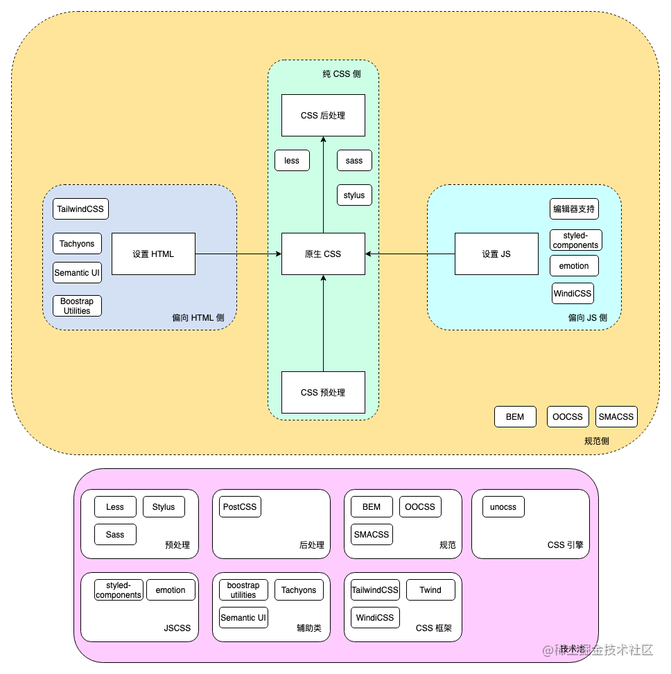

预处理器（scss、less）

- scss、less 等是通过引入变量，作用域，编程语句等扩展 css 功能的DSL 解决了 css 难复用、作用域全局污染、难维护，不灵活等问题。但需要通过预处理器转变成 css ，浏览器才能正确解析

后处理器（stylelint，autoprefixer）

- 将 css 代码通过编译原理分词解析生成抽象语法树
- 在抽象语法树上调用插件进行修改得到修改后的 ast 再转换成浏览器可识别的 css 代码

**PostCSS** 强大的插件系统，可以实现多种功能，包括预处理和后处理。

css 模块化

- 命名约束-BEM
- vue-loader 中 scroped 通过编译后添加属性选择器 [data-xxxxx] 方式 实现样式隔离模块化
- css modules 通过 css-loader 编译将一个 css 文件中的样式命名转化成一个唯一的类名前缀，实现隔离
- css-in-js 通过利用 js 在运行时而不是编译时动态生产 css
	
	- 好处：编写样式更灵活，首屏渲染无须多余的 css 阻塞
	- 坏处： js 打包体积变大，运行时消耗

- 原子化 css 通过将样式分解成最小可复用单元，组合使用。

	- tailwind css 依赖 postCss 后处理器对 AST 进行修改
	- 优点：减少命名困难症，原子类复用率高
	- 缺点：有学习记忆成本，增加 html 类名