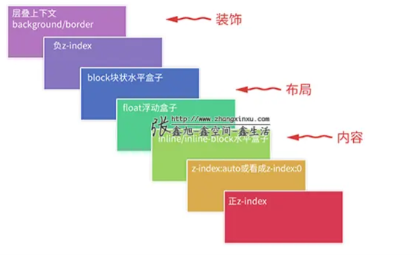

- 谁大谁上：如识别的z-index值越大越高。
- 后来居上：堆叠水平一致、堆叠顺序相同时。

层叠上下文对是 HTML 三维结构的构想，将元素沿着垂直屏幕的虚构 z 轴进行层叠。形成条件：

- fixed 、sticky
- absolute 或 relative，且 z-index 不是 auto
- flex 或 grid，且 z-index 不是 auto
- opacity 不为 1 等等

同一层层叠上下文中元素层叠顺序可以通过z-index 来设置，z-index 不能夸层级比较

