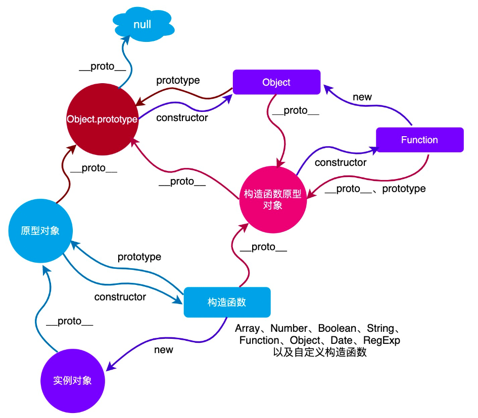

个人认为原型链是 js 中解决方法复用的一种机制。

- 每个对象都有一个 __proto__ 属性，该属性指向自己的原型对象
- 每个构造函数都有一个 prototype 属性，该属性指向实例对象的原型对象
- 原型对象里的 constructor 指向构造函数本身

每个对象都有自己的原型对象，而原型对象本身也是对象，也有自己的原型对象，从而形成了一条原型链条，原型链的终点是 NULL

当试图访问一个对象的属性时，首先会在自身搜寻，找不到就会搜寻该对象的原型，以及该对象的原型的原型，依次层层向上搜索，直到找到一个名字匹配的属性或到达原型链的末尾。instansof 就是原型链寻找算法

- `instanceof` 用来判断一个对象是否是某个构造函数的实例。它的实现原理也是基于原型链。
- `instanceof` 运算符沿着对象的原型链查找，判断是否有一个构造函数的 `prototype` 属性在对象的原型链上。




```js

function Person(name) {
  this.name = name;
}

Person.prototype.greet = function() {
  console.log('Hello, ' + this.name);
};

const alice = new Person('Alice');

// __proto__ 指向实例对象的原型
console.log(alice.__proto__ === Person.prototype); // true

// prototype 指向构造函数的原型
console.log(Person.prototype.constructor === Person); // true

// 原型链的顶端
console.log(Object.prototype.__proto__ === null); // true

// 通过原型链查找属性和方法
alice.greet(); // 输出 'Hello, Alice'
console.log(alice.toString()); // 调用的是 Object.prototype.toString

// instanceof 运算符
console.log(alice instanceof Person); // true
console.log(alice instanceof Object); // true

```

- `Person` 是一个构造函数，定义了一个属性 `name` 和一个方法 `greet`。
- `Person.prototype.greet` 是添加到 `Person` 原型上的方法，所有由 `Person` 创建的实例都可以访问这个方法。
- `alice.__proto__` 指向 `Person.prototype`，这是实例对象的原型。
- `Person.prototype.constructor` 指向 `Person` 构造函数本身。
- `Object.prototype.__proto__` 是 `null`，表示原型链的顶端。
- 访问 `alice.greet()` 时，JavaScript 引擎在 `alice` 对象自身没有找到 `greet` 方法，于是沿着原型链查找到 `Person.prototype` 并调用了该方法。
- `alice.toString()` 没有在 `alice` 和 `Person.prototype` 中找到，于是继续沿着原型链查找到 `Object.prototype` 并调用了该方法。
- `alice instanceof Person` 返回 `true`，因为 `Person.prototype` 在 `alice` 的原型链上。
- `alice instanceof Object` 返回 `true`，因为所有对象最终都继承自 `Object.prototype`。