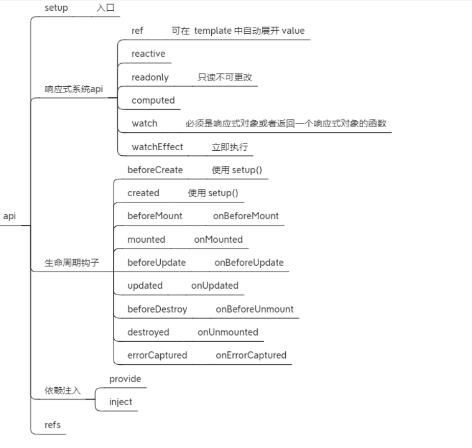

打包 体积更小 tree-shaking
compositon Api 高内聚，低耦合 减少了`this`指向不明的情况 类型推断好
Typescript支持
响应式 Api 暴露出来 原来是Vue.xxx 现在直接导入
- diff算法优化
- 静态提升
- 事件监听缓存
- SSR优化

响应式数据劫持 
原Object.defineProperty get() set()

- 检测不到对象属性的添加和删除
- 数组`API`方法无法监听到
- 需要对每个属性进行遍历监听，如果嵌套对象，需要深层监听，造成性能问题

现Proxy 来创建响应式对象，仅将 getter / setter 用于 ref

- 可以监听动态属性的添加
- 可以监听到数组的索引和数组`length`属性
- 可以监听删除属性

## 新特性
在 `Vue3.x` 中，组件现在支持有多个根节点
`Teleport` 是一种能够将我们的模板移动到 `DOM` 中 `Vue app` 之外的其他位置的技术
自定义渲染器 createRenderer
组合式`api`

`Tree shaking`是基于`ES6`模板语法（`import`与`exports`），主要是借助`ES6`模块的静态编译思想，在编译时就能确定模块的依赖关系，以及输入和输出的变量

`Tree shaking`无非就是做了两件事：

- 编译阶段利用`ES6 Module`判断哪些模块已经加载
- 判断那些模块和变量未被使用或者引用，进而删除对应代码

通过`Tree shaking`，`Vue3`给我们带来的好处是：

- 减少程序体积（更小）
- 减少程序执行时间（更快）
- 便于将来对程序架构进行优化（更友好）