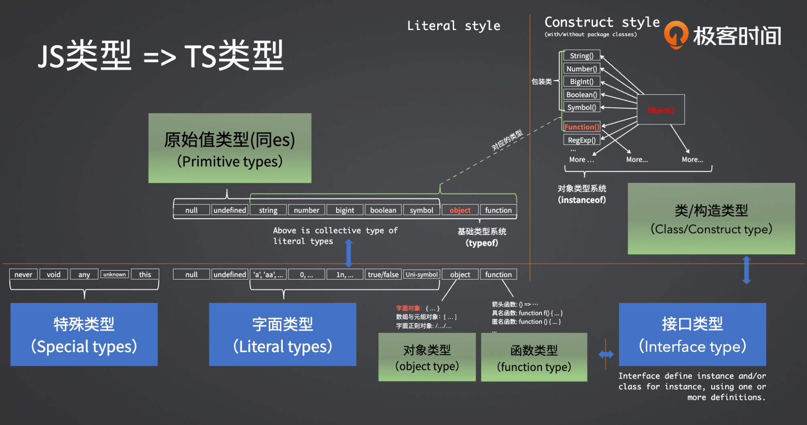
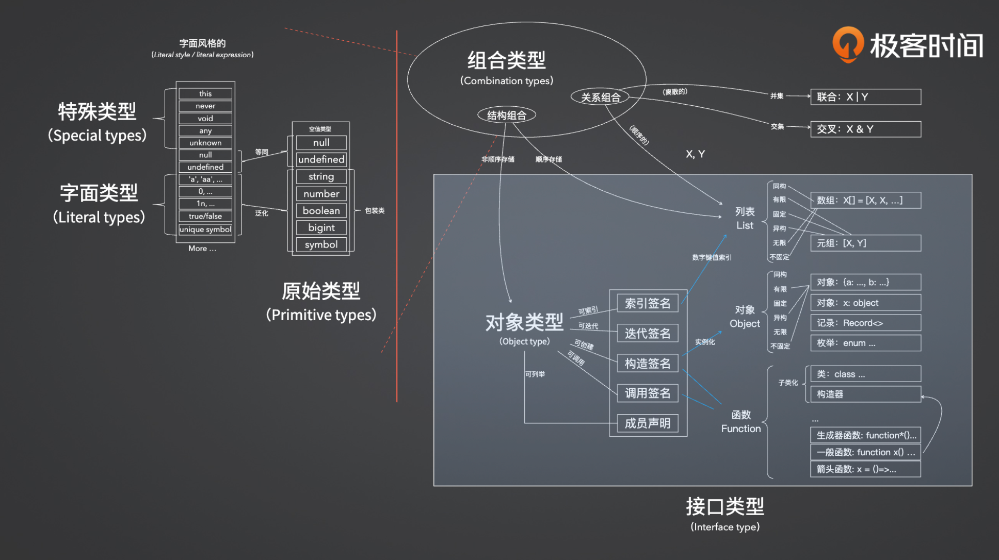

ts 是 js 的超集，在 js 语言本身的基础上引入了静态的类型系统，在编译时发生类型检查发现错误，弥补了 js 在运行时才能发现错误的缺点。

静态：类型检查发生的时间，在编译的时候，而非运行时

TS不参与任何运行时的类型检查 运行时检查是ide提供的

```json
// tsconfig.json
{
  "compilerOptions": {
  
    /* 基本选项 */
    "target": "ESNext",                       // 指定 ECMAScript 目标版本: 'ES3' (default), 'ES5', 'ES6'/'ES2015', 'ES2016', 'ES2017', or 'ESNEXT'
    "module": "ESNext",                  // 指定使用模块: 'commonjs', 'amd', 'system', 'umd' or 'es2015' 'ESNext'
    "lib": [],                             // 指定要包含在编译中的库文件 ["ES2020", "DOM", "DOM.Iterable", "ESNext", "WebWorker"],
    "allowJs": true,                       // 允许编译 javascript 文件
    "checkJs": true,                       // 报告 javascript 文件中的错误
    "jsx": "react-jsx",                     // 指定 jsx 代码的生成: 'preserve', 'react-native', or 'react-jsx'
    "declaration": true,                   // 生成相应的 '.d.ts' 文件
    "sourceMap": true,                     // 生成相应的 '.map' 文件
    "outFile": "./",                       // 将输出文件合并为一个文件
    "outDir": "./",                        // 指定输出目录
    "rootDir": "./",                       // 用来控制输出目录结构 --outDir.
    "removeComments": true,                // 删除编译后的所有的注释
    "noEmit": true,                        // 不生成输出文件
    "importHelpers": true,                 // 从 tslib 导入辅助工具函数
    "isolatedModules": true,               // 将每个文件做为单独的模块 （与 'ts.transpileModule' 类似）.
    // 只编译修改过的文件,这个时候会生成tsconfig.tsbuildinfo,下次编译的时候会进行对比只编译修改过的文件 
    "incremental": true,

    /* 严格的类型检查选项 */
    "strict": true,                        // 启用所有严格类型检查选项，不允许隐式any类型
    "noImplicitAny": true,                 // 在表达式和声明上有隐含的 any类型时报错
    "strictNullChecks": true,              // 启用严格的 null 检查
    "noImplicitThis": true,                // 当 this 表达式值为 any 类型的时候，生成一个错误
    "alwaysStrict": true,                  // 以严格模式检查每个模块，并在每个文件里加入 'use strict'

    /* 额外的检查 */
    "noUnusedLocals": true,                // 有未使用的变量时，抛出错误
    "noUnusedParameters": true,            // 有未使用的参数时，抛出错误
    "noImplicitReturns": true,             // 并不是所有函数里的代码都有返回值时，抛出错误
    "noFallthroughCasesInSwitch": true,    // 报告 switch 语句的 fallthrough 错误。（即，不允许 switch 的 case 语句贯穿）

    /* 模块解析选项 */
    "moduleResolution": "node",            // 选择模块解析策略： 'node' (Node.js) or 'classic' (TypeScript pre-1.6)
    "baseUrl": "./",                       // 用于解析非相对模块名称的基目录
    "paths": {
      "@/*": ["src/*"],
    },                       // 模块名到基于 baseUrl 的路径映射的列表
    "include": ["src"],
    "rootDirs": [],                        // 根文件夹列表，其组合内容表示项目运行时的结构内容
    "typeRoots": [],                       // 包含类型声明的文件列表
    "types": [],                           // 需要包含的类型声明文件名列表
    "allowSyntheticDefaultImports": true,  // 允许从没有设置默认导出的模块中默认导入。

    /* Source Map Options */
    "sourceRoot": "./",                    // 指定调试器应该找到 TypeScript 文件而不是源文件的位置
    "mapRoot": "./",                       // 指定调试器应该找到映射文件而不是生成文件的位置
    "inlineSourceMap": true,               // 生成单个 soucemaps 文件，而不是将 sourcemaps 生成不同的文件
    "inlineSources": true,                 // 将代码与 sourcemaps 生成到一个文件中，要求同时设置了 --inlineSourceMap 或 --sourceMap 属性

    /* 其他选项 */
    "experimentalDecorators": true,        // 启用装饰器
    "emitDecoratorMetadata": true          // 为装饰器提供元数据的支持
  }
}
```


interface 和 type 区别：

- 接口通过 interface 定义，type 是用来定义类型别名。
- 接口可以重复定义，type 不可以。
- 接口可以**继承**，type 不可以继承，**但是可以使用联合类型和交叉类型来模拟继承** 
- 类型用 & 连接起来就是交叉类型（产生一个包含所有属性的新类型），用 | 连接起来就是联合类型（产生一个包含所有类型的选择集类型）

interface 是接口，type是类型，本身就是两个概念。只是碰巧表现上比较相似。 希望定义一个变量类型，就用 type，如果希望是能够继承并约束的，就用 interface。 如果你不知道该用哪个，说明你只是想定义一个类型而非接口，所以应该用 type

TypeScript **泛型**是一种工具。它能让开发者不在定义时指定类型，而在使用时指定类型。
```ts
function getFirst<T>(arr: T[]): T {
  return arr[0];
}
```
