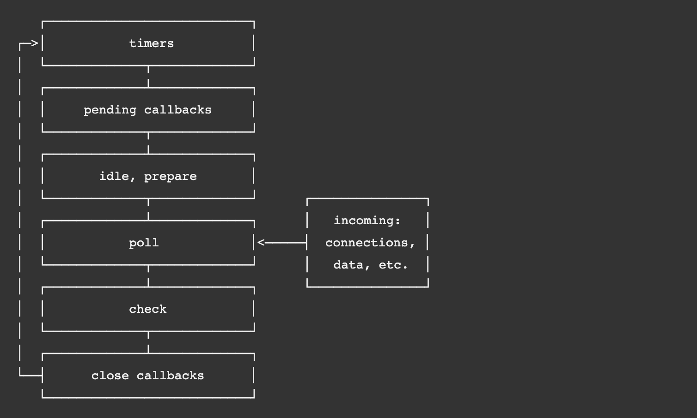
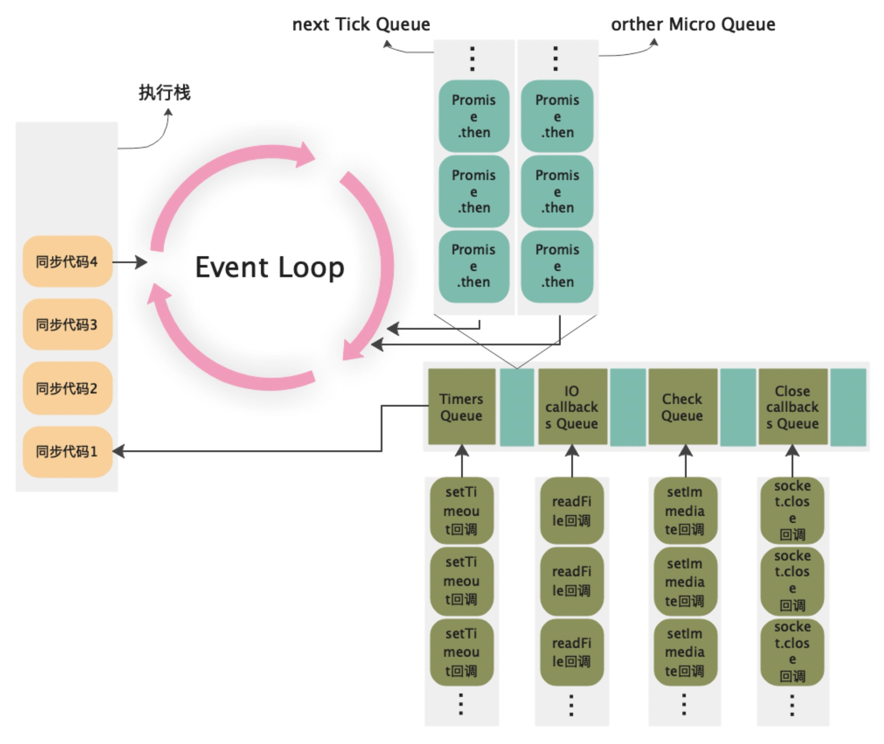
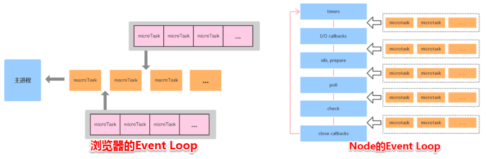

### Node.js 中的事件循环

- 微任务 process.nextTick()优先级高于 Promise
- 宏任务无优先级，按照事件循环顺序执行，timers （定时器最低设置 1ms）开始

	- 在 poll 阶段时候会同步清空所有回调并停在此阶段，假如 timer 和 check 无任务执行
	
		- 直到 check 和 timer 有任务才继续循环

- 一旦执行一个阶段里的一个任务（setTimeout，setInterval 和 setImmediate），会立刻执行微任务队列

