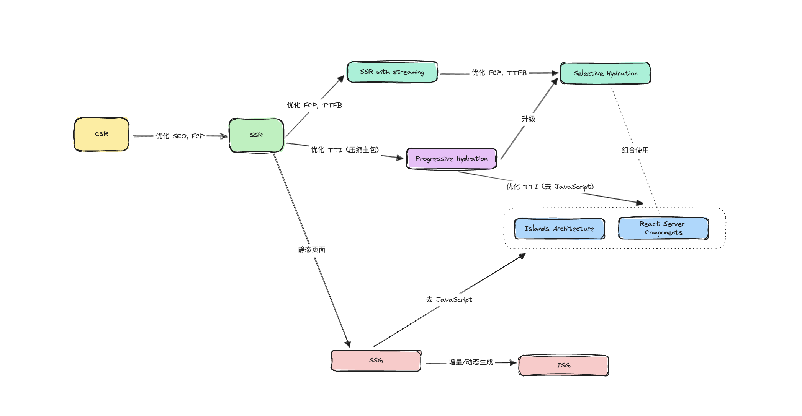
演进：
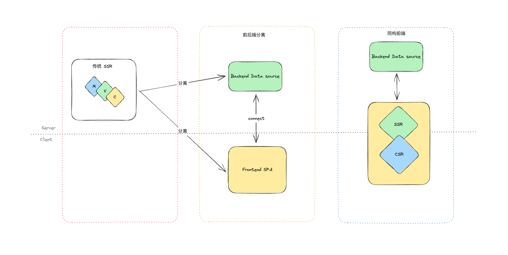
csr （**Client-Side Rendering**）**客户端渲染**：

- 优点：部署简单、交互体验好，适合复杂交互应用
- 缺点：seo 不友好（返回空 html），解析 js 才能生产页面，首屏时间长白屏，状态前端接管变得复杂

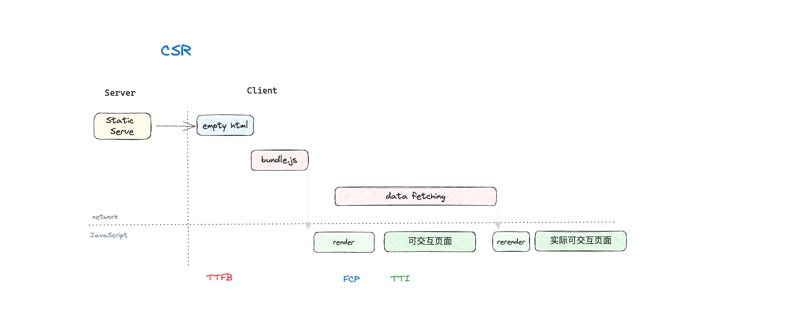

SSR  （Server-Side Rendering）**服务端渲染**：

把数据拉取拼接成 HTML 在服务端完成，浏览器重新渲染加载一遍 js，也就是水合（注册事件等），才有交互性

- 优点：返回完整 html ，故 seo 友好、首屏 FCP 变快
- 缺点：消耗服务器资源，页面能更快看到，但是 TTI 基本不变，页面看到但是不能交互，TTFB 时间长

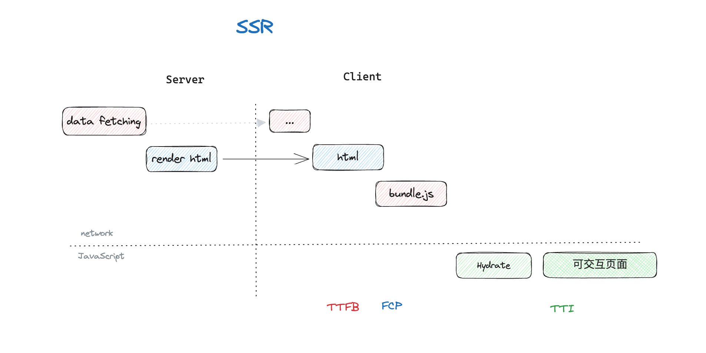

ssg （Static-Site Generation）**静态站点生成**：

完全静态页面，构建时候生产硬编码 HTML

- 优点：相比 ssr，不需要获取数据再拼接成 HTML，故 TTFB、FCP 时间变短
- 缺点：也需要进行水合，内容变更需要重新构建，麻烦

如果你调研 SSR 只是为了优化为数不多的营销页面的 SEO (例如 `/`、`/about` 和 `/contact` 等)，那么你可能需要 SSG 而不是 SSR。

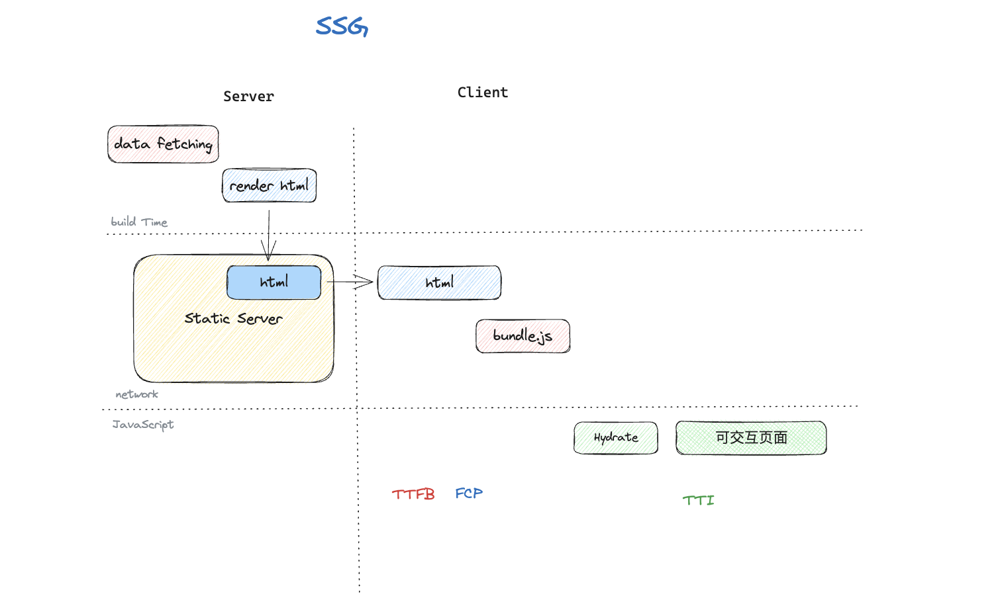

isg/isr：增量静态生成/再生
Incremental Static Regeneration (ISR)

与 ssg 相比增加服务器运行时，会按照一定的策略刷新策略来重新生产页面

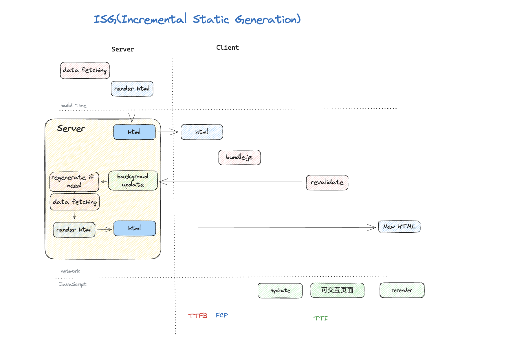

Progressive Hydration - 渐进水合：

传统的 ssr 需要加载完整的 js 页面才能具有交互性，导致 TTI 变晚，故可以通过代码分割，将某些组件抽取为异步组件（按照一定规则按需水合），降低主包体积

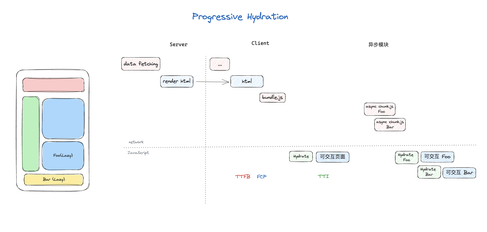

SSR with streaming - 流式 SSR：

相比传统 ssr，HTML 不是一次性服务端生成好返回，而是生成一部分就返回一部分，加快了 FFTB 和 FCP，在页面内容较长时效果较好

Selective Hydration - 选择性水合：

是渐进式水合(Progressive Hydration) 和 流式SSR (SSR with Streaming) 的升级版。主要通过选择性地跳过‘慢组件’，避免阻塞，来实现更快的 HTML 输出

- Suspend 包裹起来，准备好之后将结果替换插槽

慢组件通常指的是：需要异步获取数据、体积较大、或者是计算量比较复杂的组件

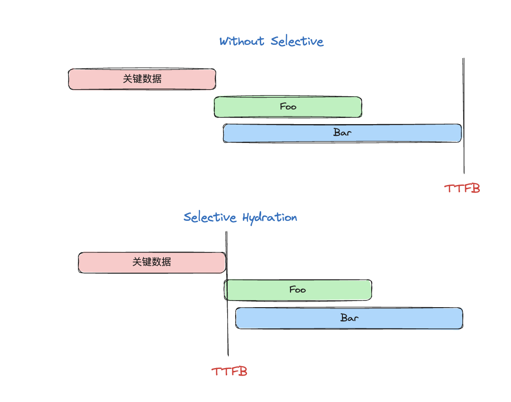

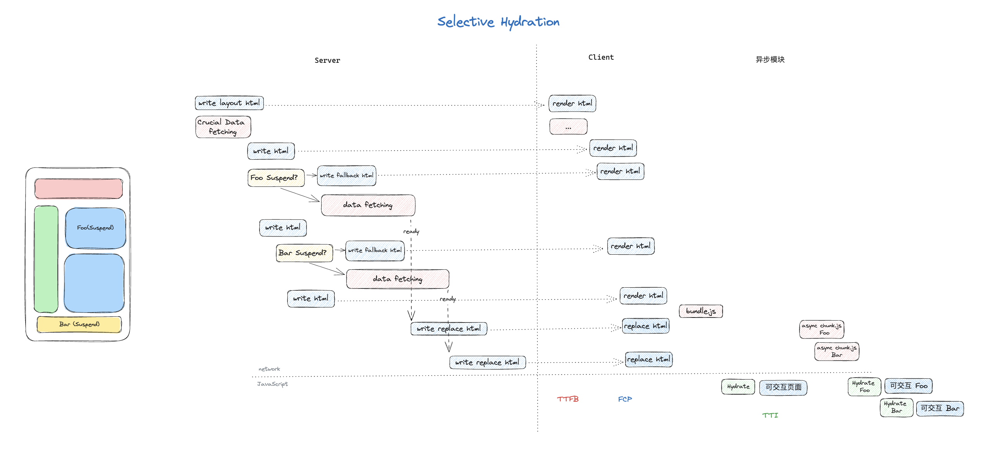

Islands Architecture - 岛屿架构（去 javascript）：

岛屿架构的主要代表是 Astro。在服务端渲染后，在客户端侧没有客户端程序和水合的过程。而对于需要 JavaScript 增强，实现动态交互的组件，需要显式标记为岛屿

- 每个岛屿都是独立加载、局部水合。而 Progressive Hydration 是整棵树水合的分支，只不过延后了
- 岛屿可以框架无关
- 缓解 TTI，适合内容静态大于动态的场景
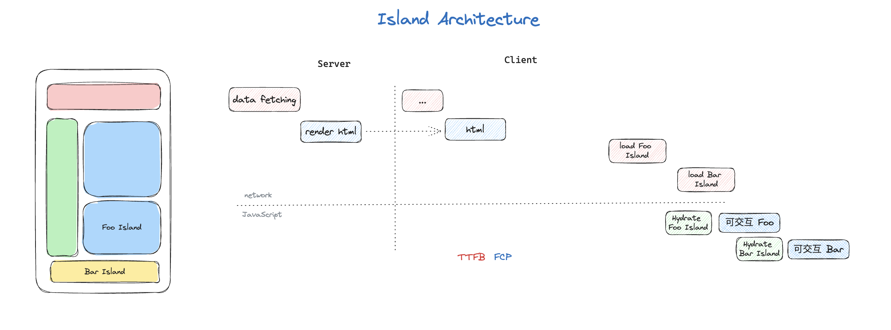

以`<NuxtIsland>`为例 无需任何客户端 JS ，在服务端完成水合好了发过来 减少bundle大小，在渲染岛屿组件时，岛屿组件的内容是静态的，因此客户端无需下载 JS。更改岛屿组件道具会触发岛屿组件的重新获取，从而再次重新渲染。

RFC 服务端组件  React RFC Server Components：

服务器组件类似于纯函数没有 hooks，没有状态

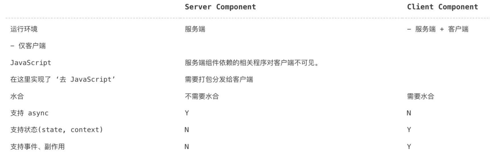

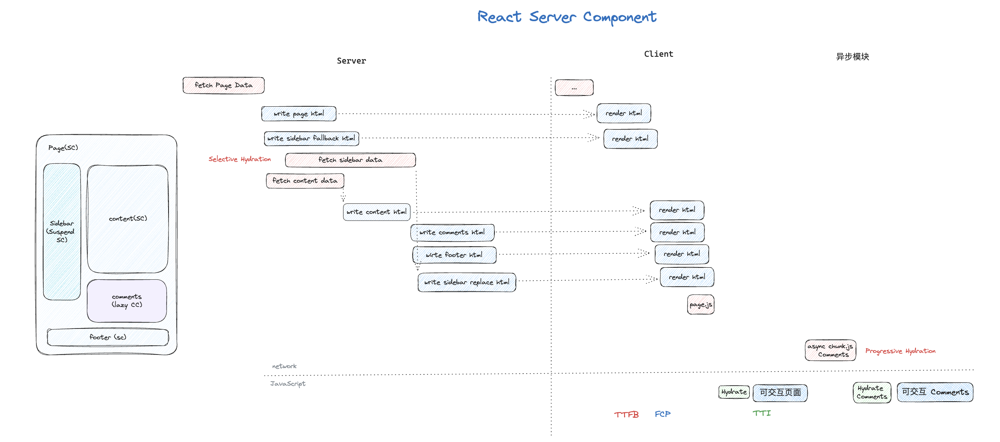

