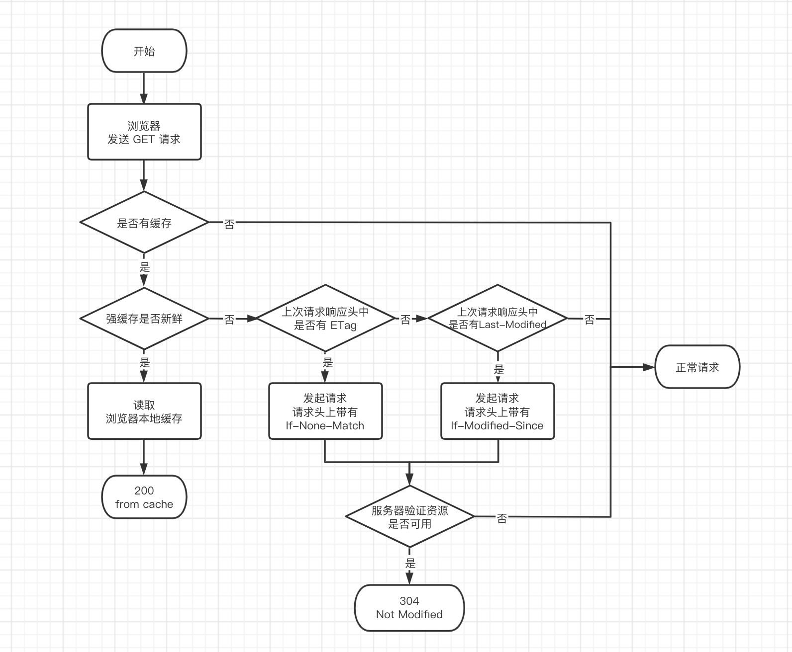

无论是强制缓存还是协商缓存，都是属于 Disk Cache 或者叫做 HTTP Cache 里面的一种

强缓存
（HTTP1.1 **Cache-control**: max-age > **expires** HTTP1.0 (过期时间通过与本地时间计算，不一定准确)）> 协商缓存

Cache-Control 是用于页面缓存的通用消息头字段

- **max-age** 设置缓存存储的最大时长，单位秒。
- **public** 表示响应可被任何对象缓存。
- **private** 表示响应只可被私有用户缓存，不能被代理服务器缓存。（默认值）
- **no-cache 强制客户端向服务器发起请求（禁用强缓存，可用协商缓存）。**
- **no-store** 禁止一切缓存，包含协商缓存也不可用。

给静态文件上缓存，当需要修改时打上哈希（webpack 可在打包时在文件名上带上）

缓存位置以及优先级：

- 从 Service Worker 中读取缓存（只支持 HTTPS）。
- 从内存读取缓存时 network 显示 **memory cache**。
- 从硬盘读取缓存时 network 显示 **disk cache**。
- Push Cache（推送缓存）（HTTP/2.0）。
- 优先级 Service Worker > memory cache > disk cache > Push Cache。

3 种不同的浏览器行为：

- 打开网页，地址栏输入地址：查找 Disk Cache 中是否有匹配。如有则使用；如没有则发送网络请求。
- 普通刷新 (F5)：因为 TAB 并没有关闭，因此 Memory Cache 是可用的，会被优先使用(如果匹配的话)。其次才是 Disk Cache。
- 强制刷新 ( Ctrl + F5 )：浏览器不使用缓存，因此发送的请求头部均带有 Cache-control: no-cache（为了兼容，还带了 Pragma: no-cache ）。服务器直接返回 200 和最新内容。

协商缓存

协商缓存就是强制缓存失效后，浏览器携带缓存标识向服务器发起请求，由服务器根据缓存标识决定是否使用缓存的过程

协商缓存生效，返回304 Not Modified

协商缓存失效，返回200和请求结果结果

ETag / If-None-Match：（上次的Etag）  >  Last-Modified/If-Modified-Since（通过最后修改时间，秒级）

若服务器的资源最后被修改时间大于 If-Modified-Since 的字段值，则重新返回资源，状态码为 200；否则则返回304，代表资源无更新，可继续使用缓存文件。

Etag 是服务器响应请求时，返回当前资源文件的一个唯一标识(由服务器生成)

老方法 Expires，记录的绝对值  
新方法 Cache-Control 多了一堆选项，记录的时间是相对值  
获取缓存检测缓存是否过期，如果没过期取缓存，优先从内存，其次硬盘，如果过期，则与服务器协商缓存是否仍然可用，如果不可用则获取，可用取缓存

no-cache 是缓存但是每次都会发起协商请求
no-store 才是真正的不缓存