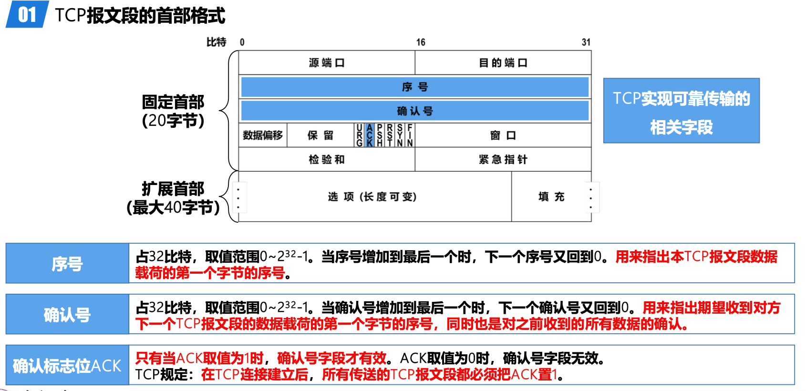
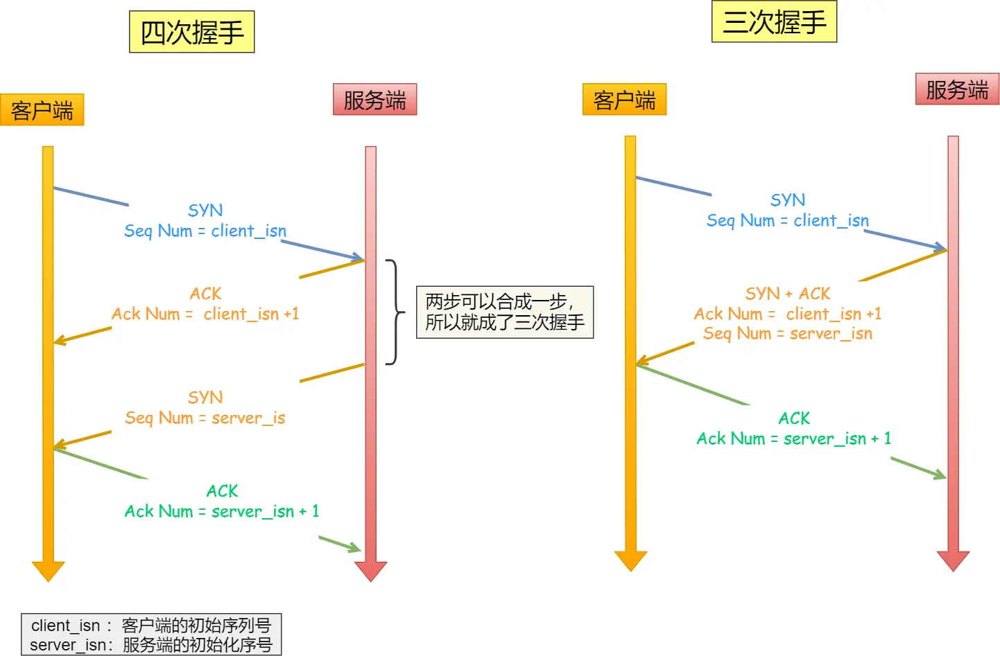
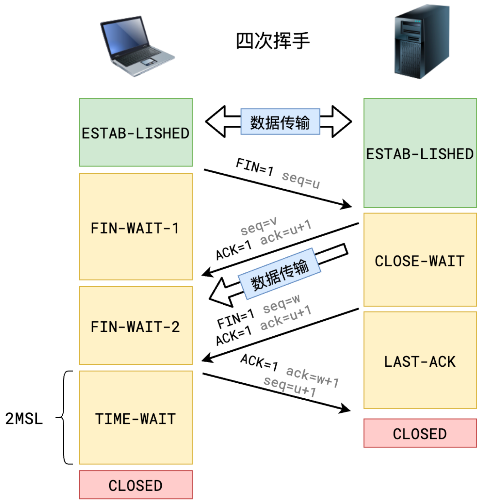

特点：

- 面相连接：一定是「一对一」才能连接，不能像 UDP 协议可以一个主机同时向多个主机发送消息
- 可靠的：无论的网络链路中出现了怎样的链路变化，TCP 都可以保证一个报文一定能够到达接收端
- 字节流：用户消息通过 TCP 协议传输时，消息可能会被操作系统「分组」成多个的 TCP 报文，通过顺序确定边界，当「前一个」TCP 报文没有收到的时候，即使它先收到了后面的 TCP 报文，那么也不能扔给应用层去处理，同时对「重复」的 TCP 报文会自动丢弃。

端口的概念：

运行在计算机上的进程是使用进程标识符 PID 来标识的。

然而，因特网上的计算机并不是使用统一的操作系统，而不同操作系统又使用不同格式的进程标识符。为了能够通信就必须使用统一的方法对 TCP/IP 体系的应用进程进行标识，就是采用端口号的长度为 16 比特，取值范围是 0~65535

首部格式：

- 序列号 seq ：在建立连接时由计算机生成的随机数作为其初始值，通过 SYN 包传给接收端主机，每发送一次数据，就「累加」一次该「数据字节数」的大小。用来解决网络包乱序问题。
- 确认应答号：指下一次「期望」收到的数据的序列号，发送端收到这个确认应答以后可以认为在这个序号以前的数据都已经被正常接收。用来解决丢包的问题。
- 数据偏移：指出了TCP报文段的首部长度
- 校验和：用来检查整个TCP报文段在传输过程中是否出现了误码
- ACK：该位为 1 时，「**确认应答**」的字段变为有效，TCP 规定除了最初建立连接时的 SYN 包之外该位必须设置为 1
- SYNC：
	- 用于TCP“三报文握手”建立连接。
	- 当SYN=1且ACK=0时，表明这是一个TCP连接请求报文段。
	- 对方若同意建立连接，则应在响应的TCP报文段的首部中使SYN=1且ACK=1。
- FIN：
	- 用于TCP“四报文挥手”释放连接。
	- 当FIN=1时，表明此TCP报文段的发送方已经将全部数据发送完毕，现在要求释放TCP连接。

三次握手

不携带请求体，但是标记位消耗一个序号，**第三次握手是可以携带数据的**

TCP 协议通过三次握手建立可靠的点对点连接，具体过程是：

- 首先服务器进入监听状态，然后即可处理连接
- 第一次握手：建立连接时，客户端发送 syn 包到服务器，并进入 SYN_SENT 状态，等待服务器确认。在发送的包中还会包含一个初始序列号 seq。此次握手的含义是客户端希望与服务器建立连接。
- 第二次握手：服务器收到 syn 包，然后回应给客户端一个 SYN+ACK 包，此时服务器进入 SYN_RCVD 状态。此次握手的含义是服务端回应客户端，表示已收到并同意客户端的连接请求。
- 第三次握手：客户端收到服务器的 SYN 包后，向服务器再次发送 ACK 包，并进入 ESTAB_LISHED 状态。
- 最后，服务端收到客户端的 ACK 包，于是也进入 ESTAB_LISHED 状态，至此，连接建立完成

为什么不是x次 要是三次？：三次握手才能保证双方具有接收和发送的能力（**首要原因是为了防止旧的重复连接初始化造成混乱**）

- 可以同步双方的初始序列号

两次握手：

- 无法可靠的同步双方序列号，服务端的发送的序列号也应该得到客户端回应

四次握手：

- 服务端发送初始序号和发送确认号可以合并在一起，故三次已经可以确定最少得可靠连接

---

四次挥手：

- 关闭连接时，客户端向服务端发送 FIN 时，仅仅表示客户端**不再发送数据了但是还能接收数据**。
- 服务端收到客户端的 FIN 报文时，先回一个 ACK 应答报文，而服务端可能还有数据需要处理和发送，等服务端不再发送数据时，才发送 FIN 报文给客户端来表示同意现在关闭连接。

1. Client 向 Server 发送 FIN 包，表示 Client 主动要关闭连接，然后进入 FIN_WAIT_1 状态，等待 Server 返回 ACK 包。此后 Client 不能再向 Server 发送数据，但能读取数据。
2. Server 收到 FIN 包后向 Client 发送 ACK 包，然后进入 CLOSE_WAIT 状态，此后 Server 不能再读取数据，但可以继续向 Client 发送数据。
3. Client 收到 Server 返回的 ACK 包后进入 FIN_WAIT_2 状态，等待 Server 发送 FIN 包。
4. Server 完成数据的发送后，将 FIN 包发送给 Client，然后进入 LAST_ACK 状态，等待 Client 返回 ACK 包，此后 Server 既不能读取数据，也不能发送数据。
5. Client 收到 FIN 包后向 Server 发送 ACK 包，然后进入 TIME_WAIT 状态，接着等待足够长的时间（2MSL）以确保 Server 接收到 ACK 包，最后回到 CLOSED 状态，释放网络资源。
6. Server 收到 Client 返回的 ACK 包后便回到 CLOSED 状态，释放网络资源。

