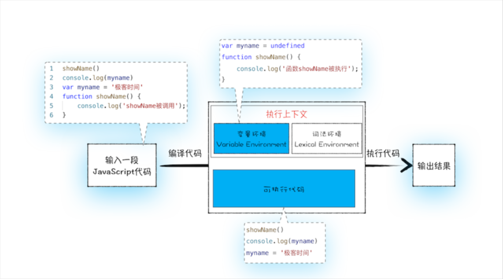
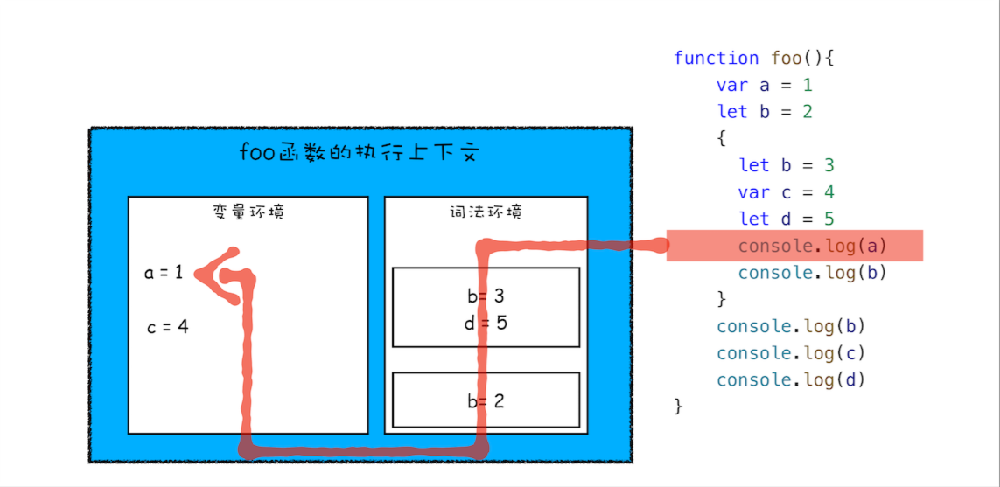

是指在JavaScript代码执行过程中，JavaScript引擎把变量的声明部分和函数的声明部分提升到代码开头的行为。变量被提升后，会给变量设置默认值 undifined

>对于 var 变量来说，它的创建和初始化是被提升的，但赋值不是。
>对于 let 变量来说，它的创建是被提升的，但是初始化和赋值不是。(因为[暂时性死区](https://developer.mozilla.org/zh-CN/docs/Web/JavaScript/Reference/Statements/let#%E6%9A%82%E6%97%B6%E6%80%A7%E6%AD%BB%E5%8C%BA)严格禁止在声明之前使用变量、所以也可以认为是不提升的)
  对于函数来说，它的创建、初始化和赋值同时被提升。


编译阶段



使用`var`，我们能够对一个变量进行多次声明，后面声明的变量会覆盖前面的变量声明
在函数中使用使用`var`声明变量时候，该变量是局部的

```js
var a = 20
function change(){
    var a = 30
}
change()
console.log(a) // 20 
```


`const`实际上保证的并不是变量的值不得改动，而是变量指向的那个内存地址所保存的数据不得改动

## 块
```js
let x = 1;
{
  let x = 2;
}
console.log(x); // 1
```

`x = 2` 的作用域仅限于定义它的块内。


作用域就是变量与函数的可访问范围，控制着变量和函数的可见性和生命周期

let 、const 创建的变量会存储在词法环境，进入一个作用域块之后就把作用域内部变量压入栈顶

- 寻找变量时先在词法环境栈顶往下找
- 找不到再去变量环境中取



没有块级作用域时，如何模拟实现？

用立即执行函数创建函数作用域来模拟块级作用域


## 暂时性死区

用 `let`、`const` 或 `class` 声明的变量可以称其从代码块的开始一直到代码执行到变量声明的位置并被初始化前，都处于一个“暂时性死区”（Temporal dead zone，TDZ）中。
```js
{
  // 暂时性死区始于作用域开头
  console.log(bar); // "undefined"
  console.log(foo); // ReferenceError: Cannot access 'foo' before initialization
  var bar = 1;
  let foo = 2; // 暂时性死区结束（对 foo 而言）
}

```

```js
function test() {
  var foo = 33;
  if (foo) {
    let foo = foo + 55; // ReferenceError
  }
}
test();
```

但是由于词法作用域，该值在块内不可用：`if` 块_内_的标识符 `foo` 是 `let foo`。表达式 `foo + 55` 会抛出 `ReferenceError` 异常，因为 `let foo` 还没完成初始化——它仍处于暂时性死区内。
