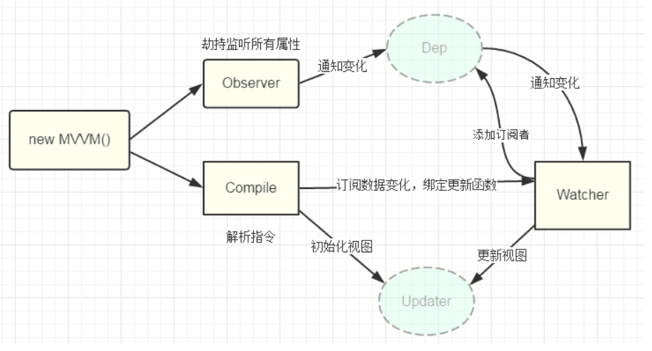

- 数据层（Model）：应用的数据及业务逻辑
- 视图层（View）：应用的展示效果，各类UI组件
- 业务逻辑层（ViewModel）：框架封装的核心，它负责将数据与视图关联起来

而上面的这个分层的架构方案，可以用一个专业术语进行称呼：`MVVM`这里的控制层的核心功能便是 “数据双向绑定”

## ViewModel

它的主要职责就是：

- 数据变化后更新视图
- 视图变化后更新数据

当然，它还有两个主要部分组成

- 监听器（Observer）：对所有数据的属性进行监听
- 解析器（Compiler）：对每个元素节点的指令进行扫描跟解析,根据指令模板替换数据,以及绑定相应的更新函数




## V-model

Vue3.4前

```vue
<!-- Child.vue -->
<script setup>
const props = defineProps(['modelValue'])
const emit = defineEmits(['update:modelValue'])
</script>

<template>
  <input
    :value="props.modelValue"
    @input="emit('update:modelValue', $event.target.value)"
  />
</template>
```

```vue
<!-- Parent.vue -->

<Child v-model="foo" />

会被编译为↓

<Child
  :modelValue="foo"
  @update:modelValue="$event => (foo = $event)"
/>
```


Vue3.4后 便利宏 [`defineModel()`](https://cn.vuejs.org/api/sfc-script-setup.html#definemodel)

```vue
<!-- Child.vue -->
<script setup>
const model = defineModel()

function update() {
  model.value++
}
</script>

<template>
  <div>Parent bound v-model is: {{ model }}</div>
  <button @click="update">Increment</button>
</template>
```

```vue
<!-- Parent.vue -->
<Child v-model="countModel" />
```


组件上的 `v-model` 也可以接受一个参数：

template

```vue
<MyComponent v-model:title="bookTitle" />
```

在子组件中，我们可以通过将字符串作为第一个参数传递给 `defineModel()` 来支持相应的参数：

```vue
<!-- MyComponent.vue -->
<script setup>
const title = defineModel('title')
</script>

<template>
  <input type="text" v-model="title" />
</template>
```


常用 v-model修饰符

### `.lazy`[​](https://cn.vuejs.org/guide/essentials/forms.html#lazy)

默认情况下，`v-model` 会在每次 `input` 事件后更新数据 ([IME 拼字阶段的状态](https://cn.vuejs.org/guide/essentials/forms.html#vmodel-ime-tip)例外)。你可以添加 `lazy` 修饰符来改为在每次 `change` 事件后更新数据

### `.number`[​](https://cn.vuejs.org/guide/essentials/forms.html#number)

如果你想让用户输入自动转换为数字，你可以在 `v-model` 后添加 `.number` 修饰符来管理输入

### `.trim`[​](https://cn.vuejs.org/guide/essentials/forms.html#trim)

如果你想要默认自动去除用户输入内容中两端的空格，你可以在 `v-model` 后添加 `.trim` 修饰符


### 自定义修饰符

```vue
<MyComponent v-model.capitalize="myText" />
```

```vue
<script setup>
const [model, modifiers] = defineModel({
  set(value) {
    if (modifiers.capitalize) {
      return value.charAt(0).toUpperCase() + value.slice(1)
    }
    return value
  },
  get(){}
})
</script>

<template>
  <input type="text" v-model="model" />
</template>
```

