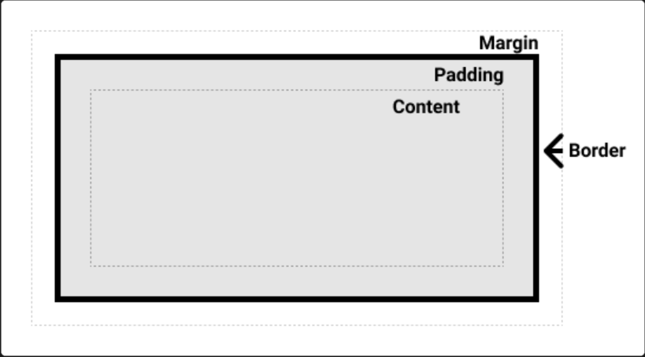

# 盒子模型

盒模型的各个部分
CSS 中组成一个区块盒子需要：

- **内容盒子**：显示内容的区域；使用 [`inline-size`](https://developer.mozilla.org/zh-CN/docs/Web/CSS/inline-size) 和 [`block-size`](https://developer.mozilla.org/zh-CN/docs/Web/CSS/block-size) 或 [`width`](https://developer.mozilla.org/zh-CN/docs/Web/CSS/width) 和 [`height`](https://developer.mozilla.org/zh-CN/docs/Web/CSS/height) 等属性确定其大小。
- **内边距盒子**：填充位于内容周围的空白处；使用 [`padding`](https://developer.mozilla.org/zh-CN/docs/Web/CSS/padding) 和相关属性确定其大小。
- **边框盒子**：边框盒子包住内容和任何填充；使用 [`border`](https://developer.mozilla.org/zh-CN/docs/Web/CSS/border) 和相关属性确定其大小。
- **外边距盒子**：外边距是最外层，其包裹内容、内边距和边框，作为该盒子与其他元素之间的空白；使用 [`margin`](https://developer.mozilla.org/zh-CN/docs/Web/CSS/margin) 和相关属性确定其大小。

w3c 官方规范中把页面中的各个元素抽象成一个个矩形盒子来表示，一个盒子从内到外分别是 content，padding，border，margin。

- 规范的标准盒子 content-box 中 width 和 height 属性对应的是 content 中的长度
- 但以前 IE 浏览器不遵守官方规范，他的规范中 border-box 盒子width 和 height 属性对应的是 content + padding+border 的长度
- 可以通过设置 box-sizing 这个属性切换这两个盒子模型。 box-sizing: border-box;

然后通过设置定位和布局来决定这些盒子在页面的排布位置

**区块盒子**（block boxes）和**行内盒子**（inline boxes）

一个拥有 `block` 外部显示类型的盒子会表现出以下行为：

- 盒子会产生换行。
- [`width`](https://developer.mozilla.org/zh-CN/docs/Web/CSS/width) 和 [`height`](https://developer.mozilla.org/zh-CN/docs/Web/CSS/height) 属性可以发挥作用。
- 内边距、外边距和边框会将其他元素从当前盒子周围“推开”。
- 如果未指定 [`width`](https://developer.mozilla.org/zh-CN/docs/Web/CSS/width)，方框将沿行向扩展，以填充其容器中的可用空间。在大多数情况下，盒子会变得与其容器一样宽，占据可用空间的 100%。

某些 HTML 元素，如 `<h1>` 和 `
`，默认使用 `block` 作为外部显示类型。

一个拥有 `inline` 外部显示类型的盒子会表现出以下行为：

- 盒子不会产生换行。
- [`width`](https://developer.mozilla.org/zh-CN/docs/Web/CSS/width) 和 [`height`](https://developer.mozilla.org/zh-CN/docs/Web/CSS/height) 属性将不起作用。
- 垂直方向的内边距、外边距以及边框会被应用但是不会把其他处于 `inline` 状态的盒子推开。
- 水平方向的内边距、外边距以及边框会被应用且会把其他处于 `inline` 状态的盒子推开。

某些 HTML 元素，如 `<a>`、 ``、 `<em>` 以及 `<strong>`，默认使用 `inline` 作为外部显示类型。

内部显示类型 
可以通过设置 `display: flex;` 来更改内部显示类型。该元素仍将使用外部显示类型 `block` 但内部显示类型将变为 `flex`。该方框的任何直接子代都将成为弹性（flex）项，并按照[弹性盒子](https://developer.mozilla.org/zh-CN/docs/Learn/CSS/CSS_layout/Flexbox)规范执行。

外边距 margin

外边距是盒子周围一圈看不到的空间。它会把其他元素退推离盒子。外边距属性值可以为正也可以为负。在盒子一侧设置负值会导致盒子和页面上的其他内容重叠。无论使用标准模型还是替代模型，外边距总是在计算可见部分后额外添加。

外边距折叠

根据外边距相接触的两个元素是正边距还是负边距，结果会有所不同：

- 两个正外边距将合并为一个外边距。其大小等于最大的单个外边距。
- 两个负外边距会折叠，并使用最小（离零最远）的值。
- 如果其中一个外边距为负值，其值将从总值中_减去_。

外边距折叠是指在使用外边距创建空间时，如果没有获得预期的空间，就会发生外边距折叠。

边框border

边框是在边距和填充盒子之间绘制的。如果你正在使用标准的盒模型，边框的大小将添加到框的宽度和高度。如果你使用的是替代盒模型，边框越大会使内容框越小，因为它会占用一些可用的宽度和高度。

为边框设置样式时，有大量的属性可以使用——有四个边框，每个边框都有样式、宽度和颜色，我们可能需要对它们进行操作。

内边距 padding
内边距位于边框和内容区域之间，用于将内容推离边框。与外边距不同，内边距不能为负数。任何应用于元素的背景都会显示在内边距后面。

`display: inline-block` 是 `display` 的一个特殊值，它提供了介于 `inline` 和 `block` 之间的中间位置。如果不希望项目换行，但又希望它使用 `width` 和 `height` 值并避免出现上述重叠现象，请使用它。

## 外边距折叠 （margin塌陷）

有三种情况会形成外边距折叠：

相邻的兄弟元素
- 相邻的同级元素之间的外边距会被折叠（除非后面的元素需要清除之前的浮动）。

没有内容将父元素和后代元素分开
- 如果没有设定边框（border）、内边距（padding）、行级（inline）内容，也没有创建区块格式化上下文或间隙来分隔块级元素的上边距（margin-top）与其内一个或多个子代块级元素的上边距（margin-top）；或者没有设定边框、内边距、行级内容、高度（height）或最小高度（min-height）来分隔块级元素的下边距（margin-bottom）与其内部的一个或多个后代后代块元素的下边距（margin-bottom），则会出现这些外边距的折叠，重叠部分最终会溢出到父代元素的外面。

空的区块
- 如果块级元素没有设定边框、内边距、行级内容、高度（height）、最小高度（min-height）来分隔块级元素的上边距（margin-top）及其下边距（margin-bottom），则会出现其上下外边距的折叠。

一些需要注意的地方：

- 上述情况的组合会产生更复杂的（超过两个外边距的）外边距折叠。
- 即使某一外边距为 0，这些规则仍然适用。因此就算父元素的外边距是 0，第一个或最后一个子元素的外边距仍然会（根据上述规则）“溢出”到父元素的外面。
- 如果包含负边距，折叠后的外边距的值为最大的正边距与最小（绝对值最大）的负边距的和。
- 如果所有的外边距都为负值，折叠后的外边距的值为最小（绝对值最大）的负边距的值。这一规则适用于相邻元素和嵌套元素。
- 外边距折叠仅与垂直方向有关。
- display 设置为 flex 或 grid 的容器中不会发生外边距折叠。