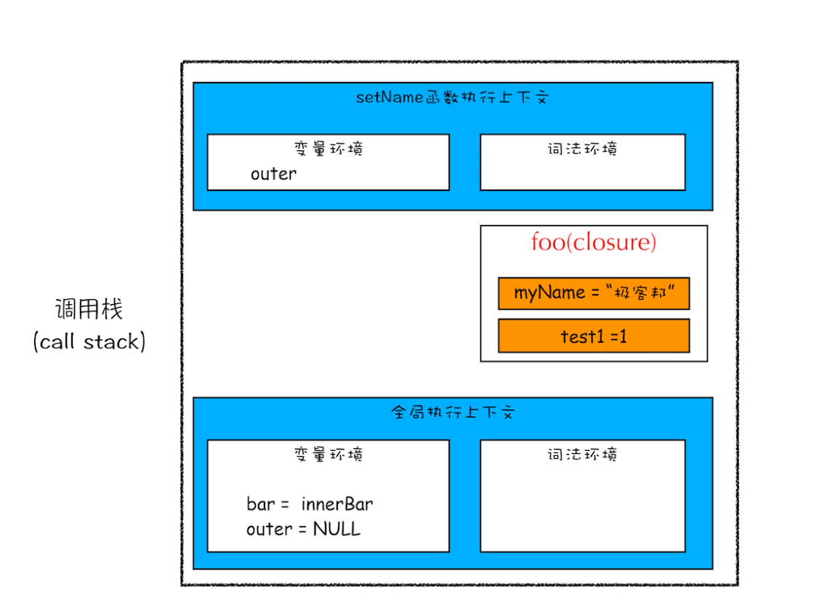

# 作用域链、闭包、立即执行函数

js 是词法作用域（静态作用域），每个执行上下文环境中，都包含一个外部的引用 outer 形成作用域链，寻找变量时先从自身执行上下文中找，找不到沿着 outer 去找

闭包个人理解是 js 词法作用域链和垃圾回收机制作用下自然而然的一种产物。

当执行外部函数后，创建执行上下文，并对内部函数进行快速词法扫描，如果内部函数有引用外部函数的变量或者参数，就会创建一个闭包来存储这些被引用的变量

为何内部函数能引用到外部函数变量或者参数？是由于 js 的作用域机制

为何外部函数执行完内部变量不销毁？是因为变量被内部函数引用，垃圾回收器不会对其进行回收

  

IE：退出函数时将不使用的局部变量全部删除

避免内存泄漏：

- 减少全局变量使用
- DOM 事件清除，清楚定时器

应用场景：

- 避免变量全局污染，实现模块化
- 可以保存状态，在防抖节流，柯里化等常见有体现





## 闭包
https://blog.csdn.net/Ed7zgeE9X/article/details/125567631

### 闭包是什么？


```js
// items 被迭代的数组 返回用于迭代的next函数
function createIterator(items) {
  let i = 0;
  function next() {
	// 如果达到数组长度，则已经完成迭代
	let done = i >= items.length;
	// 达到数组长度返回undefined，否则返回下一个值
	let value = !done ? items[i++] : undefined; 
	return {
	  done: done,
	  value: value
	};
  }
  return { next };
}

const iterator = createIterator([1,2]);
iterator.next(); // "{ value: 1, done: false }"
iterator.next(); // "{ value: 2, done: false }"
iterator.next(); // "{ value: 3, done: true }"

```

这一例子中可以说 `next()`函数 和 `i` 构成了闭包，同时也产生了副作用：每执行一次 `next()`    `i`  就会加 1。


闭包是有权限访问其他函数作用域内的变量的一个函数。

这是《JavaScript高级程序设计》中给出的定义，如果你想就用这一句话就把面试官搞定几乎是不可能的。

因为这句话还存在下面几个深入的问题：


■为什么其他非闭包的函数没有权限访问另一个函数的内部作用域

■为什么闭包有这个权限

■什么是函数作用域

面试官更想知道的是你是否知道上面的内容。

那好一个更周全的解释方法应运而生：

**由于在JS中，变量的作用域属于函数作用域，在函数执行后作用域就会被清理、内存也随之回收，但是由于闭包是建立在一个函数内部的子函数，由于其可访问上级作用域的原因，即使上级函数执行完，作用域也不会随之销毁，这时的子函数——也就是闭包，便拥有了访问上级作用域中的变量的权限，即使上级函数执行完后作用域内的值也不会被销毁。**

稍微有些啰嗦，但是一分钟以内应该足够了（如果流利的话）。这样一来，面试官基本上了解了你对于上面三个知识点是掌握的。

闭包解决了什么？


请放心，就凭上面那段话，面试官是不会善摆干休的。他一定会继续追问，一般来说会问——闭包解决了什么问题。


阮一峰在他的博客——《学习Javascript闭包（Closure）》中写到：在本质上，闭包就是将函数内部和函数外部连接起来的一座桥梁。


阮一峰写的太文艺了，我想务实点的说法应该是下面这样：


**由于闭包可以缓存上级作用域，那么就使得函数外部打破了“函数作用域”的束缚，可以访问函数内部的变量。以平时使用的Ajax成功回调为例，这里其实就是个闭包，由于上述的特性，回调就拥有了整个上级作用域的访问和操作能力，提高了极大的便利。开发者不用去写钩子函数来操作上级函数作用域内部的变量了。**

闭包有哪些应用场景


回调通常定义在另一个函数内部，并且可以在异步操作完成后执行，因此它具有闭包的特性。也就是说，回调函数在执行时可以访问其外部函数的变量和参数。

**闭包随处可见，一个Ajax请求的成功回调，一个事件绑定的回调方法，一个setTimeout的延时回调，或者一个函数内部返回另一个匿名函数，这些都是闭包。简而言之，无论使用何种方式对函数类型的值进行传递，当函数在别处被调用时都有闭包的身影。**

  

闭包有哪些

原理比较深奥：要想完全掌握闭包，一定要清楚函数作用域、内存回收机制、作用域继承等，然而闭包是随处可见的，很可能开发者在不经意间就写出了一个闭包，理解不够深入的话很可能造成运行结果与预期不符。

代码难以维护：闭包内部是可以缓存上级作用域，而如果闭包又是异步执行的话，一定要清楚上级作用域都发生了什么，而这样就需要对代码的运行逻辑和JS运行机制相当了解才能弄明白究竟发生了什么。

### **闭包的使用场景**

| 场景              | 示例                                        |
| --------------- | ----------------------------------------- |
| **模块化**         | 暴露公有方法，隐藏私有变量（如 jQuery 的模块封装）。            |
| **函数工厂**        | 生成配置化函数：`createLogger(level)`返回不同日志级别的函数。 |
| **事件处理器**       | 在回调中保留变量状态（如循环中绑定事件索引）。                   |
| **防抖/节流**       | 保存定时器 ID：`debounce(fn, delay)`控制触发频率。     |
| **缓存（Memoize）** | 缓存计算结果，避免重复计算（如斐波那契数列优化）。                 |
|                 |                                           |

### **立即执行函数（IIFE）**

**定义** ：全称 Immediately Invoked Function Expression，定义后立即执行的函数表达式。

**作用** ：

1. **隔离作用域** ：避免变量污染全局命名空间（ES6前无块级作用域时常用）。
2. **封装私有变量** ：隐藏内部实现，仅暴露必要接口（模块化雏形）。
3. **解决循环变量共享问题** ：在异步操作中保留循环变量的瞬时值。