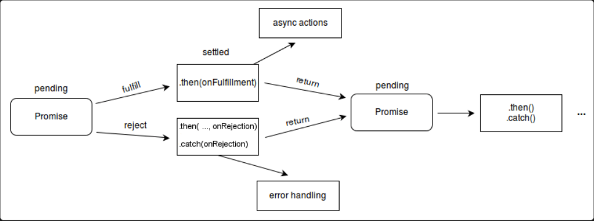

# 异步、Promise

js 异步我的理解是 js 线程遇到异步任务不会一步一步的按照顺序去执行，而是继续往下执行，等异步任务完成后再通知 js 线程去处理，常见的异步方案有异步回调、Promise、生成器 Generator、async/await

异步回调的方式回调控制权在第三方，且多层嵌套会产生回调地狱问题，后面出现了 Promise 解决方案，回调控制权通过 promise 对象的 resolve 和 reject 控制，通过链式调用.then 方法避免了回调地狱问题，后面出现的生成器函数也是一种解决方案，可以 yield 关键字和.next()方案来控制函数的执行，最后出现了 async 和 await 语法（结合了 promise（成功后继续递归调用生成器） 和生成器函数（同步写法）的优点），让异步代码写起来更像同步的代码，可读性更高。



A+规范规定：

`promise`对象仅有三种状态

- `pending`（进行中）
- `Settled`（已决、不算状态）
	- `fulfilled`（已成功）
	- `rejected`（已失败）


- **Settled（已决）**: `Promise` 已经完成，不再是 pending 状态，可以是 fulfilled 或 rejected 之一。

- 所有的异步任务都可以看作是一个异步的对象 Promise，每个任务都有两个阶段（已决，未决 ）和三种状态（pending，resolve，reject），**状态只能由 pending 到 resolve 或 reject，不可逆且改变后状态不可变（模仿现实，时间不能倒流）**
- 任务状态改变后，成功会有一个不可变的终值，失败会有一个不可变的原因，后续可以通过被 promise.then 方法(链式 then 是同步调用，状态决定才执行回调)处理
- then 方法接受onFulfilled，onRejected 函数作为可选参数，若参数不是函数，则忽略

	- then方法必定会返回一个新的Promise（可理解为后续处理也是一个任务）
	- 新任务的状态取决于后续处理：
	
		- 若没有相关的后续处理，新任务的状态和前任务一致，数据为前任务的数据
		- 若有后续处理但还未执行，新任务挂起。
		- 若后续处理执行了，则根据后续处理的情况确定新任务的状态
		
			- 后续处理执行无错，新任务的状态为完成，数据为后续处理的返回值（即使后续处理出现在 reject 的回调里）
			- 后续处理执行有错，新任务的状态为失败，数据为异常对象
			- 后续执行后返回的是一个任务对象（promise），新任务的状态和数据与该任务对象一致

### 静态方法（直接通过 `Promise` 调用）**

| 方法名                                | 作用描述                                                          | 示例场景                                                         |
| ---------------------------------- | ------------------------------------------------------------- | ------------------------------------------------------------ |
| **`Promise.resolve(value)`**       | 返回一个已**成功**的 Promise 对象（快速包装非 Promise 值为 Promise）。            | `Promise.resolve(42).then(v => console.log(v));`→ 输出`42`     |
| **`Promise.reject(reason)`**       | 返回一个已**失败**的 Promise 对象（快速生成错误状态）。                            | `Promise.reject('err').catch(e => console.log(e));`→ 输出`err` |
| **`Promise.all(iterable)`**        | 接收一组 Promise，全部成功时返回成功结果数组；**任意一个失败则立即失败**。                   | 并发多个独立异步任务，全部完成后处理。                                          |
| **`Promise.allSettled(iterable)`** | 接收一组 Promise，等待所有完成（无论成功/失败），返回结果状态对象数组（ES2020）。              | 需要收集所有异步任务的最终状态时使用。                                          |
| **`Promise.race(iterable)`**       | 接收一组 Promise，**返回第一个完成（成功/失败）的结果**。                           | 超时控制（例如网络请求超时检测）。                                            |
| **`Promise.any(iterable)`**        | 接收一组 Promise，返回第一个**成功**的结果；全部失败则抛出一个 AggregateError（ES2021）。 | 优先使用最快可用的结果（忽略错误）。                                           |

---

### 实例方法（通过 Promise 实例调用）**

|方法名|作用描述|链式调用示例|
|---|---|---|
|**`.then(onFulfilled, onRejected)`**|绑定 Promise 成功/失败的回调，返回新 Promise。若回调返回非 Promise 值，会自动包装为成功状态。|`p.then(v => v + 1).then(v => console.log(v));`|
|**`.catch(onRejected)`**|捕获链式调用中的**错误**，返回新 Promise（等同于`.then(null, onRejected)`）。|`p.catch(e => console.error(e));`|
|**`.finally(onFinally)`**|无论成功或失败都会执行的回调，适合清理操作（如关闭加载状态）。无参数，不改变 Promise 结果。|`p.finally(() => console.log('结束'));`|

---

### **关键区别与解析**

`Promise`构造函数存在以下方法：

- all() 用于将多个 `Promise`实例数组，包装成一个新的 `Promise`实例
	- **全部成功** ：按输入顺序返回结果数组。
	- **任意失败** ：立即 reject 第一个失败的原因。

```js
function promiseAll(promises) {
  return new Promise((resolve, reject) => {
    const results = [];
    let completed = 0;
    const total = promises.length;

    // 处理空数组直接 resolve
    if (total === 0) {
      resolve(results);
      return;
    }

    promises.forEach((promise, index) => {
      // 统一处理非 Promise 值
      Promise.resolve(promise)
        .then((value) => {
          results[index] = value; // 按顺序存储结果
          completed++;
          if (completed === total) {
            resolve(results);
          }
        })
        .catch((err) => {
          reject(err); // 任一失败立即终止
        });
    });
  });
}
```

- race() 同样是将多个 Promise 实例，包装成一个新的 Promise 实例
- allSettled() 方法接受一组 Promise 实例作为参数，包装成一个新的 Promise 实例 只有等到所有这些参数实例都返回结果，不管是`fulfilled`还是`rejected`，包装实例才会结束
- resolve() 将现有对象转为 `Promise`对象
- reject() 方法也会返回一个新的 Promise 实例，该实例的状态为`rejected`
- try()

### 异步时间不准

在 JavaScript 中，使用 `setTimeout` 或 `setInterval` 等异步方法设定时间时，**实际执行时间并不完全精准**。这种偏差主要由以下原因导致，并可通过相应的解决方案改进精度：

---

### **一、为什么异步设定的时间不精准？**
1. **主线程阻塞**  
   JavaScript 是单线程的，若主线程执行耗时任务（如大量计算、同步读写 DOM），会导致异步回调延迟执行。
   
   ```javascript
   // 主线程阻塞示例
   setTimeout(() => console.log('延迟 100ms'), 100);
   // 后续的耗时循环会阻塞主线程
   for (let i = 0; i < 1e9; i++) {} // 模拟长时间运算
   ```

2. **最小延迟限制（浏览器环境）**  
   - `setTimeout` 嵌套超过 5 层时，最短延迟时间会被强制设为 **4ms**。
   - 后台标签页中的定时器可能被节流至 **≥1000ms**（浏览器优化机制）。

3. **事件循环优先级**  
   异步回调任务需等待宏任务队列中的其他任务完成，如用户点击、网络请求等。

---

### **二、如何解决时间不精准的问题？**

#### **1. 对时间敏感任务优化执行逻辑**
- **使用 `performance.now()` 跟踪真实时间**  
  计算实际耗时，动态调整任务节奏。

  ```javascript
  let start = performance.now();
  function step(timestamp) {
    const elapsed = timestamp - start;
    console.log(`实际经过时间: ${elapsed}ms`);
    if (elapsed < 1000) {
      requestAnimationFrame(step); // 递归调用，保持节奏
    }
  }
  requestAnimationFrame(step);
  ```

#### **2. 利用 `requestAnimationFrame` 替代定时器（动画场景）**  
  自然适配屏幕刷新率（通常 60Hz，每 16.67ms 触发一次），避免帧丢失。

  ```javascript
  function animate() {
    // 逻辑代码
    element.style.left = `${pos}px`;
    pos += 1;
    requestAnimationFrame(animate);
  }
  requestAnimationFrame(animate); // 启动动画
  ```

#### **3. Web Workers 分线程处理耗时任务**  
  将复杂计算移至独立线程，避免主线程阻塞。

  ```javascript
  // 主线程
  const worker = new Worker('worker.js');
  worker.postMessage('startCalculation');

  // worker.js
  self.onmessage = function(e) {
    const result = intensiveComputation(); // 复杂计算
    self.postMessage(result);
  };
  ```

#### **4. 动态校准定时器延迟**  
  在回调中计算误差，动态调整下一次任务的触发时间。

  ```javascript
  function preciseInterval(callback, interval) {
    let expected = Date.now() + interval;
    const tick = () => {
      const drift = Date.now() - expected; // 计算时间偏差
      callback(); 
      expected += interval;
      setTimeout(tick, Math.max(0, interval - drift)); // 调整下次触发时间
    };
    setTimeout(tick, interval);
  }

  preciseInterval(() => console.log('每100ms触发'), 100);
  ```

#### **5. Web Audio API 高精度调度**  
  通过音频上下文的时间戳实现亚毫秒级精准调度（适合音视频同步）。  
  ```javascript
  const audioCtx = new AudioContext();
  const startTime = audioCtx.currentTime;

  function schedule() {
    const nextTime = startTime + (intervalCount * 0.1); // 按 100ms 间隔递增
    audioCtx.suspend(nextTime).then(() => {
      console.log('精准触发于:', nextTime);
      intervalCount++;
      schedule();
    });
    audioCtx.resume();
  }
  schedule();
  ```

---

### **三、场景建议**
- **动画/渲染逻辑**：优先 `requestAnimationFrame`，确保帧同步。  
- **定时数据轮询**：使用动态校准的 `setTimeout` 或 `setInterval`。  
- **高强度计算**：通过 **Web Workers** 卸载主线程压力。  
- **音频、实验精密计时**：采用 **Web Audio API** 或 **Web Socket** 的实时协议。

---

### **四、局限与注意事项**
- **浏览器后台限制**：标签页处于后台时，定时任务频率可能被降级。  
- **设备性能差异**：低端设备的刷新率或计算能力可能影响精度。  
- **任务分解**：复杂任务需拆分为小块，通过分批执行避免长时间阻塞。

通过以上方法，可根据具体需求有效提升异步任务的时间精度，优化用户体验。