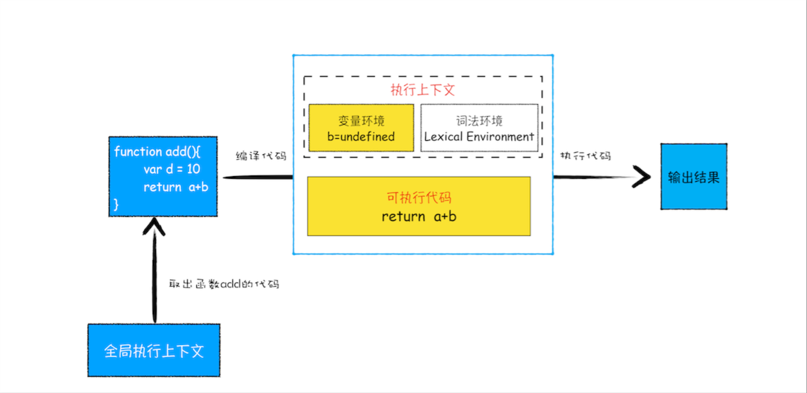
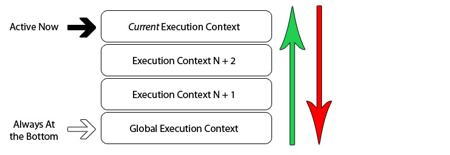

执行之前就进行编译并创建执行上下文

- 全局执行上下文：只有一个，浏览器中的全局对象就是 `window`对象，`this` 指向这个全局对象
- 函数执行上下文：存在无数个，只有在函数被调用的时候才会被创建，每次调用函数都会创建一个新的执行上下文
- Eval 函数执行上下文： 指的是运行在 `eval` 函数中的代码，很少用而且不建议使用

执行栈，也叫调用栈，具有 LIFO（后进先出）结构，用于存储在代码执行期间创建的所有执行上下文

