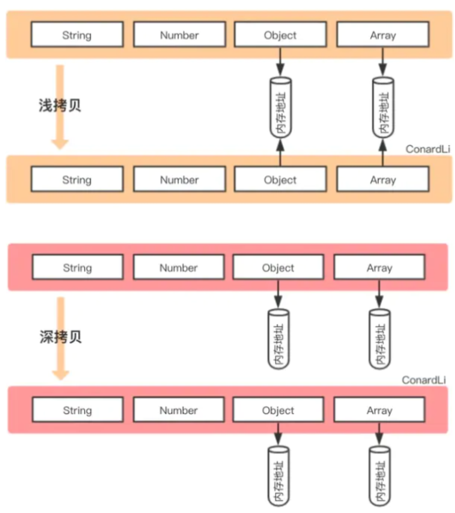

如果属性是基本类型，拷贝的就是基本类型的值。如果属性是引用类型，拷贝的就是内存地址，浅拷贝后的内容的内存地址相同

即浅拷贝是拷贝一层，深层次的引用类型则共享内存地址

```js
function shallowClone(obj) {
    const newObj = {};
    for(let prop in obj) {
        if(obj.hasOwnProperty(prop)){
            newObj[prop] = obj[prop];
        }
    }
    return newObj;
}
```

在`JavaScript`中，存在浅拷贝的现象有：

- `Object.assign`
- `Array.prototype.slice()`, `Array.prototype.concat()`
- 使用拓展运算符实现的复制


深拷贝开辟一个新的栈，两个对象属完成相同，但是对应两个不同的地址，修改一个对象的属性，不会改变另一个对象的属性

常见的深拷贝方式有：

- lodash.cloneDeep()
- jQuery.extend()
- JSON.stringify()   会忽略`undefined`、`symbol`和`函数`
- 手写循环递归

```js
const obj2=JSON.parse(JSON.stringify(obj1));
```


手写深拷贝
```js
function deepClone(obj, hash = new WeakMap()) {
  if (obj === null) return obj; // 如果是null或者undefined我就不进行拷贝操作
  if (obj instanceof Date) return new Date(obj);
  if (obj instanceof RegExp) return new RegExp(obj);
  // 可能是对象或者普通的值  如果是函数的话是不需要深拷贝
  if (typeof obj !== "object") return obj;
  // 是对象的话就要进行深拷贝
  if (hash.get(obj)) return hash.get(obj);
  let cloneObj = new obj.constructor();
  // 找到的是所属类原型上的constructor,而原型上的 constructor指向的是当前类本身
  hash.set(obj, cloneObj);
  for (let key in obj) {
    if (obj.hasOwnProperty(key)) {
      // 实现一个递归拷贝
      cloneObj[key] = deepClone(obj[key], hash);
    }
  }
  return cloneObj;
}
```


