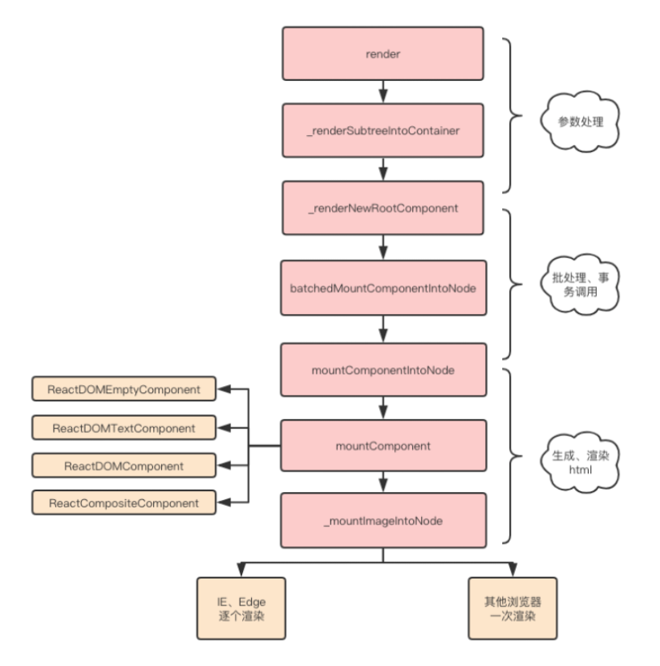

# React 虚拟dom 和 diff

`react`中`diff`算法主要遵循三个层级的策略：

- tree层级
- conponent 层级
- element 层级

### tree层级

`DOM`节点跨层级的操作不做优化，只会对相同层级的节点进行比较
只有删除和创建操作

### conponent层级

如果是同一个类的组件，则会继续往下`diff`运算，如果不是一个类的组件，那么直接删除这个组件下的所有子节点，创建新的

### element层级

对于比较同一层级的节点们，每个节点在对应的层级用唯一的`key`作为标识

提供了 3 种节点操作，分别为 `INSERT_MARKUP`(插入)、`MOVE_EXISTING` (移动)和 `REMOVE_NODE` (删除)

--- 
## jsx转dom
在`react`源码中，虚拟`Dom`转化成真实`Dom`整体流程如下图所示：

- 使用React.createElement或JSX编写React组件，实际上所有的 JSX 代码最后都会转换成React.createElement(...) ，Babel帮助我们完成了这个转换的过程。
- createElement函数对key和ref等特殊的props进行处理，并获取defaultProps对默认props进行赋值，并且对传入的孩子节点进行处理，最终构造成一个虚拟DOM对象
- ReactDOM.render将生成好的虚拟DOM渲染到指定容器上，其中采用了批处理、事务等机制并且对特定浏览器进行了性能优化，最终转换为真实DOM

---

## react优化

- 避免使用内联函数
    
- 使用 React Fragments 避免额外标记
    
- 使用 Immutable
    
- 懒加载组件
    
- 事件绑定方式
    
- 服务端渲染