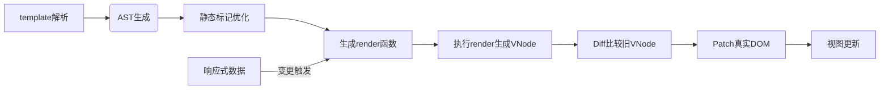

# Vue 模板渲染过程详解

Vue 的模板渲染是一个将 `template` 转换为真实 DOM 的复杂过程，涉及 **模板解析、虚拟 DOM 生成、响应式更新** 三个阶段。以下是其核心步骤详解：

---

### **一、模板编译阶段（Build Time）**
#### **1. 模板解析（Parse）**
- **输入**：`.vue` 文件的 `<template>` 内容或通过 `template` 选项传递的字符串。
- **处理工具**：Vue 的**模板编译器**。
  
**过程**：
```text
template 字符串 → 词法分析（Lexical Analysis）→ 生成 AST（抽象语法树）
```
- **AST 示例**：
  ```javascript
  {
    type: 1, // 元素节点
    tag: 'div',
    attrs: [{ name: 'class', value: 'container' }],
    children: [
      { type: 2, text: '{{ message }}' } // 动态文本节点
    ]
  }
  ```

#### **2. 优化阶段（Optimize）**
- **静态节点标记**：遍历 AST，标记**静态节点（不会变化的节点）**。
  ```javascript
  // 静态节点标记示例
  staticRoot: true, // 整棵树为静态
  static: true      // 单节点为静态
  ```
- **跳过静态节点 Diff**：优化后续 `render` 和 `patch` 性能。

#### **3. 生成可执行代码（Generate）**
将 AST 转换为 `render` 函数字符串（JavaScript 代码）：
```javascript
// AST → render 函数
function render() {
  return _c('div', { class: 'container' }, [_v(_s(message))]);
}
// _c 为 createElement，_v 为创建文本节点，_s 为 toString
```

---

### **二、虚拟 DOM 生成阶段（Runtime）**
#### **1. 执行 `render` 函数**
- **触发条件**：首次渲染或响应式数据变更。
- **结果**：生成**虚拟 DOM（VNode 树）**，描述真实 DOM 结构。
  
#### **2. 虚拟 DOM 结构示例**
```javascript
const vnode = {
  tag: 'div',
  data: { class: 'container' },
  children: [
    { type: 3, text: 'Hello Vue' } // 3 表示文本节点
  ]
};
```

---

### **三、Diff & Patch 阶段（Runtime）**
#### **1. Diff 算法比较新旧 VNode**
- **目标**：找出需要更新的最小节点集合。
- **关键策略**：
  - **同层比较（逐层比较，不跨层级）**
  - **双端指针（头尾同时比对，减少移动成本）**
  - **Key 优化（识别节点复用）**

#### **2. 生成 DOM 更新指令**
根据 Diff 结果生成 DOM 操作指令：
- **新增节点**：`createElement` → `appendChild`
- **删除节点**：`removeChild`
- **更新节点**：`patchProps`、`patchText` 等

#### **3. 应用更新到真实 DOM**
执行生成的 DOM 操作指令，更新视图。

---

### **四、响应式更新流程**
#### **触发更新过程**
```text
数据变更 → 触发 setter → 通知 Watcher → 重新执行 render 函数 → 生成新 VNode → Diff & Patch
```

#### **关键优化**
- **批量异步更新（队列机制）**：确保多次数据变更合并为单次渲染（减少重复计算）。
- **异步渲染（Vue.nextTick）**：保障更新后的 DOM 操作在下一事件循环执行。

---

### **五、流程图解**


---

### **六、性能优化点**
1. **模板静态标记**：
   - Vue 自动跳过静态节点 Diff，降低计算量。
   
2. **组件级更新**：
   - 每个组件维护独立 Watcher，精准更新组件树。

3. **虚拟 DOM Diff 优势**：
   - 最小化 DOM 操作，减少性能开销。

4. **懒编译（Vue3）**：
   - 按需编译模板（如动态组件、异步组件）。

---

### **代码示例：手动触发渲染过程**
```javascript
const vm = new Vue({
  template: '<div class="container">{{ message }}</div>',
  data: { message: 'Hello Vue' }
});

// 内部过程：
const ast = parse(vm.$options.template);     // 生成 AST
optimize(ast);                               // 静态标记
const render = generate(ast);                // 生成 render 函数
const vnode = render.call(vm._renderProxy);  // 生成虚拟 DOM
vm._update(vnode);                           // 更新视图
```

---

### **总结：Vue 渲染的三大核心**
1. **编译时**：模板 → AST → render 函数。  
2. **运行时**：render → VNode → Diff/Patch。  
3. **响应式**：数据驱动视图更新，通过虚拟 DOM 实现高效渲染。  

通过将 `template` 转化为高效的 `render` 函数，并借助虚拟 DOM 和 Diff/Patch 机制，Vue 在开发体验与性能之间实现了平衡。