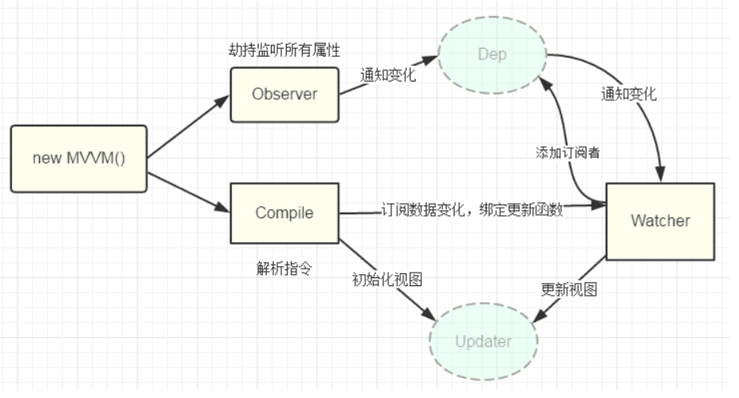

# 双向数据绑定（V-model）

- 数据层（Model）：应用的数据及业务逻辑
- 视图层（View）：应用的展示效果，各类UI组件
- 业务逻辑层（ViewModel）：框架封装的核心，它负责将数据与视图关联起来

而上面的这个分层的架构方案，可以用一个专业术语进行称呼：`MVVM`这里的控制层的核心功能便是 “数据双向绑定”

**双向绑定 = 数据变化自动更新视图 + 视图操作自动更新数据**  
以输入框为例：修改输入框内容会更新数据（View → Data），数据变化后输入框内容也会自动变化（Data → View）。

Vue 的双向数据绑定是其响应式系统的核心机制之一，主要通过 **数据劫持 + 发布-订阅模式** 实现，其核心是结合 `v-model` 指令与响应式对象属性，**自动同步视图（DOM）与数据（JS）的变化**。以下是详细实现原理：

---

### 1. **整体架构**
   - **核心模块**  
     - **Observer**（数据劫持）  
     - **Dep**（依赖管理）  
     - **Watcher**（更新调度）  
     - **Compiler**（模板解析）  



### 2. **具体步骤**

#### **2.1 数据劫持（Observer）**
Vue 通过 **劫持对象的属性访问**，将普通数据转换为响应式数据：
- **Vue 2.x**：使用 `Object.defineProperty`。
  ```javascript
  function defineReactive(obj, key) {
    const dep = new Dep();
    let val = obj[key];
    
    Object.defineProperty(obj, key, {
      enumerable: true,
      configurable: true,
      get() {
        // 访问属性时收集依赖
        if (Dep.target) {
          dep.depend(); // 将 Watcher 注册到 Dep
        }
        return val;
      },
      set(newVal) {
        if (val === newVal) return;
        val = newVal;
        dep.notify(); // 通知所有 Watcher 更新
      }
    });
  }
  ```
- **Vue 3.x**：改用 `Proxy`，可监听对象和数组深层变化。
  ```javascript
  const proxy = new Proxy(data, {
    get(target, key) {
      track(target, key); // 收集依赖
      return Reflect.get(target, key);
    },
    set(target, key, value) {
      Reflect.set(target, key, value);
      trigger(target, key); // 触发更新
      return true;
    }
  });
  ```

---

#### **2.2 依赖管理（Dep & Watcher）**
- **Dep**（Dependency）  
  每个响应式数据属性对应一个 `Dep`，用于存储所有依赖该属性的 `Watcher`。
- 每个 `Dep` 实例内部存储的是 **订阅了该属性的 `Watcher` 或 `ReactiveEffect` 对象**
- watcher（对应组件渲染、计算属性、`watch` 选项等）
- reactiveeffect（对应 `watchEffect`、`computed`、组件渲染等）
  ```javascript
  class Dep {
    static target = null; // 全局标记当前活动的 Watcher
    constructor() {
      this.subs = []; // 存储 Watcher 列表
    }
    depend() {
      if (Dep.target) {
        this.subs.push(Dep.target); // Watcher 订阅 Dep
        Dep.target.addDep(this);    // Dep 反向记录 Watcher
      }
    }
    notify() {
      this.subs.forEach(watcher => watcher.update());
    }
  }
  ```
- **Watcher**  
- Watcher订阅者是Observer和Compile之间通信的桥梁，主要做的事情是: 
  - ①在自身实例化时往属性订阅器(dep)里面添加自己 
  - ②自身必须有一个update()方法 
  - ③待属性变动dep.notice()通知时，能调用自身的update()方法，并触发Compile中绑定的回调，则功成身退。

```javascript
class Watcher {
  constructor(vm, expOrFn, cb) {
    this.vm = vm;
    this.getter = parsePath(expOrFn);
    this.cb = cb;
    this.value = this.get();
  }
  get() {
    pushTarget(this); // 将自身设置为 Dep.target
    const value = this.getter.call(this.vm, this.vm);
    popTarget();      // 恢复上一个 Watcher
    return value;
  }
  update() {
    // 触发异步更新（Vue 实际使用队列优化批量更新）
    queueWatcher(this);
  }
  run() {
    const oldValue = this.value;
    this.value = this.get();
    this.cb.call(this.vm, this.value, oldValue);
  }
}
```

---

#### **2.3 模板编译（Compiler）**
- **功能**：解析模板中的 `v-model`、`{{ }}` 等指令，生成渲染函数。
- **流程**：
  1. **解析指令**：找到所有包含 `v-model` 的节点。
  2. **绑定事件监听器**：例如对 `<input>` 元素监听 `input` 事件。
  3. **创建 Watcher**：为每个绑定项创建 `Watcher`，将视图与数据关联。

完整流程：从模板到 DOM

1. **模板编译**  
   ```html
   <!-- 模板 -->
   <div class="container">{{ message }}</div>
   ```
   ↓ 编译为  
   ```javascript
   // 渲染函数
   function render() {
     return _c('div', { class: 'container' }, [_v(_s(message))])
   }
   ```

2. **执行渲染函数**  
   调用 `render()`，生成 **vnode**：  
   ```javascript
   const vnode = render()
   // vnode 结果：
   {
     tag: 'div',
     data: { class: 'container' },
     children: [{ text: 'Hello' }]
   }
   ```

3. **虚拟 DOM 比对（Patch）**  
   将新 vnode 与旧 vnode 对比，计算出需要更新的 DOM 操作。

4. **更新真实 DOM**  
   应用变更到浏览器 DOM 上。

---

#### **2.4 双向绑定实现（v-model）**
`v-model` 是语法糖，其底层实现分两部分：
1. **数据 → 视图**：依赖数据劫持，**数据变化时通过 Watcher 更新 DOM**。
2. **视图 → 数据**：通过监听 DOM 的 `input`、`change` 等事件，更新数据。
   ```javascript
   // 简化版 v-model 实现
   function bindModel(el, vm, exp) {
     el.value = vm[exp]; // 初始数据 → 视图
     el.addEventListener('input', (e) => {
       vm[exp] = e.target.value; // 视图 → 数据
     });
     new Watcher(vm, exp, (val) => {
       el.value = val; // 数据变化时更新视图
     });
   }
   ```

---

### 3. **示例场景**
假设有如下代码：
```html
<input v-model="message">
<p>{{ message }}</p>
```

**实现步骤**：
1. **数据初始化**：通过 `defineReactive` 让 `message` 变为响应式。
2. **模板解析**：
   - 为 `<input>` 添加 `v-model` 绑定，监听 `input` 事件。
   - 为 `{{ message }}` 创建文本节点，并绑定对应的 `Watcher`。
3. **依赖收集**：
   - 首次渲染时，`message` 的 `getter` 触发，收集所有依赖的 `Watcher`（输入框和段落）。
4. **双向更新**：
   - 用户在输入框输入：触发 `input` 事件，修改 `message`，触发 `setter` 和 `dep.notify()`。
   - `dep.notify()` 调用所有 `Watcher` 的 `update()` 方法，更新视图。

---

### 4. **关键细节**
- **数组劫持**：  
  Vue 2.x 需重写数组方法（`push`, `pop`, `splice` 等）以触发更新。
- **虚拟 DOM 优化**：  
  Vue 在数据变化时不会直接操作 DOM，而是通过 **Diff 算法** 批量更新。
- **批量异步更新**：  
  同一事件循环内的数据变更会被合并，避免频繁更新视图（`nextTick` 机制）。
- **代理对象（Vue 3.x）**：  
  `Proxy` 可深层监听对象和数组，无需遍历属性，支持动态新增属性。

---

### 5. **差异对比（Vue 2.x vs Vue 3.x）**
| **特性**            | **Vue 2.x**             | **Vue 3.x**               |
|---------------------|-------------------------|---------------------------|
| 数据劫持方法         | `Object.defineProperty` | `Proxy`                   |
| 数组监听             | 需重写数组方法          | 原生支持                  |
| 动态属性响应         | 不支持，需用 `Vue.set`  | 直接支持                  |
| 性能优化             | 相对较低                | 更高（惰性依赖收集）      |
| 深层对象响应         | 递归初始化所有层        | 按需劫持，延迟初始化      |

---

### 6. **代码实现总结**
```javascript
// 双向绑定核心逻辑
class Vue {
  constructor(options) {
    this._data = options.data;
    observe(this._data);     // 数据劫持
    new Compiler(options.el, this); // 模板编译
  }
}

// Observer（Vue 2.x风格）
function observe(data) {
  Object.keys(data).forEach(key => {
    defineReactive(data, key, data[key]);
  });
}

// 完整双向绑定流程：
// 1. 数据初始化 → 2. 模板解析 → 3. 依赖收集 → 4. 双向触发更新
```
