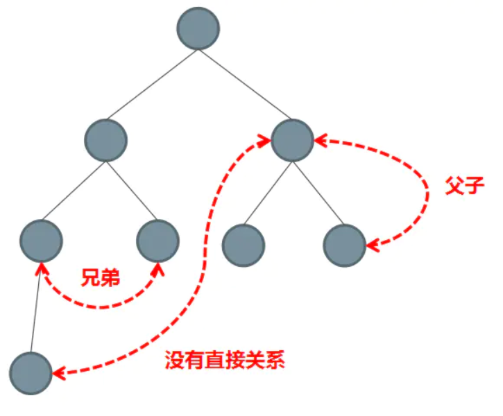

- 父子组件之间的通信
- 兄弟组件之间的通信
- 祖孙与后代组件之间的通信
- 非关系组件间之间的通信


1. 通过 props 传递
2. 通过 $emit 触发自定义事件
3. 使用 ref
4. EventBus
5. $parent 或 $root
6. attrs 与 listeners
7. Provide 与 Inject
8. Vuex、Pinia

https://cn.vuejs.org/api/component-instance.html
## props

父传子

父组件

```vue 
<template>
    <div>
        <h1>向子组件传递a的值</h1>
        <son :A="a"/>
    </div>
</template>
```

子组件

```vue
<template>
    <div>
        a的值是：{{ value }}
    </div>
</template>
 
<script setup lang="ts">
import {ref} from "vue";
 
const props = defineProps<{
    A: number
}>()
 
const value = ref<number>(props.A)
 
</script>
```

每次父组件更新后，所有的子组件中的 props 都会被更新到最新值，这意味着你**不应该**在子组件中去更改一个 prop。若你这么做了，Vue 会在控制台上向你抛出警告： ❌ 警告！prop 是只读的！

如果你想要改 可以套一层


## $emit 

1.在父组件中定义函数，该函数用于接收子组件通过emits传过来的值以及修改父组件页面中的值

2.在父组件标签内部把该函数传递给子组件

3.子组件通过emits方式接收

4.子组件通过某种方式触发该emits

父组件
```vue
<template>
    <div>
        <div>a:{{a}}</div>
        <son @changeA="triggerEvent"/>
    </div>
</template>
 
<script setup lang="ts">
import{ref} from "vue";
import Son from "@/components/son.vue";
const a=ref(0);
//这里的X是子组件通过emit传递过来的
const triggerEvent=(X:number)=>{
    a.value=X
}
</script>
```

子组件
```vue
<template>
    <div>
        <button @click="emits('changeA',20)">修改父组件A的值</button>
    </div>
</template>
 
<script setup lang="ts">
const emits=defineEmits<{
    (e:'changeA',value:number):void
}>()
</script>
 
```


## ref

- 父组件在使用子组件的时候设置`ref`
- 父组件通过设置子组件`ref`来获取数据

父组件

```vue
<Children ref="foo" />  
  
this.$refs.foo  // 获取子组件实例，通过子组件实例我们就能拿到对应的数据  非响应式
```


## provide 与 inject

- 在祖先组件定义`provide`属性，返回传递的值
- 在后代组件通过`inject`接收组件传递过来的值

父组件

```vue
<template>
    <div>
        <h1>父组件</h1>
        父组件的a值：{{a}}
        <button @click="add">a值+1</button>
        <hr>
        <son/>
    </div>
</template>
 
<script setup lang="ts">
import{ref,provide} from "vue";
import Son from "@/components/son.vue";
const a=ref<number>(0);
provide('A',a);
const add=()=>{
    a.value++;
}
</script>
 
```

子组件
```vue
<template>
    <div>
        <h1>孙组件</h1>
        孙组件的a值：{{ a }}
        <button @click="add">a值+1</button>
    </div>
</template>
 
<script setup lang="ts">
import {inject, Ref} from "vue";
 
const a = inject<Ref<number>>('A')
const add = () => {
    if (a) {
        a.value++
    }
}
</script>
```


## vuex  pinia

pinia 安装会在router后

```js
import { createApp } from 'vue'
import { createPinia } from 'pinia'
import App from './App.vue'

const pinia = createPinia()
const app = createApp(App)

app.use(pinia)
app.mount('#app')
```

定义store 内有三个部分 
- `ref()` 就是 `state` 属性
- `computed()` 就是 `getters`
- `function()` 就是 `actions` **`action` 可以是异步的**，你可以在它们里面 `await` 调用任何 API
```js
export const useCounterStore = defineStore('counter', () => {
  const count = ref(0)
  const doubleCount = computed(() => count.value * 2)
  function increment() {
    count.value++
  }

  return { count, doubleCount, increment }
})
```
使用store
```js
<script setup>
import { storeToRefs } from 'pinia'
const store = useCounterStore()
// `name` 和 `doubleCount` 是响应式的 ref
// 同时通过插件添加的属性也会被提取为 ref
// 并且会跳过所有的 action 或非响应式 (不是 ref 或 reactive) 的属性
const { name, doubleCount } = storeToRefs(store)
// 作为 action 的 increment 可以直接解构
const { increment } = store
</script>
```


## EventBus

v3干掉了EventBus  `vue3-eventbus mitt`

- 使用场景：兄弟组件传值
- 创建一个中央事件总线`EventBus`
- 兄弟组件通过`$emit`触发自定义事件，`$emit`第二个参数为传递的数值
- 另一个兄弟组件通过`$on`监听自定义事件


## $parent 或 $ root

- 通过共同祖辈`$parent`或者`$root`搭建通信桥连

兄弟组件

`this.$parent.on('add',this.add)`

另一个兄弟组件

`this.$parent.emit('add')`

也被v3砍了应该


## $attrs 与 $listeners

v3 listeners砍了

- 适用场景：祖先传递数据给子孙
- 设置批量向下传属性`$attrs`和 `$listeners`
- 包含了父级作用域中不作为 `prop` 被识别 (且获取) 的特性绑定 ( class 和 style 除外)。
- 可以通过 `v-bind="$attrs"` 传⼊内部组件

```vue
// child：并未在props中声明foo  
<p>{{$attrs.foo}}</p>  
  
// parent  
<HelloWorld foo="foo"/>  
```


```vue
// 给Grandson隔代传值，communication/index.vue  
<Child2 msg="lalala" @some-event="onSomeEvent"></Child2>  
  
// Child2做展开  
<Grandson v-bind="$attrs" v-on="$listeners"></Grandson>  
  
// Grandson使⽤  
<div @click="$emit('some-event', 'msg from grandson')">  
{{msg}}  
</div>  
```