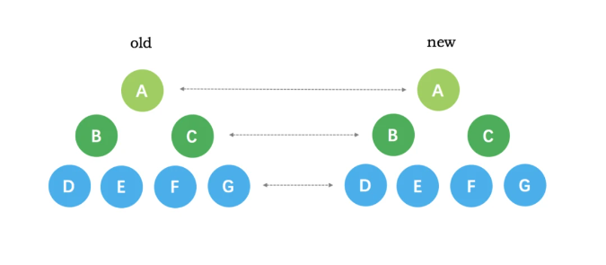
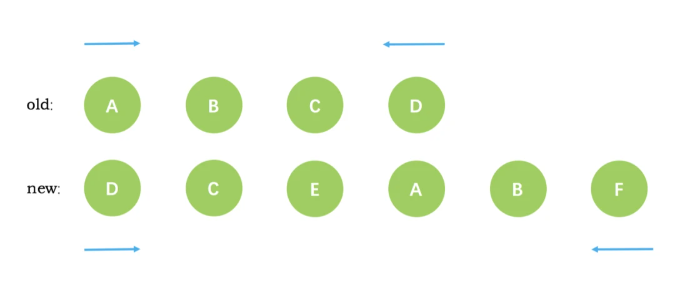

# 虚拟 DOM 和 diff

虚拟 DOM (Virtual DOM，简称 VDOM) 是一种编程概念，意为将目标所需的 UI 通过数据结构“虚拟”地表示出来，保存在内存中，然后将真实的 DOM 与之保持同步。

如果我们有两份虚拟 DOM 树，渲染器将会有比较地遍历它们，找出它们之间的区别，并应用这其中的变化到真实的 DOM 上。这个过程被称为**更新** (patch)，又被称为“比对”(diffing) 或“协调”(reconciliation)。

`DOM`是很慢的，其元素非常庞大，页面的性能问题，大部分都是由`DOM`操作引起的

而通过`VNode`，同样更新10个`DOM`节点，虚拟`DOM`不会立即操作`DOM`，而是将这10次更新的`diff`内容保存到本地的一个`js`对象中，最终将这个`js`对象一次性`attach`到`DOM`树上，避免大量的无谓计算

很多人认为虚拟 DOM 最大的优势是 diff 算法，减少 JavaScript 操作真实 DOM 的带来的性能消耗。虽然这一个虚拟 DOM 带来的一个优势，但并不是全部。虚拟 DOM 最大的优势在于抽象了原本的渲染过程，实现了跨平台的能力


`diff` 算法是一种通过同层的树节点进行比较的高效算法

其有两个特点：

- 比较只会在同层级进行, 不会跨层级比较
- 在diff比较的过程中，循环从两边向中间比较

`diff`整体策略为：深度优先，同层比较

1. 比较只会在同层级进行, 不会跨层级比较


1. 比较的过程中，循环从两边向中间收拢



`vue3`在`diff`算法中相比`vue2`增加了静态标记，已经标记静态节点的`p`标签在`diff`过程中则不会比较，把性能进一步提高

`Vue3`中对不参与更新的元素，会做静态提升，只会被创建一次，在渲染时直接复用


```js
// 旧子节点：[A, B, C, D]
// 新子节点：[D, A, B, E]

// 1. 头尾比较
旧头A vs 新头D → 不匹配
旧尾D vs 新尾E → 不匹配
旧头A vs 新尾E → 不匹配
旧尾D vs 新头D → 匹配！将D移动到最前面

// 2. 更新指针继续比较
旧子节点：[A, B, C] 
新子节点：[A, B, E]

// 3. 头头匹配（A vs A）
复用A，指针后移

// 4. 头头匹配（B vs B）
复用B，指针后移

// 5. 剩余旧节点C，新节点E
无复用节点，创建E并插入，删除C
```


### **Diff 算法在 Vue 2 vs Vue 3 的差异**

|**特性**|**Vue 2**|**Vue 3**|
|---|---|---|
|**算法核心**|双端比较 + 递归遍历子节点|动态子序列优化（贪心 + LIS）|
|**静态标记**|无|标记静态节点，跳过 Diff|
|**事件缓存**|无|缓存事件处理函数|
|**Fragment**|不支持|支持多根节点|
