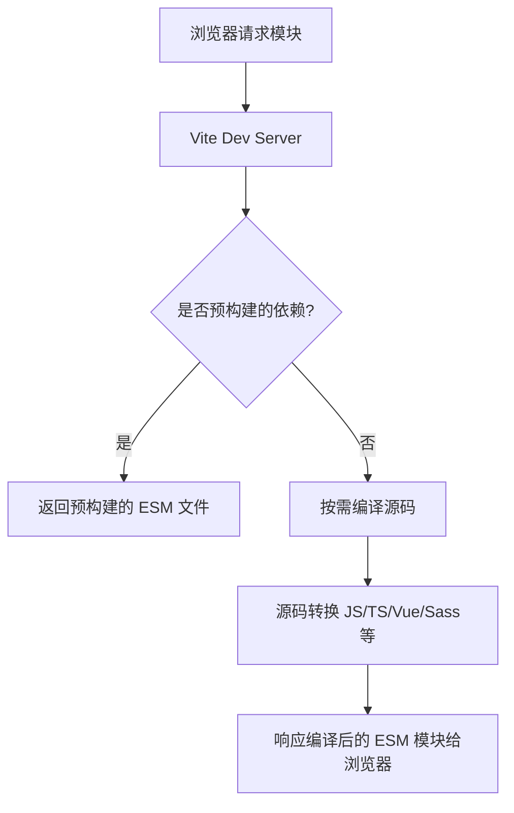

# vite

（1）构建原理： Webpack 是一个静态模块打包器，通过对项目中的 JavaScript、CSS、图片等文件进行分析，生成对应的静态资源，并且可以通过一些插件和加载器来实现各种功能；Vite 则是一种基于浏览器原生 ES 模块解析的构建工具。
  (2) dev启动时，Vite 通过在一开始将应用中的模块区分为 **依赖** 和 **源码** 两类，改进了开发服务器启动时间。Vite 以 [原生 ESM](https://developer.mozilla.org/en-US/docs/Web/JavaScript/Guide/Modules) 方式提供源码。这实际上是让浏览器接管了打包程序的部分工作：Vite 只需要在浏览器请求源码时进行转换并按需提供源码。根据情景动态导入代码，即只在当前屏幕上实际使用时才会被处理。
（2）打包速度： Webpack 的打包速度相对较慢，Vite 的打包速度非常快。
（3）配置难度： Webpack 的配置比较复杂，因为它需要通过各种插件和加载器来实现各种功能；Vite 的配置相对简单，它可以根据不同的开发场景自动配置相应的环境变量和配置选项。
（4）插件和加载器： Webpack 有大量的插件和加载器可以使用，可以实现各种复杂的构建场景，例如代码分割、按需加载、CSS 预处理器等；Vite 的插件和加载器相对较少
（5）Vite是按需加载，webpack是全部加载： 在HMR（热更新）方面，当改动了一个模块后，vite 仅需让浏览器重新请求该模块即可，不像 webpack 那样需要把该模块的相关依赖模块全部编译一次，效率更高。
（6）Vite 同时利用 HTTP 头来加速整个页面的重新加载（再次让浏览器为我们做更多事情）：源码模块的请求会根据 `304 Not Modified` 进行协商缓存，而依赖模块请求则会通过 `Cache-Control: max-age=31536000,immutable` 进行强缓存，因此一旦被缓存它们将不需要再次请求。
（6）webpack 
是先打包再启动开发服务器，vite是直接启动开发服务器，然后按需编译依赖文件 由于vite在启动的时候不需要打包，也就意味着不需要分析模块的依赖、不需要编译，因此启动速度非常快。当浏览器请求某个模块时，再根据需要对模块内容进行编译，这种按需动态编译的方式，极大的缩减了编译时间。


Vite 是一个现代化的前端构建工具，由 Vue.js 作者尤雨溪开发，主要解决了传统构建工具（如 Webpack）在开发环境下的性能瓶颈问题。其核心实现围绕 **原生 ES 模块（Native ESM）** 和 **按需编译** 理念展开，以下是其工作原理的详解：

---

### **一、Vite 的核心设计思想**
1. **开发环境**：  
   - **基于浏览器的原生 ES 模块**，避免打包整个应用。  
   - **按需编译**，仅转换当前页面所需资源。  
   - **快速冷启动**，无需等待打包完成。  

2. **生产环境**：  
   - 基于 **Rollup**（性能优秀的打包工具）进行 Tree-shaking 和代码优化。  
   - 生产构建依然追求高性能和最佳实践。  

---

### **二、开发模式的核心实现**
#### **1. 原生 ESM 动态加载**
Vite 在开发环境下直接将源码以原生 ES 模块的形式提供给浏览器，无需预先打包。  
- **浏览器发起请求**：  
  请求如 `http://localhost:3000/src/main.js`，Vite 服务器返回未打包的代码。  
- **依赖处理**：  
  - 代码中通过 `import` 导入的模块会被浏览器再次请求。  
  - Vite 通过劫持浏览器请求，按需编译这些模块（如 `.vue`、`.ts` 文件），并返回给浏览器。  

#### **2. 按需编译（On-demand Compilation）**
对于非 JS 文件（如 `.vue`、`.tsx`、`.scss`），Vite 通过 **中间件（Plugin Middleware）** 实时编译：  
```text
浏览器请求  →  Vite 服务器拦截请求  →  按需编译文件  →  返回编译后内容
```

- **支持的编译能力**：  
  - TypeScript → `.ts` → `.js`  
  - Vue SFC → `.vue` → `.js` + `.css`  
  - CSS 预处理器（Sass/Less） → `.scss` → `.css`  
  - JSX → `.jsx` → `.js`  

#### **3. 依赖预构建（Pre-Bundling）**
- **触发条件**：  
  首次运行 `vite dev` 时，或依赖变更（如 `package.json` 修改）。  
- **实现步骤**：  
  1. 使用 `esbuild` 将项目依赖的 CommonJS 转换为 ESM 格式。  
  2. 将多个小文件合并成少数大文件，减少浏览器并发请求压力。  
  3. 缓存预构建结果（存储在 `node_modules/.vite`）。  
- **优势**：  
  - 加速后续启动速度（依赖库无需实时编译）。  
  - 解决 ESM 依赖的兼容性问题（某些库未导出 ESM）。  

#### **4. 热模块替换（HMR）优化**
与传统工具的 HMR 不同，Vite 的 HMR 直接在 ESM 的边界生效：  
- **精准更新**：  
  仅替换被修改的模块及其依赖链，无需刷新页面。  
- **毫秒级响应**（借助 ESM 的依赖关系追踪）。  
- **支持框架级的 HMR**：  
  Vue 单文件组件、React Fast Refresh 等。  

---

### **三、生产环境构建**
生产模式下，Vite 切换到基于 Rollup 的打包逻辑，但保留了开发工具链的优化经验：  
1. **Tree-shaking**：Rollup 提供的强大死代码剔除（优于 Webpack 的 Scope Hoisting）。  
2. **代码分块（Code Splitting）**：支持动态导入自动拆包（如路由懒加载）。  
3. **静态资源处理**：自动压缩、文件名哈希（CDN 缓存友好）。  
4. **插件系统**：兼容 Rollup 插件生态（如 `@rollup/plugin-image`），且扩展了 Vite 专有插件。  

---

### **四、核心组件与架构**
#### **1. Vite 的模块解析与转换流程**


#### **2. 关键依赖工具**
- **esbuild**：超快的预构建工具（用 Go 编写，比 Babel 快 10-100 倍）。  
- **Rollup**：生产构建的核心打包器（支持 Tree-shaking 和插件扩展）。  
- **Connect**：基于 Node.js 的轻量 HTTP 服务器框架（处理中间件链）。  

---

### **五、性能优化机制**
- **缓存策略**：  
  - 预构建依赖缓存（避免重复转换）。  
  - 源码编译缓存（相同文件快速响应）。  
- **懒编译**：仅编译当前访问的页面所需文件（SPA 按路由加载）。  
- **并行处理**：利用多核 CPU 预构建依赖（`esbuild` 的并行能力）。  

---

### **六、与传统工具（Webpack）的对比**
| **维度**        | **Vite** (开发环境)                     | **Webpack** (开发环境)            |  
|-------------------|----------------------------------------|----------------------------------|  
| **启动速度**      | **极快**（无打包阶段）                  | **慢**（需完整打包）               |  
| **HMR 响应**      | **毫秒级**（基于 ESM 精准更新）         | **较慢（需重新打包变更模块）**       |  
| **构建生态**      | 兼容 Rollup 插件 + 自研扩展            | 庞大但独立的插件体系                |  
| **适用场景**      | 现代浏览器项目、追求开发体验            | 旧项目、复杂配置需求                |  

---

### **七、适用场景与局限性**
- **优势场景**：  
  - 需要快速启动和热更新的现代前端应用（如 Vue/React 单页应用）。  
  - TypeScript、Vue 3、JSX 开箱即用。  
- **局限性**：  
  - 对老旧浏览器支持较弱（依赖原生 ESM）。  
  - 复杂多页应用（MPA）需手动配置优化。  
  - 生产构建对旧项目可能存在兼容性问题。  

---

### **总结**
Vite 通过 **开发环境的原生 ESM 支持** 和 **按需编译**，彻底革新了开发阶段的体验，同时配合高效的生产打包机制，成为现代前端工具链的重要一环。通过 **esbuild** 和 **Rollup** 的结合，既保证了开发速度，又能输出高性能的生产代码，是如今构建高效前端项目的首选工具。