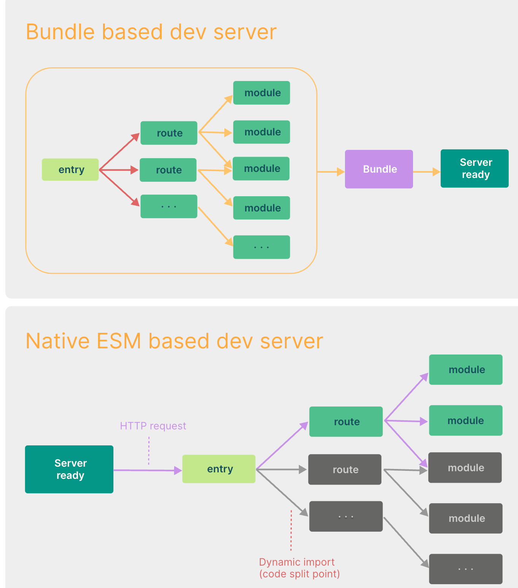

（1）构建原理： Webpack 是一个静态模块打包器，通过对项目中的 JavaScript、CSS、图片等文件进行分析，生成对应的静态资源，并且可以通过一些插件和加载器来实现各种功能；Vite 则是一种基于浏览器原生 ES 模块解析的构建工具。
  (2) dev启动时，Vite 通过在一开始将应用中的模块区分为 **依赖** 和 **源码** 两类，改进了开发服务器启动时间。Vite 以 [原生 ESM](https://developer.mozilla.org/en-US/docs/Web/JavaScript/Guide/Modules) 方式提供源码。这实际上是让浏览器接管了打包程序的部分工作：Vite 只需要在浏览器请求源码时进行转换并按需提供源码。根据情景动态导入代码，即只在当前屏幕上实际使用时才会被处理。
（2）打包速度： Webpack 的打包速度相对较慢，Vite 的打包速度非常快。
（3）配置难度： Webpack 的配置比较复杂，因为它需要通过各种插件和加载器来实现各种功能；Vite 的配置相对简单，它可以根据不同的开发场景自动配置相应的环境变量和配置选项。
（4）插件和加载器： Webpack 有大量的插件和加载器可以使用，可以实现各种复杂的构建场景，例如代码分割、按需加载、CSS 预处理器等；Vite 的插件和加载器相对较少
（5）Vite是按需加载，webpack是全部加载： 在HMR（热更新）方面，当改动了一个模块后，vite 仅需让浏览器重新请求该模块即可，不像 webpack 那样需要把该模块的相关依赖模块全部编译一次，效率更高。
（6）Vite 同时利用 HTTP 头来加速整个页面的重新加载（再次让浏览器为我们做更多事情）：源码模块的请求会根据 `304 Not Modified` 进行协商缓存，而依赖模块请求则会通过 `Cache-Control: max-age=31536000,immutable` 进行强缓存，因此一旦被缓存它们将不需要再次请求。
（6）webpack 
是先打包再启动开发服务器，vite是直接启动开发服务器，然后按需编译依赖文件 由于vite在启动的时候不需要打包，也就意味着不需要分析模块的依赖、不需要编译，因此启动速度非常快。当浏览器请求某个模块时，再根据需要对模块内容进行编译，这种按需动态编译的方式，极大的缩减了编译时间。

Vite 是一种新型的前端构建工具，旨在通过**快速开发**和**高效打包**来改善开发体验。相比传统工具如 Webpack 或 Gulp，Vite 使用了现代浏览器的原生 ES 模块支持和高性能打包工具（如 `esbuild` 和 `rollup`）来提高速度和效率。

### Vite 的打包过程主要包括以下步骤：

### 1. **依赖预构建**
Vite 在开发阶段有一个**依赖预构建（dependency pre-bundling）**的过程。使用 `esbuild` 进行依赖预处理，这比传统工具处理依赖的速度快得多。

- **为什么需要依赖预构建？**
  - 有些依赖包是用 CommonJS 或者 UMD 格式编写的，而现代浏览器只支持 ES 模块。因此，Vite 会在启动时把这些依赖预先转换为 ES 模块。
  - 这样做可以提高开发阶段的热重载（HMR）性能，因为浏览器加载时不会重复解析每个依赖包的所有模块。

### 2. **生产环境构建**
当你准备将应用打包用于生产时，Vite 会使用 `Rollup` 进行完整的打包过程。`Rollup` 是一个专注于 ES 模块的打包工具，Vite 借助它来优化、压缩和输出最终的生产代码。

#### 生产构建的步骤如下：

1. **文件打包与代码拆分**：
   - Vite 使用 `Rollup` 处理项目中的所有模块，将它们按照依赖关系打包到一起。它会根据代码的模块化特性进行**代码拆分**（code splitting），将不同的模块按需加载，以提高性能。
   - Vite 的代码拆分策略可以确保重要的代码在应用加载时立即可用，而次要的代码可以延迟加载。

2. **静态资源处理**：
   - Vite 可以处理静态资源如 CSS、图片、字体等。在打包过程中，它会将这些资源转为模块，可以通过 `import` 语法进行引入。图片和字体等文件会被处理成 base64 编码或被复制到输出目录中。
   - Vite 内置了处理 `.css`, `.scss`, `.less`, 以及 `.svg`, `.png` 等资源的能力，打包时会将这些资源优化并打包。

3. **Tree Shaking（树摇优化）**：
   - `Rollup` 提供了强大的**树摇优化**功能，它可以自动移除未使用的代码，减少打包后的文件大小。通过这种方式，Vite 能够在生产构建中生成更小、更高效的代码包。

4. **代码压缩**：
   - 在打包过程中，Vite 会对 JavaScript 和 CSS 进行压缩。通常会使用 `Terser`（用于 JavaScript）和 `cssnano`（用于 CSS）等工具来进行压缩和混淆，减少文件大小。
   
5. **生产环境配置**：
   - Vite 支持通过 `vite.config.js` 来配置生产环境的构建选项。在配置文件中可以指定入口文件、输出路径、别名、全局变量注入等。
   - 可以根据生产环境的需求，修改优化策略，例如开启 Gzip 压缩、指定 CDN 地址等。

### 3. **构建优化**
Vite 的打包优化体现在以下几个方面：
- **现代模式**：Vite 生成的代码主要面向现代浏览器，自动移除了对不必要的旧版浏览器的支持。你也可以通过 `build.target` 指定构建的目标浏览器版本。
- **动态导入**：Vite 支持**动态导入**，使得代码按需加载，减少初始加载的代码体积。
- **CSS 代码分割**：Vite 自动进行 CSS 文件的分割和按需加载，减少了不必要的全局样式加载，提高页面渲染速度。

### 4. **输出结果**
打包完成后，Vite 会输出如下结构的文件：
- **`index.html`**：作为入口文件，会自动注入所有必要的脚本和样式。
- **`assets/` 目录**：存储所有静态资源，如图片、字体、CSS 等。Vite 会为每个资源生成带有哈希值的文件名，以确保缓存有效性。
- **`dist/` 目录**：存放最终的打包结果，准备好部署到生产环境。

### Vite 打包流程的核心步骤：
1. **预构建依赖**：使用 `esbuild` 将第三方依赖预打包为 ES 模块。
2. **Rollup 打包**：使用 `Rollup` 进行代码打包，处理静态资源和代码拆分。
3. **压缩和优化**：对代码进行压缩，进行 Tree Shaking，移除未使用的代码。
4. **输出生产环境文件**：生成经过优化的 HTML、JS、CSS 和静态资源文件。