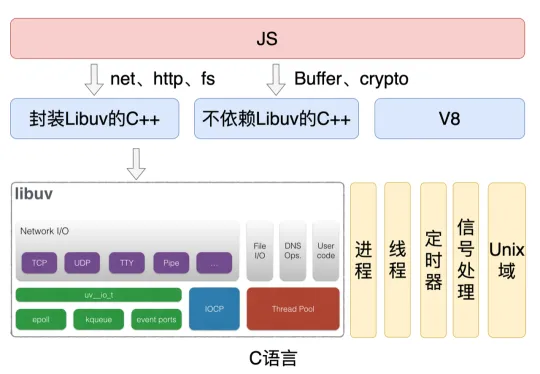

# nodejs

node 由 v8，libuv，第三方库组成。 让 js 具备了操作系统提供的能力（文件模块，os，多线程等）以及异步非阻塞 IO 特性，js 和事件循环运行在单线程上 ，适合做 IO 密集型任务，不适合做 cpu 密集型任务。  

- 所有的异步会维护在一个 事件循环中(队列)，就是所说的**单线程** 
- 会不断的去**事件循环**中取出任务来执行，所以CPU密集型的任务会造成执行时间过长，导致其他任务无法执行。这样整个程序的性能就不行了。  

