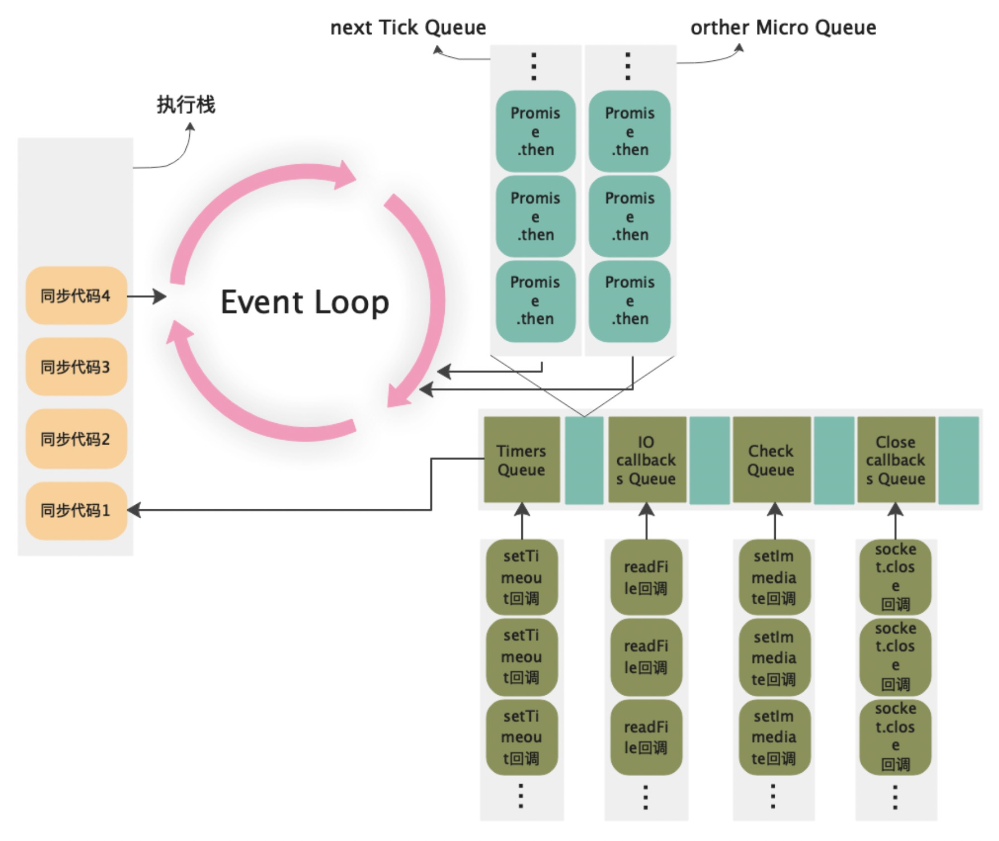

# Node.js 中的事件循环

事件循环由 **libuv 库** 驱动，按固定顺序循环执行以下 **6 个阶段** （每个阶段对应特定任务队列）：

1. **Timers**
    
    - 处理 `setTimeout` 和 `setInterval` 的回调。
    - 仅检查**当前时间是否满足计时器条件** ，否则跳到下一阶段。
2. **Pending Callbacks**
    
    - 执行系统操作（如 TCP 错误、FS 操作）的 pending 回调。
3. **Idle/Prepare**
    
    - 内部使用的准备阶段（开发者无需关心）。
4. **Poll（轮询阶段）**
    
    - **核心阶段** ，负责处理 I/O 事件（如文件读写、网络请求回调）和计算阻塞时间。
    - 执行直到队列为空或达到系统限制：
        - **若定时器到期** ：跳到 **Timers 阶段** 执行回调。
        - **若无任务** ：检查是否有 `setImmediate` 回调，有则进入 **Check 阶段** 。
5. **Check**
    
    - 执行 `setImmediate` 注册的回调（优先级高于定时器）。
6. **Close Callbacks**
    
    - 处理关闭事件的回调（如 `socket.on('close', ...)`）。

微任务**不属于事件循环阶段** ，而是在 **每个阶段切换时优先执行** ，包括：

- `process.nextTick()`（Node.js 特有，优先级最高）。
- `Promise` 回调（ES6+ 规范）。
- 微任务 process.nextTick()优先级高于 Promise
- 宏任务无优先级，按照事件循环顺序执行，timers （定时器最低设置 1ms）开始

	- 在 poll 阶段时候会同步清空所有回调并停在此阶段，假如 timer 和 check 无任务执行
	
		- 直到 check 和 timer 有任务才继续循环

- 一旦执行一个阶段里的一个任务（setTimeout，setInterval 和 setImmediate），会立刻执行微任务队列

