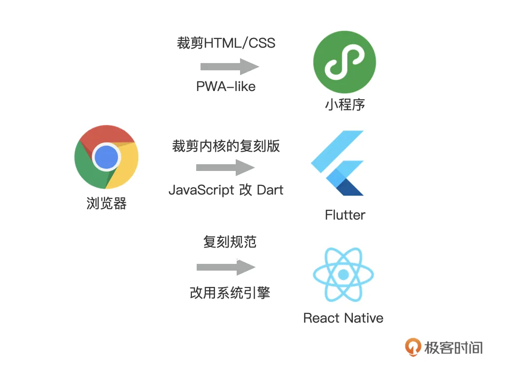
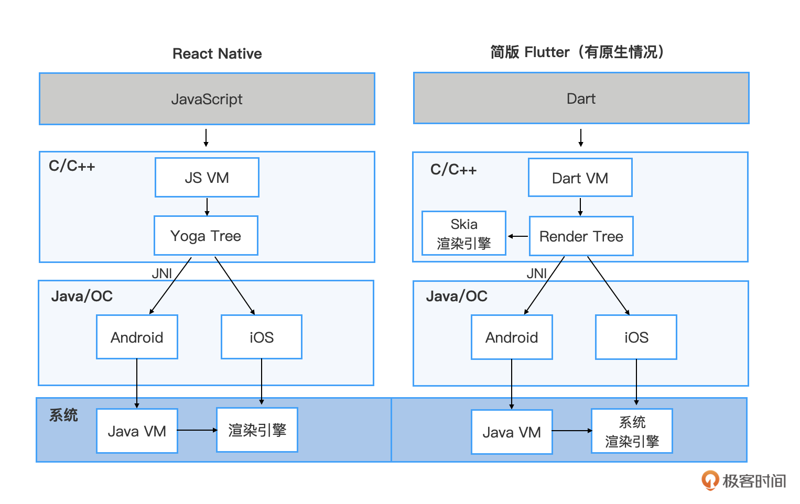
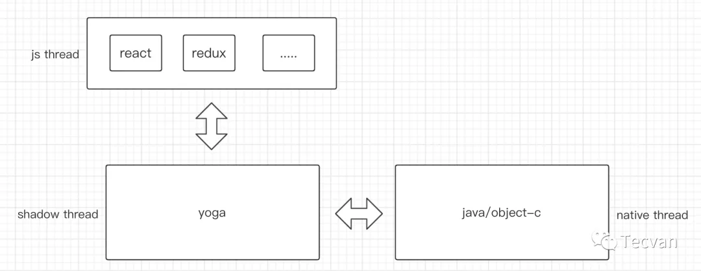
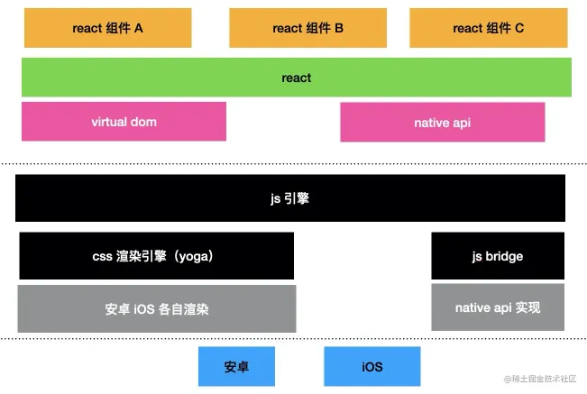
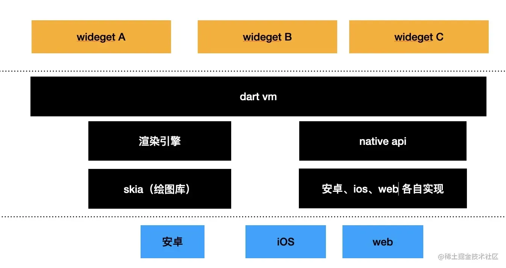
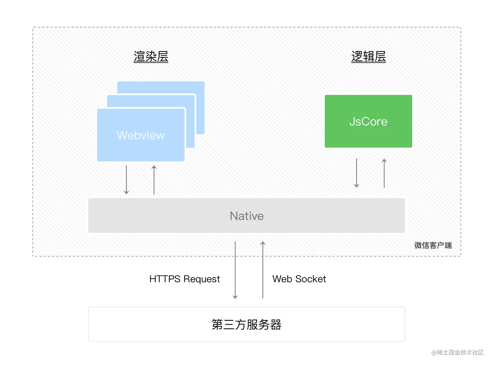

这里的跨端，是指跨客户端，目前一般有嵌入 webview，rn，flutter，都想通过在开发层写一套代码，就可以运行在各种平台，总的来说就是我知道我想要什么，但是我没有能力去渲染，我要通知有能力渲染的人来帮助我渲染

React Native：
让 js 的能力逃离浏览器，可以获得系统原生的接口调用能力

js 线程负责处理逻辑和 diff，将结果发送到 shadow 线程进行布局计算，最后通过 bridge 通知 native 线程去调用原生的能力渲染 ui，通信只能通过 bridge，时限性要求高的常见性能不太好，同时 bridge 将底层的原生能力（比如通知，定位等）封装成 js 接口给 js 线程调用

- native thread 监听到了滚动事件，发送消息通知
- js threadjs thread 处理滚动事件，如果需要修改 state 需要经过一层js diff，拿到最终需要更新的结点
- js thread 通知 shadow threadshadow thread 通知 native 渲染
- 当用户操作过快的时候，就会导致界面来不及更新，进而导致在快速滑动的时候会出现**白屏、卡顿**的现象。

flutter：

它最大的特点是渲染不是基于操作系统的组件，直接调用底层绘制库 skia 来做到跨端渲染，逻辑跨端是自研的 dart vm 虚拟机，相当于自己实现的一个小浏览器

小程序：

小程序的渲染层和逻辑层分别由两个线程管理，不会相互堵塞（将逻辑层与视图层进行分离，视图层和逻辑层之间只有数据的通信，可以防止开发者随意操作界面，更好的保证了用户数据安全。）：

- 渲染层的界面使用 WebView （具有 js 能力但 js 不在这里运行）进行渲染；
- 逻辑层采用 JSCore 运行 JavaScript 代码。一个小程序存在多个界面，所以渲染层存在多个 WebView。这两个线程间的通信经由小程序 Native 侧中转，逻辑层发送网络请求也经由 Native 侧转发

小程序框架的逻辑层并非运行在浏览器中，因此 JavaScript 在 web 中一些能力都无法使用，如 window，document

