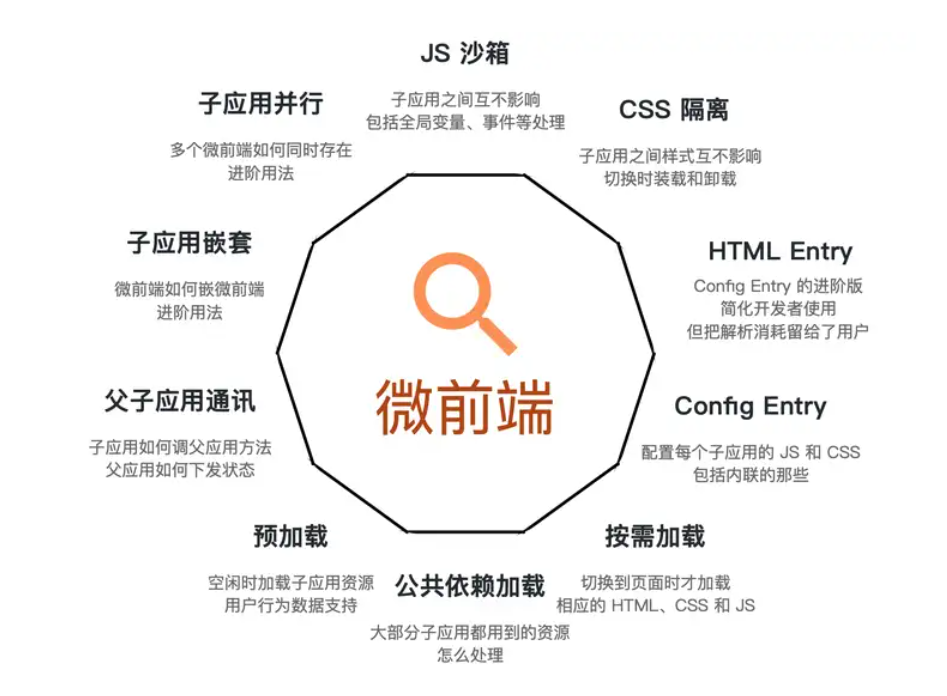

## 微组件构想

类似一个react server components

iframe方案或其他 

子组件 ssr 渲染过来 发 html js 再水合

要技术栈无关

组件数据流通  父可以给子发数据




## 康威定律

🤓☝️你说得对但是康威定律是一个架构定律。

> 设计系统的架构受制于产生这些设计的组织的沟通结构。  — M.Conway

我的理解是：
1. 如果所有组件由一个小组织开发（目测小于10人）则架构应为一般耦合 spa 应用
2. 如果所有组件由一个大组织开发（目测约为50人）则架构应为微前端应用
3. 小组织可以直接治理老项目混杂问题，拆分成本高于治理成本
4. 大组织可能一个小组分一个小服务，新的需求源源不断，想支持动态插拔，想小组内不需要什么难的沟通就完成需求
5. **既然沟通是大问题，那么就不要沟通就好了**

本质上，微前端(微服务架构)关注的是如何解决组织和团队间协作带来的工程问题，而不是单纯的某个技术问题。


## 微前端的现状

| 方案类型       | single-spa | 类WebComponent   | WebComponent + iframe        |
| ---------- | ---------- | --------------- | ---------------------------- |
| 框架         | qiankun    | micro-app       | wujie-micro                  |
| 支持 IE      | Yes        | No              | Yes，自动切换成iframe              |
| 数据通信机制     | props      | addDataListener | props、window、eventBus        |
| js沙箱       | Yes        | Yes             | Yes，iframe来实现js沙箱            |
| 样式隔离       | Yes        | Yes             | Yes，webcomponent来实现页面的样式元素隔离 |
| 元素隔离       | No         | Yes             | Yes                          |
| 静态资源地址补全   | No         | Yes             | No                           |
| 预加载        | Yes        | Yes             | Yes                          |
| keep-alive | No         | Yes             | Yes                          |
| 应用共享同一个资源  | Yes        | Yes             | Yes                          |
| 应用嵌套       | Yes        | Yes             | Yes                          |
| 插件系统       | No         | Yes             | Yes                          |
| 子应用不改造接入   | No         | Yes             | Yes，满足跨域可以不改                 |
| 内置降级兼容处理   | No         | No              | Yes，通过 babel 来添加 polyfill    |


iframe方案似乎会让css定位不准

## qiankun原理

这边因为我只看了qiankun所以我只讲这个☝️

核心功能是 一个父应用在某个路由下可以拉起子应用（通过网络引入、类似nginx），这样会让不同技术栈的应用同时存活在一个父框架上。这样维护就可以分组维护，某一些功能是一个子应用项目由某个小组维护。目前广泛应用于toB的控制台项目，例如aws、cf控制台这些

样式隔离：单应用会约定样式前缀来隔离（或者直接scoped）；微前端框架在子应用卸载后卸载css

js运行环境隔离：单应用同样是约定前缀等隔离方式；微前端框架使用JS沙箱。

最简单的js沙箱为

```js
const windowProxy = new Proxy(window, traps);

with(windowProxy) {
// 提前将一些全局变量通过 赋值/取值 从 proxy 里缓存下来
const undefined = windowProxy.undefined; const Array = windowProxy.Array; const Promise = windowProxy.Promise;

// 应用代码，通过 with 确保所有的全局变量的操作实际都是在操作 qiankun 提供的代理对象
  ${appCode}
}

```


## 使用方法

在主应用中注册

```js
import { registerMicroApps, start } from 'qiankun';

registerMicroApps([

  {

    name: 'react app', // app name registered

    entry: '//localhost:7100',

    container: '#yourContainer',

    activeRule: '/yourActiveRule',

  },

  {

    name: 'vue app',

    entry: { scripts: ['//localhost:7100/main.js'] },

    container: '#yourContainer2',

    activeRule: '/yourActiveRule2',

  },

]);

start();
```

在微应用中适配

微应用需要在自己的入口 js (通常就是你配置的 webpack 的 entry js) 导出 `bootstrap`、`mount`、`unmount` 三个生命周期钩子，以供主应用在适当的时机调用。（你自己写仨函数）

```js
/**

 * bootstrap 只会在微应用初始化的时候调用一次，下次微应用重新进入时会直接调用 mount 钩子，不会再重复触发 bootstrap。

 * 通常我们可以在这里做一些全局变量的初始化，比如不会在 unmount 阶段被销毁的应用级别的缓存等。

 */

export async function bootstrap() {

  console.log('react app bootstraped');

}

/**

 * 应用每次进入都会调用 mount 方法，通常我们在这里触发应用的渲染方法

 */

export async function mount(props) {

  ReactDOM.render(<App />, props.container ? props.container.querySelector('#root') : document.getElementById('root'));

}

/**

 * 应用每次 切出/卸载 会调用的方法，通常在这里我们会卸载微应用的应用实例

 */

export async function unmount(props) {

  ReactDOM.unmountComponentAtNode(

    props.container ? props.container.querySelector('#root') : document.getElementById('root'),

  );

}

/**

 * 可选生命周期钩子，仅使用 loadMicroApp 方式加载微应用时生效

 */

export async function update(props) {

  console.log('update props', props);

}

// 以下是一些其他适配
if (window.__POWERED_BY_QIANKUN__) {

  __webpack_public_path__ = window.__INJECTED_PUBLIC_PATH_BY_QIANKUN__;

}

<BrowserRouter basename={window.__POWERED_BY_QIANKUN__ ? '/app-react' : '/'}>

```

配置webpack

> 这玩意不支持 vite 因为 vite 是 esm 他兼容沙箱做不了，但是有一些社区 plugin 可以让你用就是没有沙箱

```js
const packageName = require('./package.json').name;

module.exports = {

  output: {

    library: `${packageName}-[name]`,

    libraryTarget: 'umd',

    chunkLoadingGlobal: `webpackJsonp_${packageName}`,

  },

};
```

