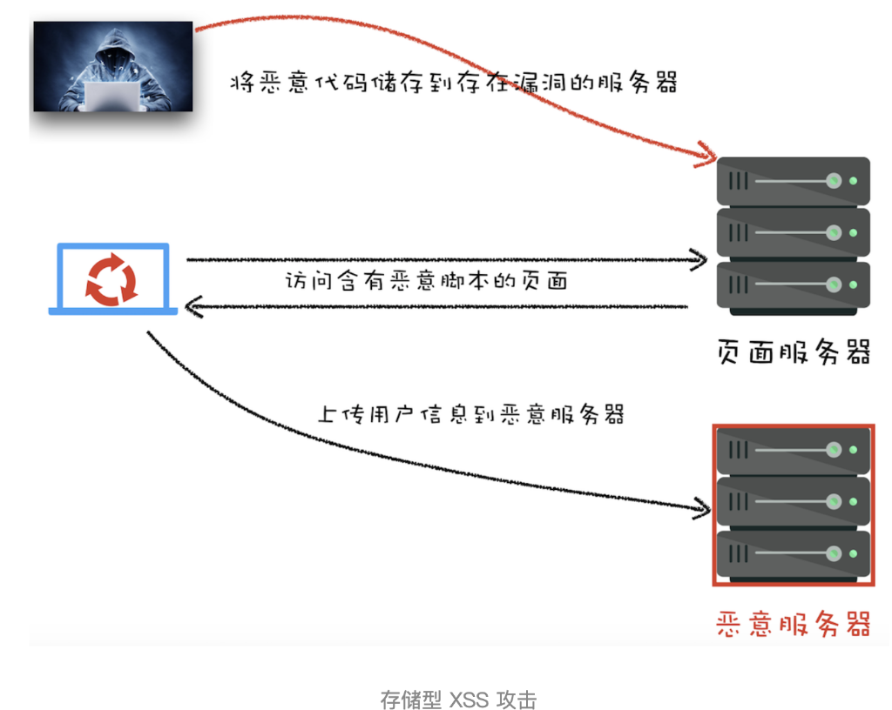

# 安全
### XSS

xss（跨站脚本攻击） 攻击是指黑客往 HTML 文件中或者 DOM 中注入恶意脚本（窃取 cookie，监听用户事件等），实现攻击

如何注入的？

- 存储型 XSS 攻击
- 注入的脚本永久存储在目标服务器上。当浏览器发送数据请求时，受害者会从服务器接收到该恶意脚本。
- 

- 反射型 XSS 攻击（点恶意链接）

将一段含有恶意代码的请求提交给 Web 服务器，Web 服务器接收到请求时，又将恶意代码反射给了浏览器端

- 基于 DOM 的 XSS 攻击

在 Web 资源传输过程或者在用户使用页面的过程中修改 Web 页面的数据

解决：

- **输入过滤** ：对用户输入进行转义（如 `<` → `&lt;`）。
- **输出编码** ：根据输出位置（HTML/JS/CSS）使用不同编码库（如 `encodeURIComponent`）。
- **CSP（内容安全策略）** ：通过 HTTP 头限制脚本来源，如 `Content-Security-Policy: script-src 'self'`。
- **现代框架防护** ：React/Vue 默认转义插值内容，避免 `v-html`/`dangerouslySetInnerHTML` 的滥用。

### CSRF

CSRF（跨站请求伪造）**就是黑客利用了用户的登录状态，并通过第三方的站点来做一些坏事**

**是一种挟制用户在当前已登录的Web应用上执行非本意的操作的攻击方法**

维基百科提到了一个很好的 CSRF 示例。在这种情况下，某人访问了一个实际上并不是图像的图像（例如在未经过滤的聊天或论坛中），而是向银行服务器发出取款请求：

```html

```

现在如果你登录银行账户并且你的 cookie 仍然有效（并且没有其他验证），那么在加载包含此图像的 HTML 后你将立即转账。对于需要 POST 请求的端点，可以在加载页面时以编程方式触发 `<form>` 提交（可能在不可见的 `<iframe>` 中）：


**解决：**

- Referer 和 Origin（只包含域名） 属性（服务器的策略是优先判断 Origin 后 Referer）
- 敏感操作的会话 Cookie 应具有较短的生命周期，并且 SameSite 属性设置为 Strict 或 Lax。
	-  阻止跨域的非用户主动请求（如通过 ``、`<script>` 触发的请求）携带 Cookie。
- **CSRF Token** ：
    - 服务端生成随机 Token，嵌入表单或请求头。
    - 请求时验证 Token（攻击者无法获取第三方站点的 Token）。
- **关键操作使用 POST 而非 GET**  
    GET 请求容易通过 URL、图片标签直接触发，POST 需配合表单提交（但仍需其他防护）。


### **Cookie 发送的条件**

假设银行网站的 Cookie 是用户登录后生成的会话凭证（例如 `session_id=abc123`），以下情况会导致 Cookie 被自动发送给银行服务器：

#### 1. **Cookie 未设置 `SameSite` 属性**

- **默认行为** ：如果 Cookie 未明确设置 `SameSite` 属性（旧版浏览器或未更新的配置），浏览器会将其视为 `SameSite=None`，此时：
    - 跨域请求（如恶意网站的 `` 请求）会携带 Cookie。
- **攻击结果** ：银行的转账请求会携带用户的会话 Cookie，攻击成功。

#### 2. **Cookie 设置为 `SameSite=None`**

- **需配合 `Secure` 属性** ：现代浏览器要求 `SameSite=None` 的 Cookie 必须同时设置 `Secure`（仅通过 HTTPS 发送）。
- **跨域请求** ：即使请求来自恶意网站的 `` 标签，浏览器也会发送 Cookie。
- **攻击结果** ：转账成功（假设银行接口未校验其他防护机制）。

#### 3. **Cookie 设置为 `SameSite=Lax`（浏览器默认行为）**

- **限制跨域请求** ：浏览器只会在以下跨域请求中发送 Cookie：
    - 用户主动触发的 **导航行为** （如点击 `<a>` 链接）。
    - **GET 请求** （如通过 `<form method="GET">` 提交）。
- **对 `` 标签的影响** ：
    - 通过 `` 触发的 GET 请求是**非用户主动行为** 的跨域请求，浏览器不会发送 Cookie。
- **攻击结果** ：转账失败（Cookie 未被携带）。

#### 4. **Cookie 设置为 `SameSite=Strict`**

- **完全禁止跨域请求携带 Cookie** ：即使是用户主动触发的请求（如点击链接），只要来源是第三方网站，Cookie 也不会被发送。
- **攻击结果** ：转账一定失败。


### 中间人（MitM）

第三方拦截了 Web 服务器和客户端（浏览器）之间的流量，并冒充 Web 服务器以捕获数据（例如登录凭据或信用卡信息）。流量被传递，可能会进行修改。公共 Wi-Fi 网络是执行此类攻击的典型手段。偷走未加密数据


### 会话劫持

会话劫持是指获取并滥用用户的已验证会话。session id 或者 cookie

通过部署严格的内容安全策略（Content-Security-Policy），可以限制数据泄露途径。

请注意，子域名（例如 application.example.com）可以通过设置 `Domain` 属性来设置一个 cookie，以便在发送请求到 example.com 或其他子域名时将其发送出去：

浏览器存储了非法 cookie 并将其发送到 example.com 下的所有其他页面。