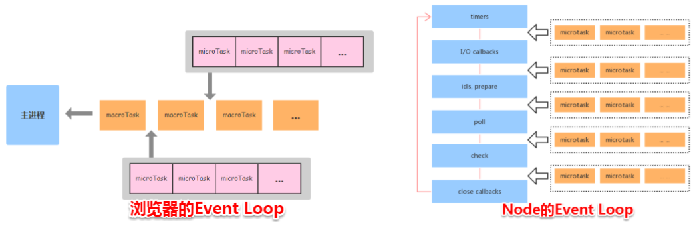

# 浏览器 JS 事件循环

浏览器是通过事件循环来协调用户操作、脚本执行、渲染、网络请求等操作的调度。通过**任务队列（**可能有多个，看浏览器实现**，**浏览器维护**）**来管理任务

可以分为微任务（micro task）队列和宏任务（macro task）队列。

1. **执行顺序铁律** ：每个事件循环中，**先执行同步代码 ⇒ 清空微任务队列 ⇒ 执行下一个宏任务** 。
2. 微任务可以认为是**寄生在宏任务结束后** 的“快速通道”任务。

#### 为什么需要区分宏任务和微任务？

- **微任务优先级高** ：确保与当前执行上下文紧密相关的操作**优先执行** （例如 Promise 状态处理、DOM 更新后的回调）。
- **避免阻塞渲染** ：浏览器通常在宏任务之间执行 UI 渲染，微任务逻辑可以抢在渲染前完成（如 `MutationObserver` 监听 DOM 变化后立即处理）。

具体过程：

1. 执行一个任务（执行栈为空就从任务队列中获取）。
2. 执行过程中如果遇到微任务，就将它添加到微任务的任务队列中（js 引擎维护）。
3. 任务执行完毕后，立即执行当前微任务队列中的所有微任务（包括执行期间加入的微任务）（依次执行）。
4. 当前任务执行完毕，浏览器会检查要不要进行渲染（比如影响视觉显示的操作以及 scroll，resize 事件等、具体看浏览器实现），如果要就渲染线程接管

	1. 渲染前会调用 RAF （requestAnimationFrame）回调函数（有些浏览器在渲染之后调用），如果 RAF 回调函数中有新的 RAF 回调则会到下一次渲染前调用
	2. 然后走一遍渲染过程（ 计算 html css、 重排、重绘、合成）

		1. 如果一帧时间还没结束或者没有其他的任务，一般会执行 requestIdleCallback

			1. 具体是否有空执行要看浏览器的调度，使用 timeout 参数可以强制执行。
			2. 可能在几帧的时间内浏览器都是空闲的，并没有发生任何影响视图的操作，会有最高 50ms 的 deadline

5. 如果不需要进行渲染，则直接开始取下一个任务

  

RIC 和 RAF 是和帧相关的。  

宏任务主要包含：
- script（整体代码）
- setTimeout
- setInterval
- setImmediate
- I/O
- 交互事件
- requestAnimationFrame

微任务主要包含
- Promise.then()
- Promise.catch()
- Promise.finally()
- new MutationObserver
- process.nextTick() 
- 微任务队列不属于任务队列

在浏览器中 setTimeout 的延时设置为 0 的话，会默认为 4ms，NodeJS 为 1ms

new Promise 是同步执行的，promise.then 里面的回调才是异步的。

微任务是在当前事件循环的尾部去执行；宏任务是在下一次事件循环的开始去执行。就是先执行微任务

**简单小结一下微任务和宏任务的本质区别**

**宏任务特征：有明确的异步任务需要执行和回调；需要其他异步线程支持。**

**微任务特征：没有明确的异步任务需要执行，只有回调；不需要其他异步线程支持。**

