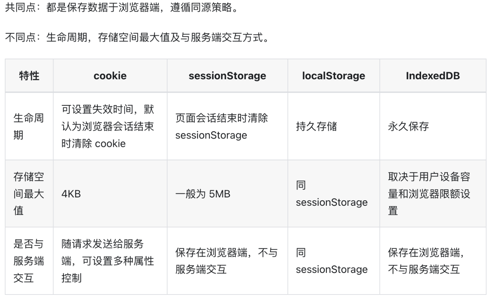

# 浏览器存储机制

- cookie：为了辨别用户身份而储存在客户端上的数据（通常经过加密）。cookie 通常由服务端生成，客户端维护，主要用于维持用户的状态。cookie 会随请求发送给服务器。（Chrome每个域名cookie限制为53个、4097个字节4K）
- Web Storage：以键值对的形式来存储数据，提供除 cookie 之外存储会话数据的途径。存储限制大于 cookie。
	
	- `sessionStorage` 为每一个给定的源（given origin）维持一个独立的存储区域，该存储区域在页面会话期间可用（即只要浏览器处于打开状态，包括页面重新加载和恢复）。（每个域最大 5MB）
	- `localStorage` 同样的功能，但是在浏览器关闭，然后重新打开后数据仍然存在。（每个域最大 5MB）

- IndexedDB：能存储大量结构化数据，适用于高性能搜索场景。（一般不限制大小、磁盘50%、超了会LRU删某个TLD组下的全部）（非关系型数据库、文档）

cookie 字段：

- Expires 属性用于设置过期时间，Max-Age 用于设置有效时间段，过期后 cookie 会被删除。
- Secure 属性代表 cookie 只会随 HTTPS 请求发送。
- HttpOnly 属性代表 cookie 只用于发送给服务端，无法被 JavaScript 访问。
- Domain 属性设置可接收 cookie 的 hosts，不设置则默认为当前 host。如果设置了 Domain，子域名也被包含在内。
- Path 属性设置可接收 cookie 的 URL path，只有包含指定路径的 url 请求才会带上 cookie。如设置为 “/”，则子路径也包含在内。
- SameSite 属性表示跨域时 cookie 的处理策略，包括 Strict, Lax 和 None。

	- Strcit：cookie 只会在第一方上下文中发送，不会与第三方网站发起的请求一起发送。
	- Lax：cookie 允许与顶级**导航**一起发送，并将与第三方网站发起的 GET 请求一起发送，这也是浏览器的默认值。
	- None：cookie 将在所有上下文中发送，即允许跨域发送。使用 None 时，需在最新的浏览器版本中同时使用 Secure 属性，否则会报错。
- cookie 使用不同的方案（`http:` 或 `https:`）发送来自同一域的 cookie，则不再视为来自同一站点。

### **LocalStorage 与 Cookie 的核心区别**

|**对比维度**|**LocalStorage**|**Cookie**|
|---|---|---|
|**存储容量**|5-10 MB（不同浏览器差异）|4 KB 左右（单个域名下总大小有限制）|
|**生命周期**|永久存储，需手动清除|可设置过期时间（默认会话级，关闭失效）|
|**数据传递**|仅在客户端存储，不参与 HTTP 请求|每次请求自动携带同域 Cookie（增加流量）|
|**安全性**|无加密，易受 XSS 攻击|支持`HttpOnly`、`Secure`等安全属性|
|**API 易用性**|提供`setItem`/`getItem`等简单接口|需手动拼接字符串，操作复杂|
|**作用域**|同源策略（协议+域名+端口）|可指定`domain`和`path`作用范围|
|**典型应用场景**|客户端持久化数据（如用户偏好、缓存）|会话管理、身份验证（如 Session ID）|
