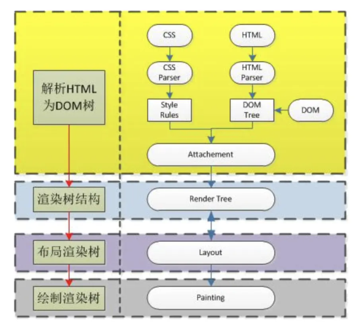
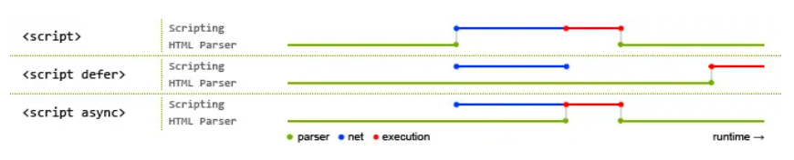

# 浏览器渲染机制

当浏览器进程获取到 HTML 的第一个字节开始，会通知渲染进程开始解析 HTML

渲染进程流程：

1. PARSE：预解析 html，提前找到资源链接，提前发送请求获取，开始解析 HTML 生产 DOM 树，遇到 link 同时构建 cssom（# CSS 对象模型（CSSOM）是一系列用于读取和修改文档样式相关的（CSS）信息的 API。换句话说，[DOM](https://developer.mozilla.org/zh-CN/docs/Web/API/Document_Object_Model) 使得 JavaScript 可以读取和修改文档的结构和内容，CSSOM 则使得 JavaScript 可以读取和修改文档样式。），如果遇到 script 暂停解析 html 直到 script 完成后继续解析（防止脚本中运行中操作修改 DOM ，发生错乱，同时 js 是单线程解决了多线程可能会同时去修改 DOM 的问题）

2. STYLE：收集 CSS 文本转化为样式表，属性标准化（bule->rgb()，最后根据继承和层叠规则计算节点最终的有效样式，生成 CSSOM，（ js 的执行依赖 css 下载完成并生成 cssom，css 解析会阻塞 js）

	1. preload（立即获取），prefetch（空闲时间获取） 只提前加载，但不执行
	
3. JS 编译解析成 AST 、生成无障碍树 AOM

4. LAYOUT： 等 DOM 和 CSSOM 都完成后结合二者，为节点计算位置和大小等布局信息生成 Layout 树（head 标签和 display：none，伪元素等没有）。

> 不会被显示的元素，如 [`<head>`](https://developer.mozilla.org/zh-CN/docs/Web/HTML/Element/head) 元素及其子元素，以及任何带有 `display: none` 的节点，如用户代理样式表中的 `script { display: none; }`，都不会包含在渲染树中，因为它们不会出现在渲染输出中。应用了 `visibility: hidden` 的节点会包含在渲染树中，因为它们会占用空间。

5. PAINT：给拥有单独层叠上下文属性分层，最后生成绘制指令顺序和绘制列表，最后提交给合成线程。_布局_ 是确定呈现树中所有节点的尺寸和位置，以及确定页面上每个对象的大小和位置的过程。_重排_ 是后续过程中对页面的任意部分或整个文档的大小和位置的重新计算。

6. COMPOSITE：将图层分成图块，将图块交给 GPU 加速通过栅格化生成位图，并通过 IPC 提交一个渲染帧给浏览器主进程，浏览器主进程根据将渲染帧发给 gpu 将页面渲染出来

	- 合成器线程不需要等待主线程样式计算或 js 执行，因此适合做只和合成相关的动画（这就是为什么经常主线程卡住了，但是 CSS 动画依然能执行的原因，will-change 设置属性）。同时，还负责处理页面的滚动，滚动时会更新页面的位置和内容。
	- 当页面继续加载资源时，可能会发生回流，回流会触发重新合成和重新绘制。

> 可以通过设置属性 passive 的值 true 告诉浏览器（`el.addEventListener("wheel", zoom, { passive: false });`），代表该监听器内部不会调用 preventDefault 函数来阻止默认滑动行为，合成器线程会将页面中附加有事件处理程序的区域标记为 “非快速可滚动区域”，合成器线程可以确保在该区域发生事件时将输入事件发送到主线程。如果输入事件来自该区域之外，则合成器线程继续合成新帧，而无需等待主线程，滚动速度快

  

在流程完成之后，DOM、CSSOM、LayoutObject（重排）、PaintLayer（重绘） COMPOSITE（合成）等数据都会保留下来，以便在用户操作、网络请求、JS 执行等事件发生时，重新触发渲染流程。

1. 浏览器输入的 url 经过 DNS 解析获得对应的 IP 地址
2. 向服务器发起 TCP 的 3 次握手
3. 建立链接后，浏览器向该IP地址发送 http 请求
4. 服务器接收到请求，HTML格式的字符串代码
5. 浏览器获得 html 代码，解析成 DOM 树，同时 js 阻塞解析
6. 获取 CSS 并构建 CSSOM
7. 将 DOM 与 CSSOM 结合，创建渲染树
8. 找到所有内容都处于网页的哪个位置，布局渲染树（重排）
9. 最终绘制出页面（重绘）

#### async和defer的作用是什么？有什么区别?

defer 和 async 属性的区别：

> - 在加载多个JS脚本的时候，async是无顺序的加载，而defer是有顺序的加载

10. 立即执行 阻塞 dom
11. 异步下载但是等着执行 解析完 dom 之后再执行
12. 异步下载 下好了就执行、依然会阻塞 dom

## 重排和重绘的区别

重排是指重新生成布局，重新排列元素

重绘是指某些元素的外观被改变，例如元素的填充颜色；

浏览器的重绘（repaint）和重排（reflow）是指浏览器对网页进行重新渲染的过程。重排是指重新计算网页布局的过程，而重绘则是根据新的布局信息重新绘制网页的过程。它们的区别在于，重排会导致元素的尺寸、位置、内容等属性的变化，因此需要重新计算布局信息；而重绘则是在元素的位置和尺寸等属性不变的情况下，重新绘制元素的样式。

### **重绘与重排的触发位置**

- **重排（Reflow）** ：发生在 **布局阶段** 。
    
    - **触发条件** ：修改影响元素几何属性的样式（如宽度、高度、位置、字体大小）。
    - **示例** ：`width`、`margin`、`padding`、`position` 等属性变化。
    
- **重绘（Repaint）** ：发生在 **绘制阶段** 。
    
    - **触发条件** ：修改不影响几何属性的样式（如颜色、背景色、可见性）。
    - **示例** ：`color`、`background`、`visibility` 等属性变化。

1. **重排比重绘代价更高**
    
    - 重排会导致后续所有阶段（布局 → 绘制 → 合成）重新执行，而重绘仅重新执行绘制及后续步骤。
2. **优化策略**
    
    - **减少重排** ：
        
        - 使用 `transform` 替代 `top/left` 位移。
        - 批量修改 DOM（如通过 `DocumentFragment` 或虚拟 DOM）。
        - 避免频繁读取布局属性（如 `offsetTop`），必要时缓存值。
        
    - **减少重绘** ：
        - 使用 CSS 动画替代 JavaScript 动画（利用 GPU 加速）。
        - 将频繁变化的元素提升为独立图层（`will-change: transform`）。

我理解的回流是重排加重绘两个过程

- 重绘(repaint): 当元素样式的改变**不影响布局**时，浏览器将使用重绘对元素进行更新，此时由于只需要UI层面的重新像素绘制，因此损耗较少
- 回流(reflow): 当元素的尺寸、结构或触发某些属性时，浏览器会**重新渲染页面**，称为回流。此时，浏览器需要重新经过计算，计算后还需要重新页面布局，因此是较重的操作。会触发回流的操作:
- 添加或删除可见的 DOM 元素
- 元素的位置发生变化
- 元素的尺寸发生变化（包括外边距、内边框、边框大小、高度和宽度等）
- 内容发生变化，比如文本变化或图片被另一个不同尺寸的图片所替代。
- 页面一开始渲染的时候（这肯定避免不了）
- 浏览器的窗口尺寸变化（因为回流是根据视口的大小来计算元素的位置和大小的

> 注意：回流一定会触发重绘，而重绘不一定会回流,重绘的开销较小，回流的代价较高

因此为了减少性能优化，我们可以尽量避免回流或者重绘操作 css

- 避免使用 table 布局
- 将动画效果应用到 position 属性为 absolute 或 fixed 的元素上
