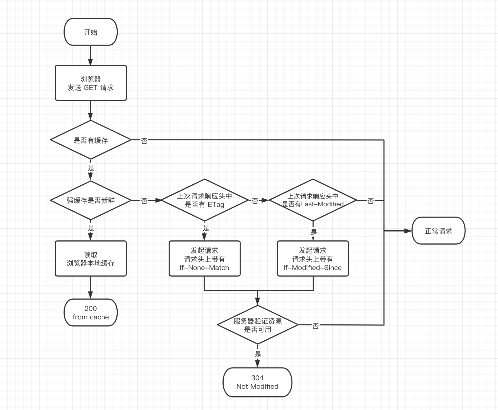

# 浏览器缓存机制

无论是强制缓存还是协商缓存，都是属于 Disk Cache 或者叫做 HTTP Cache 里面的一种

### 强缓存（本地缓存）
（HTTP1.1 **Cache-control**: max-age > **expires** HTTP1.0 (过期时间通过与本地时间计算，不一定准确)）> 协商缓存

Cache-Control （HTTP/1.1）是用于页面缓存的通用消息头字段

- **max-age** 设置缓存存储的最大时长，单位秒、优先级高于 `Expires`。
- **public** 表示响应可被任何对象缓存。
- **private** 表示响应只可被私有用户缓存，不能被代理服务器缓存。（默认值）
- **no-cache 强制客户端向服务器发起请求（禁用强缓存，可用协商缓存）。**
- **no-store** 禁止一切缓存，包含协商缓存也不可用。

no-cache 是缓存但是每次都会发起协商请求
no-store 才是真正的不缓存

`Expires`（HTTP/1.0）

- 指定缓存过期时间（绝对时间），如 `Expires: Wed, 21 Oct 2023 07:28:00 GMT`。
- 缺陷：客户端与服务器时间不一致时会导致缓存误差。

浏览器请求 → 检查 Cache-Control/Expires → 未过期 → 使用缓存

给静态文件上缓存，当需要修改时打上哈希（webpack 可在打包时在文件名上带上）

3 种不同的浏览器行为：

- 打开网页，地址栏输入地址：查找 Disk Cache 中是否有匹配。如有则使用；如没有则发送网络请求。
- 普通刷新 (F5)：因为 TAB 并没有关闭，因此 Memory Cache 是可用的，会被优先使用(如果匹配的话)。其次才是 Disk Cache。
- 强制刷新 ( Ctrl + F5 )：浏览器不使用缓存，因此发送的请求头部均带有 Cache-control: no-cache（为了兼容，还带了 Pragma: no-cache ）。服务器直接返回 200 和最新内容。

### 协商缓存（条件请求）

协商缓存就是强制缓存失效后，浏览器携带缓存标识向服务器发起请求，由服务器根据缓存标识决定是否使用缓存的过程

- **`Last-Modified`（服务器响应头）**  
    资源最后修改时间，如 `Last-Modified: Wed, 21 Oct 2023 05:28:00 GMT`。
    
- **`If-Modified-Since`（浏览器请求头）**  
    将 `Last-Modified` 的值发送给服务器，询问资源是否已修改。
    
- **`ETag`（服务器响应头）**  
    资源内容的唯一标识（哈希值），如 `ETag: "33a64df551425fcc55e4d42a148795d9f25f89d4"`。
    
- **`If-None-Match`（浏览器请求头）**  
    将 `ETag` 的值发送给服务器进行比对。

ETag / If-None-Match：（上次的Etag）  >  Last-Modified/If-Modified-Since（通过最后修改时间，秒级）

若服务器的资源最后被修改时间大于 If-Modified-Since 的字段值，则重新返回资源，状态码为 200；否则则返回304，代表资源无更新，可继续使用缓存文件。

浏览器请求 → 强缓存失效 → 携带 If-Modified-Since/If-None-Match → 服务器验证  
           → 资源未修改（304 Not Modified） → 使用缓存  
           → 资源已修改（200 OK） → 返回新资源并更新缓存

### 其他缓存位置以及优先级

- 从 Service Worker 中读取缓存（只支持 HTTPS）。
- 从内存读取缓存时 network 显示 **memory cache**。
- 从硬盘读取缓存时 network 显示 **disk cache**。
- Push Cache（推送缓存）（HTTP/2.0）。
- 优先级 Service Worker > memory cache > disk cache > Push Cache。

### **1. HTML 文件**

**缓存时间建议：**

- **短缓存或无缓存** ：一般设置 `max-age=300`（5 分钟）或 `Cache-Control: no-cache`（每次需验证更新）。
    
    - **原因** ：HTML 通常包含动态内容（如帖子列表、用户个性化信息），缓存太久可能导致用户无法及时看到最新内容。
    
- **例外** ：若页面为纯静态（如帮助文档或关于页面），可适当延长至 `max-age=86400`（1 天）。
### **2. CSS 文件**

**缓存时间建议：**

- **长缓存** ：设置 `max-age=31536000`（1 年），并配合 **文件哈希或版本号** （如 `style.a1b2c3.css`）。
    - **原因** ：CSS 内容稳定，更新频率低。哈希值确保更新后文件名变化，浏览器自动加载新版本。
### **3. JavaScript 文件**

**缓存时间建议：**

- **长缓存** ：同 CSS，设置 `max-age=31536000`（1 年） + 文件哈希。
    
    - **原因** ：JS 文件一般不会频繁变动，但需确保修复 BUG 或新增功能时通过哈希更新。
    
- **例外** ：内联 JS 或动态加载的非版本化脚本可缩短缓存（如 `max-age=3600`）。