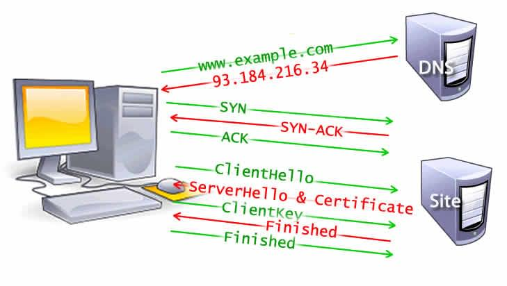

- 用户输入 url 并回车
- 浏览器进程检查url，组装协议，构成完整的 url 
- 浏览器进程通过进程间通信（IPC）把url请求发送给网络进程
- 网络进程接收到 url 请求后检查本地缓存是否缓存了该请求资源，如果有则将该资源返回给浏览器进程
- **如果没有，网络进程向web服务器发起http请求（网络请求）：**

	- 进行DNS解析（浏览器缓存->系统缓存 host->本地服务器->远程服务器），获取服务器ip地址
	- 利用 ip 地址和服务器建立 tcp 连接(三z次握手) 打开端口
	- 构建请求头信息
	- 发送请求头信息
	- 服务器响应后，网络进程接收响应头和响应信息，并解析响应内容
		- 初始请求的响应包含所接收数据的第一个字节。[首字节时间（TTFB）](https://developer.mozilla.org/zh-CN/docs/Glossary/Time_to_first_byte)是用户通过点击链接进行请求与收到第一个 HTML 数据包之间的时间。第一个内容分块通常是 14KB 的数据。

- **网络进程解析响应流程**；

	- 检查状态码，如果是 301/302，则需要重定向，从Location自动中读取地址，重新进行第4步 （301（会读本地缓存 ）307 不能更改方法 /302（不会）308 不能更改方法），如果是200，则继续处理请求。
	- 200响应处理：检查响应类型 Content-Type ，如果是字节流类型，则将该请求提交给下载管理器，该导航流程结束，不再进行后续的渲染，如果是 html则通知浏览器进程准备渲染进程准备进行渲染。

- **准备渲染进程**

	- 浏览器进程检查当前url是否和之前打开的渲染进程根域名是否相同，如果相同，则复用原来的进程，如果不同，则开启新的渲染进程

- **传输数据、更新状态**

	- 渲染进程准备好后，浏览器通过 IPC 向渲染进程发送文档的消息，渲染进程接收到消息和网络进程建立传输数据的“管道”
	- 渲染进程接收完数据后，向浏览器发送“确认提交”
	- 浏览器进程接收到确认消息后更新浏览器界面状态：安全、地址栏url、前进后退的历史状态、更新web页面
	- 渲染进程开始渲染

- **页面渲染**
	- - 通过遍历DOM节点树创建一个“Frame 树”或“渲染树”，并计算每个节点的各个CSS样式值
	- 通过累加子节点的宽度，该节点的水平内边距(padding)、边框(border)和外边距(margin)，自底向上的计算"Frame 树"中每个节点的首选(preferred)宽度
	- 通过自顶向下的给每个节点的子节点分配可行宽度，计算每个节点的实际宽度
	- 通过应用文字折行、累加子节点的高度和此节点的内边距(padding)、边框(border)和外边距(margin)
	- 使用上面的计算结果构建每个节点的坐标
	- 创建layer(层)来表示页面中的哪些部分可以成组的被绘制，而不用被重新栅格化处理。每个帧对象都被分配给一个层
	- 每个层的帧对象都会被遍历，计算机执行绘图命令绘制各个层，此过程可能由CPU执行栅格化处理，或者直接通过D2D/SkiaGL在GPU上绘制
	- 上面所有步骤都可能利用到最近一次页面渲染时计算出来的各个值，这样可以减少不少计算量
	- 计算出各个层的最终位置，一组命令由 Direct3D/OpenGL发出，GPU命令缓冲区清空，命令传至GPU并异步渲染，帧被送到Window Server。

1.  浏览器输入的 url 经过 DNS 解析获得对应的 IP 地址
2. 向服务器发起 TCP 的 3 次握手
3. 建立链接后，浏览器向该IP地址发送 http 请求
4. 服务器接收到请求，HMTL 格式的字符串代码
5. 浏览器获得 html 代码，解析成 DOM 树，同时 js 阻塞解析
6. 获取 CSS 并构建 CSSOM
7. 将 DOM 与 CSSOM 结合，创建渲染树
8. 找到所有内容都处于网页的哪个位置，布局渲染树
9. 最终绘制出页面

