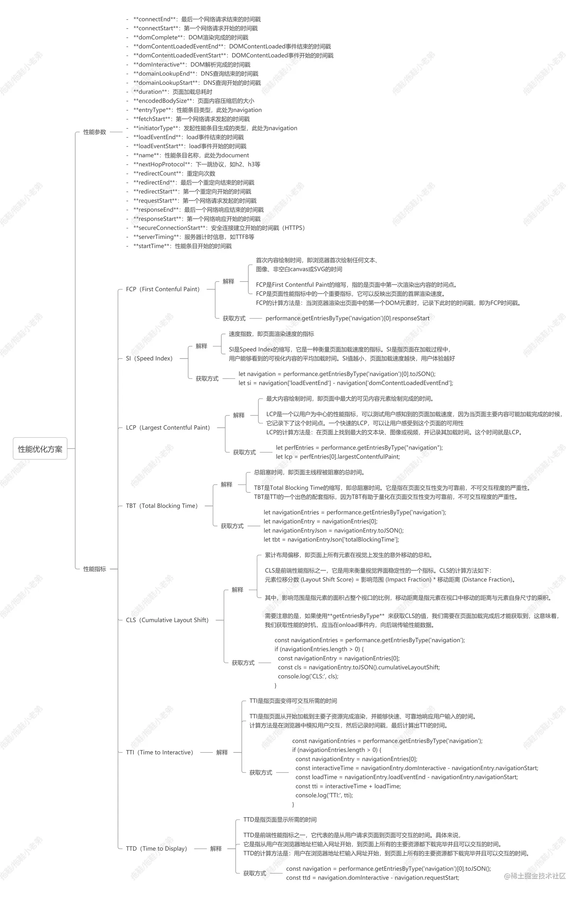

- FCP（First Contentful Paint）白屏时间（渲染第一段dom所用的时间），值越低越好；【fast：0~1.8s】{主要解决方案：提高字体加载速度、使用cdn、服务端缓存、dns解析}
- LCP（Largest Contentful Paint）可视窗口最大内容渲染时间（图片、url加载背景图片的元素），值越低越好；【fast：0~2.5s】{主要解决方案：减少首字节时间 (TTFB)、资源加载时间（缩减大小）}
- Time to First Byte (TTFB) 请求资源到响应的第一个字节到达的时间，值越低越好；【fast：0~0.8s】{主要解决方案：调整主机流量、服务提供商、使用cdn、使用sw}
- TBT（Total Blocking Time）用户行为阻塞时间（FCP后被阻塞的时间、期间用户无法输入），值越低越好；【fast：0~0.2s】{主要解决方案：减少js执行时间}
- CLS（Cumulative Layout Shift）可视窗口中累计可见元素布局偏移（突然的布局意外变化），值越低越好；【量化指标：0~0.1】 https://web.dev/articles/cls {设置长宽值、不要在已经加载的内容前面插入内容、transform变动元素 别跳}
- SI（Speed Index）页面渲染时间，值越低越好；【fast：0~3.4s】{主要解决方案：减少js运行时间、减少复杂样式嵌套、避免大布局和布局回流、异步加载非必须css}
- TTI（Time to Interactive）用户可交互时间（页面加载到页面可交互），值越低越好；【fast：0~3.8s】 https://web.dev/articles/tti {本指标已经不常用、衡量负载响应速度、预载最重要的资源懒加载非关键资源}
- FID（First Input Delay）用户首次交互时间（用户交互到浏览器处理事件的时间），值越低越好。【fast：0~0.1s】{主要解决方案：分解长任务为模块、使用sw、减少js执行时间}

