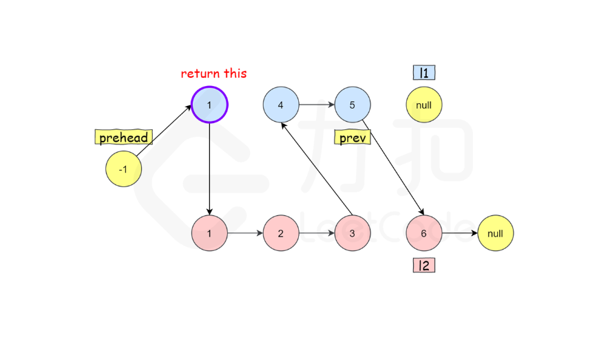

将两个升序链表合并为一个新的 **升序** 链表并返回。新链表是通过拼接给定的两个链表的所有节点组成的。 

**示例 1：**

输入：l1 = [1,2,4], l2 = [1,3,4]
输出：[1,1,2,3,4,4]


```js
/**

 * Definition for singly-linked list.

 * function ListNode(val, next) {

 *     this.val = (val===undefined ? 0 : val)

 *     this.next = (next===undefined ? null : next)

 * }

 */

/**

 * @param {ListNode} list1

 * @param {ListNode} list2

 * @return {ListNode}

 */

var mergeTwoLists = function (list1, list2) {

    let dummy = new ListNode(-1)

    let prev = dummy

    while (list1!=null && list2!=null) {

        if (list1.val <= list2.val) {

            prev.next = list1

            list1 = list1.next

        } else {

            prev.next = list2

            list2 = list2.next

        }

        prev = prev.next

    }

    prev.next = list1 === null ? list2 : list1

    return dummy.next

};
```



dummy是哨兵节点 

哨兵节点 也就是哑巴节点 避免边界问题 哨兵节点初始化的时候值是任意的 你给-10000000都行。然后哨兵节点指向的是原链表的头节点

所以最开始的索引是从-1开始的
