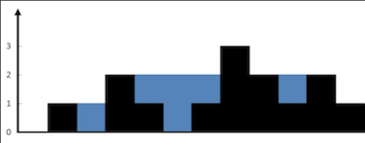
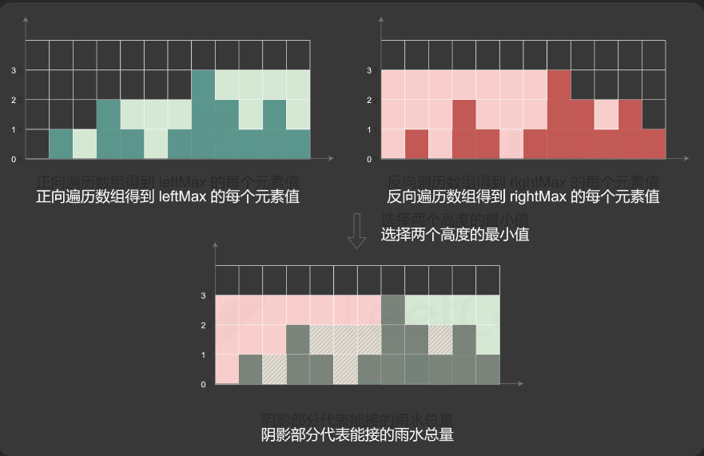

# 42 接雨水

经典字节跳动必考算法之接雨水

给定 `n` 个非负整数表示每个宽度为 `1` 的柱子的高度图，计算按此排列的柱子，下雨之后能接多少雨水。



输入：height = [0,1,0,2,1,0,1,3,2,1,2,1]
输出：6
解释：上面是由数组 [0,1,0,2,1,0,1,3,2,1,2,1] 表示的高度图，在这种情况下，可以接 6 个单位的雨水（蓝色部分表示雨水）。 


输入：height = [4,2,0,3,2,5]
输出：9


- `n == height.length`
- `1 <= n <= 2 * 104`
- `0 <= height[i] <= 105`


## 方法一 动态规划

// 1. 从左向右遍历，找到每个柱子左侧的最大值

// 2. 从右向左遍历，找到每个柱子右侧的最大值



// 3. 遍历每个柱子，计算每个柱子的蓄水量

```js
var trap = function(height) {
    const n = height.length;
    if (n == 0) {
        return 0;
    }
    const leftMax = new Array(n).fill(0);
    leftMax[0] = height[0];
    for (let i = 1; i < n; ++i) {
        leftMax[i] = Math.max(leftMax[i - 1], height[i]);
    }
    const rightMax = new Array(n).fill(0);
    rightMax[n - 1] = height[n - 1];
    for (let i = n - 2; i >= 0; --i) {
        rightMax[i] = Math.max(rightMax[i + 1], height[i]);
    }
    let ans = 0;
    for (let i = 0; i < n; ++i) {
        ans += Math.min(leftMax[i], rightMax[i]) - height[i];
    }
    return ans;
};
```


## 方法二 单调栈


// 1. 遍历每个柱子，如果栈不为空且当前柱子高度大于 栈顶柱子高度 ，弹出栈顶元素

// 2. 计算当前柱子和栈顶柱子之间的蓄水量 长乘宽

// 3. 将当前柱子入栈

// 4. 遍历结束后，返回蓄水量


```js
var trap4 = function(height) {

  let ans = 0;

  const stack = [];

  const n = height.length;

  for (let i = 0; i < n; ++i) {

      while (stack.length && height[i] > height[stack[stack.length - 1)) {

          const top = stack.pop();

          if (!stack.length) {

              break;

          }

          const left = stack[stack.length - 1];

          const currWidth = i - left - 1;

          const currHeight = Math.min(height[left], height[i]) - height[top];

          ans += currWidth * currHeight;

      }

      stack.push(i);

  }

  return ans;

};
```


## 方法三 双指针

蓄水量 由左侧最高柱子和右侧最高柱子中，较矮的那个柱子决定


注意到下标 i 处能接的雨水量由 leftMax[i] 和 rightMax[i] 中的最小值决定。由于数组 leftMax 是从左往右计算，数组 rightMax 是从右往左计算，因此可以使用双指针和两个变量代替两个数组。

维护两个指针 left 和 right，以及两个变量 leftMax 和 rightMax，初始时 left=0,right=n−1,leftMax=0,rightMax=0。指针 left 只会向右移动，指针 right 只会向左移动，在移动指针的过程中维护两个变量 leftMax 和 rightMax 的值。

当两个指针没有相遇时，进行如下操作：

使用 height[left] 和 height[right] 的值更新 leftMax 和 rightMax 的值；

如果 height[left]<height[right]，则必有 leftMax<rightMax，下标 left 处能接的雨水量等于 leftMax−height[left]，将下标 left 处能接的雨水量加到能接的雨水总量，然后将 left 加 1（即向右移动一位）；

如果 height[left]≥height[right]，则必有 leftMax≥rightMax，下标 right 处能接的雨水量等于 rightMax−height[right]，将下标 right 处能接的雨水量加到能接的雨水总量，然后将 right 减 1（即向左移动一位）。

当两个指针相遇时，即可得到能接的雨水总量。


```js
const trap = function (height) {
  let left = 0;
  let right = height.length - 1;
  let leftMax = 0;
  let rightMax = 0;
  let ans = 0;
  while (left < right) {
    const leftHeight = height[left];
    const rightHeight = height[right];
    if (leftHeight < rightHeight) {
      leftMax = Math.max(leftHeight, leftMax);
      ans = ans + leftMax - leftHeight;
      left++;
    } else {
      rightMax = Math.max(rightHeight, rightMax);
      ans = ans + rightMax - rightHeight;
      right--;
    }
  }
  return ans;
};
```


