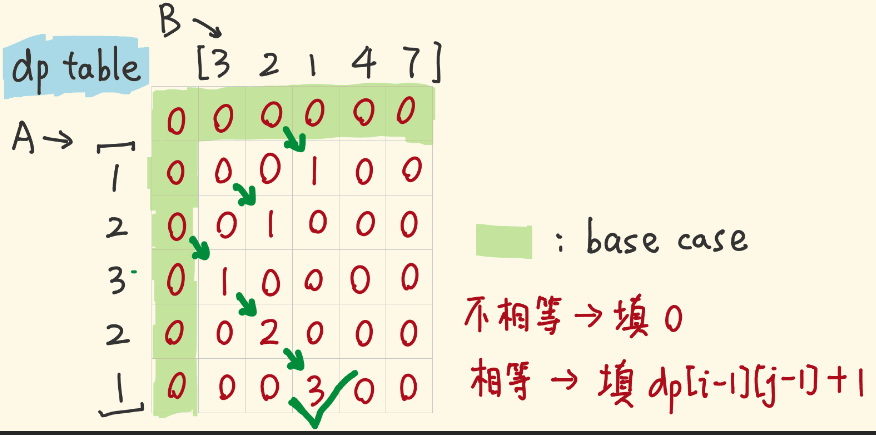

给两个整数数组 nums1 和 nums2 ，返回 两个数组中 公共的 、长度最长的子数组的长度 。

  

示例 1：

  

输入：nums1 = [1,2,3,2,1], nums2 = [3,2,1,4,7]

输出：3

解释：长度最长的公共子数组是 [3,2,1] 。

示例 2：

  

输入：nums1 = [0,0,0,0,0], nums2 = [0,0,0,0,0]

输出：5


```js
//滑动窗口

/**

 * @param {number[]} nums1

 * @param {number[]} nums2

 * @return {number}

 */

var findLength = function (nums1, nums2) {

  return nums1.length < nums2.length ? findmax(nums1, nums2) : findmax(nums2, nums1)

};

  

let findmax = function (arr1, arr2) {

  let max = 0

  let a_len = arr1.length

  let b_len = arr2.length

  //arr1,arr2 中较短的数组不动，这里默认arr1，较长的数组滑动;;初始位置：arr2右边界挨着arr1左边界，arr2从左往右滑动

  
  

  //第一阶段：arr2从左往右滑动，两数组重合部分长度不断增加，重合部分长度len从1开始增加

  //重合部分：arr1起点下标0，arr2起点下标b_len - len，

  for (let len = 1; len <= a_len; len++) {

    max = Math.max(max, maxlen(arr1, 0, arr2, b_len - len, len))

  }

  //第二阶段：arr2从左往右滑动，两数组重合部分长度不变，重合部分长度始终为arr1长度a_len

  //重合部分：arr1起点下标0，arr2起点下标a_len-b_len，然后递减

  for (let j = b_len - a_len; j >= 0; j--) {

    max = Math.max(max, maxlen(arr1, 0, arr2, j, a_len))

  }

  //第三阶段：arr2从左往右滑动，两数组重合部分长度递减，重合部分长度始终为arr1长度a_len-i

  //重合部分：arr1起点下标i，递增，arr2起点下标0

  for (let i = 1; i < a_len; i++) {

    max = Math.max(max, maxlen(arr1, i, arr2, 0, a_len - i))

  }

  return max

}

  

//a中下标i开始，b中下标j开始，长度为len子数组中，最长公共子数组(注意要连续)长度

let maxlen = function (a, i, b, j, len) {

  let count = 0

  let max = 0

  for (let k = 0; k < len; k++) {

    if (a[i + k] == b[j + k]) {

      count++

    }

    else if (count > 0) {

      //进入到这个if判断体里面，说明当前 a[i+k]!=b[j+k],即之前的公共子数组不再连续， 所以要记录最大值，同时将count置零

      max = Math.max(max, count)

      count = 0

    }

  }

  

  //count>0,说明有公共子数组是以a[i+len-1],b[j+len-1]结尾的，上面最后一步for循环没有进入到else if判断题里面，所以最终结果要取当前count和max的最大值

  //count=0，说明max已经更新过了，max即为最终结果

  return count > 0 ? Math.max(max, count) : max

}
```


动态规划
```js
/**

 * @param {number[]} nums1

 * @param {number[]} nums2

 * @return {number}

 */

var findLength2 = function (nums1, nums2) {

  let a_len = nums1.length

  let b_len = nums2.length

  let dp = Array.from(Array(a_len + 1), () => Array(b_len + 1).fill(0))

  let ans = 0

  for (let i = a_len - 1; i >= 0; i--) {

    for (let j = b_len - 1; j >= 0; j--) {

      dp[i][j] = nums1[i] == nums2[j] ? dp[i + 1][j + 1] + 1 : 0

      ans = Math.max(ans, dp[i][j])

    }

  }

  return ans

}
```


从大往小算
base case：如果`i==0||j==0`，则二者没有公共部分，`dp[i][j]=0`
最长公共子数组以哪一项为末尾项都有可能，求出每个 `dp[i][j]`，找出最大值。
