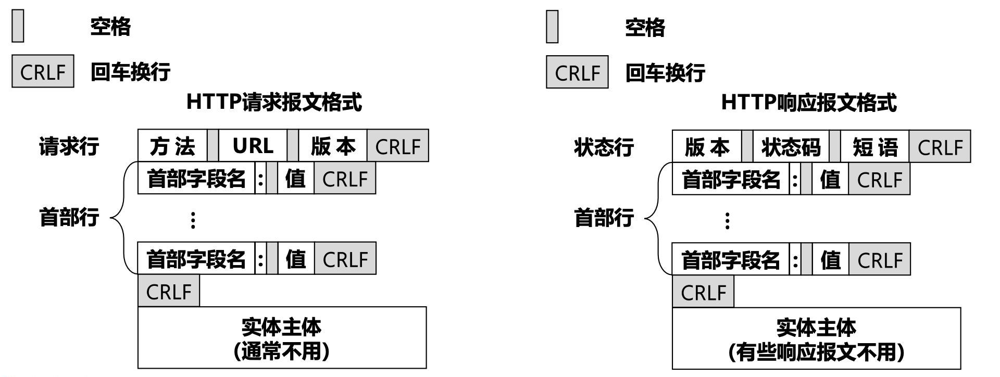

HTTP 超文本传输协议 是一个在计算机世界里专门在「两点」之间「传输」文字、图片、音频、视频等「超文本」数据的「约定和规范」

不一定是浏览器与服务器，服务器和服务器也可以

格式：（换行解决 tcp 粘包问题，不知道边界）（消息头里一般含有消息体的长度，通过这个长度可以去截取真正的消息体得到边界）



## 常用状态码：

- 1xx 类状态码属于**提示信息**
	- 100 Continue ：这个临时响应表明，迄今为止的所有内容都是可行的，客户端应该继续请求，如果已经完成，则忽略它。
	- 101 Switching Protocols：协议交换 指明服务器即将切换的协议

- 2xx 类状态码表示服务器**成功**处理了客户端的请求

	- 「**200 OK**」是最常见的成功状态码，表示一切正常。如果是非 HEAD 请求，服务器返回的响应头都会有 body 数据。
	- 「**204 No Content**」也是常见的成功状态码，与 200 OK 基本相同，但响应头没有 body 数据。
	- 「**206 Partial Content**」是应用于 HTTP 分块下载或断点续传，表示响应返回的 body 数据并不是资源的全部，从客户端发送 Range 范围标头以只请求资源的一部分，也是服务器处理成功的状态。

- 3xx 类状态码表示客户端请求的资源发生了变动，需要客户端用新的 URL 重新发送请求获取资源，也就是**重定向**。

	- 「**301 Moved Permanently**」表示永久重定向，说明请求的资源已经不存在了，需改用新的 URL 再次访问 (对应 307，不可修改请求方法重定向)
	- 「**302 Found**」表示临时重定向，说明请求的资源还在，但暂时需要用另一个 URL 来访问（对应 308，不可修改请求方法重定向）
	- 「**304 Not Modified**」 这是用于缓存的目的。它告诉客户端响应还没有被修改，因此客户端可以继续使用相同的缓存版本的响应。

> 301 和 302 都会在响应头里使用字段 Location，指明后续要跳转的 URL，浏览器会自动重定向新的 URL。

- 4xx 类状态码表示**客户端**发送的**报文有误**，服务器无法处理，也就是错误码的含义。

	- 「**400 Bad Request**」表示客户端请求的报文有错误，但只是个笼统的错误。由于被认为是客户端错误（例如，错误的请求语法、无效的请求消息帧或欺骗性的请求路由），服务器无法或不会处理请求。
	- 「**401 Unauthorized**」表示请求没有被认证或者认证失败，例如：token 失效。
	- 「**403 Forbidden**」表示服务器禁止访问资源（授权失败），并不是客户端的请求出错。未经授权的，因此服务器拒绝提供请求的资源。服务器知道客户端的身份但你权限不够不给看。
	- 「**404 Not Found**」表示请求的资源在服务器上不存在或未找到，所以无法提供给客户端。服务器找不到请求的资源。
	- 「**405  Method Not Allowed**」：客户端请求中的方法被禁止。服务器知道请求方法，但目标资源不支持该方法。
	- 「422 Unprocessable Entity」 ： 数据验证失败：当服务器接收到的数据字段不符合预期的格式或值（例如，缺失必要字段、字段数据类型错误、或字段值不在允许的范围内）时，可以返回这个状态码。
	- 「**429 Too Many Requests**」 用户在给定的时间内发送了太多请求（"限制请求速率"）

- 5xx 类状态码表示客户端请求报文正确，但是**服务器处理时内部发生了错误**，属于服务器端的错误码。

	- 「**500 Internal Server Error**」与 400 类型，是个笼统通用的错误码，服务器发生了什么错误，我们并不知道。
	- 「**501 Not Implemented**」表示客户端请求的功能还不支持，类似“即将开业，敬请期待”的意思。服务器不支持请求方法，因此无法处理。
	- 「**502 Bad Gateway**」通常是服务器作为网关或代理时返回的错误码，表示服务器自身工作正常，访问后端服务器发生了错误。作为网关或代理的服务器，从上游服务器中接收到的响应是无效的。
	- 「**503 Service Unavailable**」表示服务器当前很忙，暂时无法响应客户端，类似“网络服务正忙，请稍后重试”的意思。
	- 「**504 Gateway Timeout**」当服务器充当网关且无法及时获得响应时，会给出此错误响应。
	- 「**505 HTTP Version Not Supported**」：服务器不支持请求的HTTP协议的版本，无法完成处理


**常见的请求头：**

> 1. User-Agent：标识客户端代理信息，通常用于识别用户使用的浏览器或设备类型。
> 2. Accept：指示客户端可以接受的内容类型，例如 text/html, application/json 等。
> 3. Content-Type：指示请求体的媒体类型，例如 application/json, application/x-www-form-urlencoded 等。
> 4. Authorization：用于传递认证信息，比如基本认证、Bearer 令牌等。
> 5. Cookie：用于在客户端和服务端之间传递会话信息。
> 6. **Referer**（注意拼写，实际上是“referrer”）：此字段指示当前请求页面的来源页面的地址，这有助于服务器了解哪些网页链接到了当前请求的资源，常用于日志、分析和缓存优化。
> 7. **If-Modified-Since**：这个字段允许客户端请求只在内容自上次请求后被修改过时才返回内容。如果内容未被修改，服务器可以返回一个 `304 Not Modified` 响应，节省带宽和处理时间。
> 8. **Cache-Control**：这个字段是用来指定请求和响应遵循的缓存机制。客户端可以请求不要获取缓存的数据，或者指定获取的数据可以接受多旧。

**常见的响应头：**

> 1. Content-Type：指示响应体的媒体类型，告诉客户端返回的内容是什么类型的，例如 text/html, application/json 等。
> 2. Set-Cookie：用于在客户端设置 Cookie，通常用于会话管理或跟踪用户状态。
> 3. Cache-Control：指示客户端如何缓存响应，控制缓存的行为，例如 public、private、no-cache 等。
> 4. Location：用于重定向，指示客户端应该重定向到哪个 URL。
> 5. Access-Control-Allow-Origin：用于 CORS（跨域资源共享）策略，指示允许访问资源的域。
> 6. **Strict-Transport-Security**：HSTS，让网站只能通过 HTTPS 连接。
> 7. **Content-Length**：表示响应体的长度，单位是字节。
> 8. **Content-Encoding**：表示响应体的内容编码格式，如 `gzip`。
> 9. **Expires**：响应内容过期的日期/时间，之后内容被认为是过时的。
> 10. **Content-Security-Policy**（CSP）：帮助防止跨站脚本（XSS）攻击，通过指定有效的源和脚本的执行策略。


# HTTP 请求方法

HTTP 定义了一组**请求方法**，以表明要对给定资源执行的操作。指示针对给定资源要执行的期望动作。虽然它们也可以是名词，但这些请求方法有时被称为 _HTTP 动词_。每一个请求方法都实现了不同的语义，但一些共同的特征由一组共享：例如一个请求方法可以是[安全的](https://developer.mozilla.org/zh-CN/docs/Glossary/Safe)、[幂等的](https://developer.mozilla.org/zh-CN/docs/Glossary/Idempotent)或[可缓存的](https://developer.mozilla.org/zh-CN/docs/Glossary/Cacheable)。

[`GET`](https://developer.mozilla.org/zh-CN/docs/Web/HTTP/Methods/GET)：`GET` 方法请求一个指定资源的表示形式，使用 `GET` 的请求应该只被用于获取数据。

[`HEAD`](https://developer.mozilla.org/zh-CN/docs/Web/HTTP/Methods/HEAD)：`HEAD` 方法请求一个与 `GET` 请求的响应相同的响应，但没有响应体。

[`POST`](https://developer.mozilla.org/zh-CN/docs/Web/HTTP/Methods/POST)：`POST` 方法用于将实体提交到指定的资源，通常导致在服务器上的状态变化或副作用。

[`PUT`](https://developer.mozilla.org/zh-CN/docs/Web/HTTP/Methods/PUT)：`PUT` 方法用有效载荷请求替换目标资源的所有当前表示。

[`DELETE`](https://developer.mozilla.org/zh-CN/docs/Web/HTTP/Methods/DELETE)：`DELETE` 方法删除指定的资源。

[`CONNECT`](https://developer.mozilla.org/zh-CN/docs/Web/HTTP/Methods/CONNECT)：`CONNECT` 方法建立一个到由目标资源标识的服务器的隧道。

[`OPTIONS`](https://developer.mozilla.org/zh-CN/docs/Web/HTTP/Methods/OPTIONS)：`OPTIONS` 方法用于描述目标资源的通信选项。

[`TRACE`](https://developer.mozilla.org/zh-CN/docs/Web/HTTP/Methods/TRACE)：`TRACE` 方法沿着到目标资源的路径执行一个消息环回测试。

[`PATCH`](https://developer.mozilla.org/zh-CN/docs/Web/HTTP/Methods/PATCH)：`PATCH` 方法用于对资源应用**部分修改**。

## GET 和 POST 有什么区别

GET 的语义是从服务器获取指定的资源：

- 参数一般写在 URL里，只能支持 ASCII，浏览器对长度有限制
- **幂等（多次请求结果都一样）**
- 可以缓存，当书签

POST 的语义是根据请求负荷对指定的资源做出处理：

- body 中的数据可以是任意格式的数据，对大小无限制
- 不是幂等
- 一般不可缓存，不能当书签

Cookie是一种对无状态的HTTP进行状态化的技术

WebSocket 使用了 TCP全双工能力，想建立 WebSocket 连接，就会在 HTTP 请求里带上一些特殊的header 头：

```http
Connection: Upgrade
Upgrade: WebSocket
Sec-WebSocket-Key: T2a6wZlAwhgQNqruZ2YUyg==\r\n
```


**Content-Security-Policy** 补充

```http
Content-Security-Policy: default-src 'self'; img-src *; media-src media1.com media2.com; script-src userscripts.example.com
```

在这里，各种内容默认仅允许从文档所在的源获取，但存在如下例外：

- 图片可以从任何地方加载 (注意“*”通配符)。
- 多媒体文件仅允许从 media1.com 和 media2.com 加载（不允许从这些站点的子域名）。
- 可运行脚本仅允许来自于 userscripts.example.com。


可以指定 report-uri 来向特定地址发送违规报告 