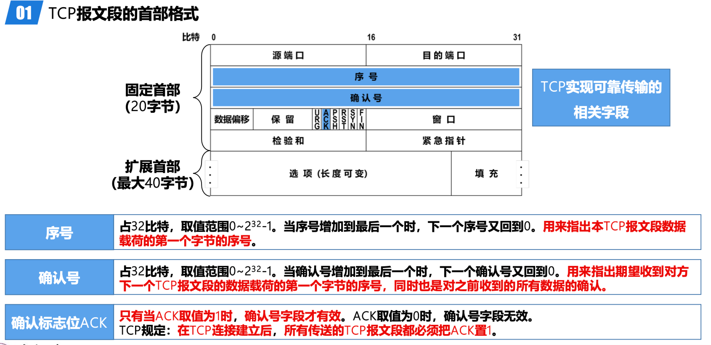
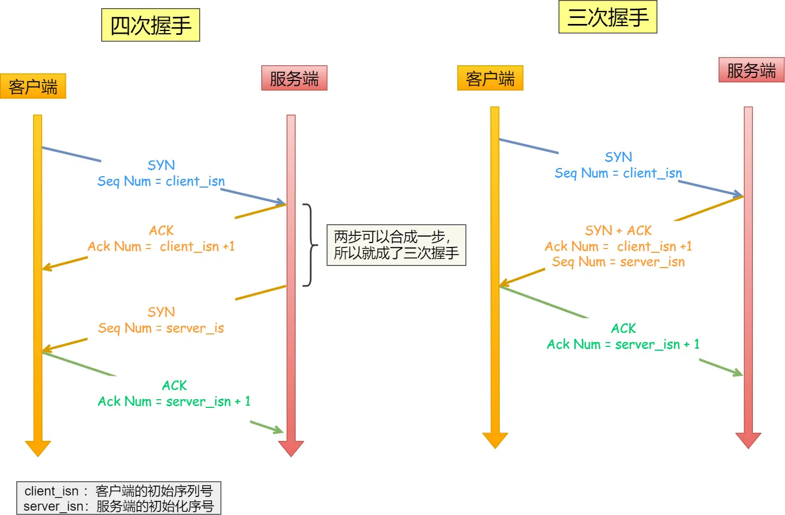

# TCP

特点：

- 面相连接：一定是「一对一」才能连接，不能像 UDP 协议可以一个主机同时向多个主机发送消息
- 可靠的：无论的网络链路中出现了怎样的链路变化，TCP 都可以保证一个报文一定能够到达接收端
- 字节流：用户消息通过 TCP 协议传输时，消息可能会被操作系统「分组」成多个的 TCP 报文，通过顺序确定边界，当「前一个」TCP 报文没有收到的时候，即使它先收到了后面的 TCP 报文，那么也不能扔给应用层去处理，同时对「重复」的 TCP 报文会自动丢弃。

端口的概念：

运行在计算机上的进程是使用进程标识符 PID 来标识的。

然而，因特网上的计算机并不是使用统一的操作系统，而不同操作系统又使用不同格式的进程标识符。为了能够通信就必须使用统一的方法对 TCP/IP 体系的应用进程进行标识，就是采用端口号的长度为 16 比特，取值范围是 0~65535

首部格式：

- 序列号 seq ：在建立连接时由计算机生成的随机数作为其初始值，通过 SYN 包传给接收端主机，每发送一次数据，就「累加」一次该「数据字节数」的大小。用来解决网络包乱序问题。
- 确认应答号：指下一次「期望」收到的数据的序列号，发送端收到这个确认应答以后可以认为在这个序号以前的数据都已经被正常接收。用来解决丢包的问题。
- 数据偏移：指出了TCP报文段的首部长度
- 校验和：用来检查整个TCP报文段在传输过程中是否出现了误码
- ACK：该位为 1 时，「**确认应答**」的字段变为有效，TCP 规定除了最初建立连接时的 SYN 包之外该位必须设置为 1
- SYNC：
	- 用于TCP“三报文握手”建立连接。
	- 当SYN=1且ACK=0时，表明这是一个TCP连接请求报文段。
	- 对方若同意建立连接，则应在响应的TCP报文段的首部中使SYN=1且ACK=1。
- FIN：
	- 用于TCP“四报文挥手”释放连接。
	- 当FIN=1时，表明此TCP报文段的发送方已经将全部数据发送完毕，现在要求释放TCP连接。

三次握手

不携带请求体，但是标记位消耗一个序号，**第三次握手是可以携带数据的**

TCP 协议通过三次握手建立可靠的点对点连接，具体过程是：

- 首先服务器进入监听状态，然后即可处理连接
- 第一次握手：建立连接时，客户端发送 syn 包到服务器，并进入 SYN_SENT 状态，等待服务器确认。在发送的包中还会包含一个初始序列号 seq。此次握手的含义是客户端希望与服务器建立连接。
- 第二次握手：服务器收到 syn 包，然后回应给客户端一个 SYN+ACK 包，此时服务器进入 SYN_RCVD 状态。此次握手的含义是服务端回应客户端，表示已收到并同意客户端的连接请求。
- 第三次握手：客户端收到服务器的 SYN 包后，向服务器再次发送 ACK 包，并进入 ESTAB_LISHED 状态。
- 最后，服务端收到客户端的 ACK 包，于是也进入 ESTAB_LISHED 状态，至此，连接建立完成

为什么不是x次 要是三次？：三次握手才能保证双方具有接收和发送的能力（**首要原因是为了防止旧的重复连接初始化造成混乱**）

- 可以同步双方的初始序列号

两次握手：

- 无法可靠的同步双方序列号，服务端的发送的序列号也应该得到客户端回应

四次握手：

- 服务端发送初始序号和发送确认号可以合并在一起，故三次已经可以确定最少得可靠连接

---

四次挥手：

- 关闭连接时，客户端向服务端发送 FIN 时，仅仅表示客户端**不再发送数据了但是还能接收数据**。
- 服务端收到客户端的 FIN 报文时，先回一个 ACK 应答报文，而服务端可能还有数据需要处理和发送，等服务端不再发送数据时，才发送 FIN 报文给客户端来表示同意现在关闭连接。

1. Client 向 Server 发送 FIN 包，表示 Client 主动要关闭连接，然后进入 FIN_WAIT_1 状态，等待 Server 返回 ACK 包。此后 Client 不能再向 Server 发送数据，但能读取数据。
2. Server 收到 FIN 包后向 Client 发送 ACK 包，然后进入 CLOSE_WAIT 状态，此后 Server 不能再读取数据，但可以继续向 Client 发送数据。
3. Client 收到 Server 返回的 ACK 包后进入 FIN_WAIT_2 状态，等待 Server 发送 FIN 包。
4. Server 完成数据的发送后，将 FIN 包发送给 Client，然后进入 LAST_ACK 状态，等待 Client 返回 ACK 包，此后 Server 既不能读取数据，也不能发送数据。
5. Client 收到 FIN 包后向 Server 发送 ACK 包，然后进入 TIME_WAIT 状态，接着等待足够长的时间（2MSL）以确保 Server 接收到 ACK 包，最后回到 CLOSED 状态，释放网络资源。
6. Server 收到 Client 返回的 ACK 包后便回到 CLOSED 状态，释放网络资源。

## TIME_WAIT

TCP 的 **TIME_WAIT** 状态是 TCP 协议中连接关闭过程中的一个重要状态，通常发生在主动关闭连接的一方（如客户端或主动发起关闭的服务端）。它的主要作用是**确保连接的可靠终止**，并避免网络中残留的旧数据包干扰新连接。
### **1. TIME_WAIT 的触发条件**
当 TCP 连接的一方（称为**主动关闭方**）发送最后一个 `ACK` 后，会进入 `TIME_WAIT` 状态。具体流程如下（以四次挥手为例）：
1. 主动关闭方发送 `FIN` 报文，进入 `FIN_WAIT_1` 状态。
2. 接收方（被动关闭方）回复 `ACK`，主动关闭方进入 `FIN_WAIT_2` 状态。
3. 被动关闭方发送自己的 `FIN` 报文，进入 `LAST_ACK` 状态。
4. 主动关闭方收到 `FIN` 后回复 `ACK`，并进入 `TIME_WAIT` 状态，等待 **2MSL** 时间后彻底关闭连接。

---

### **2. TIME_WAIT 的作用**
#### （1）保证最后的 ACK 可靠到达
- 如果主动关闭方发送的最后一个 `ACK` 丢失，被动关闭方会重传 `FIN` 报文。处于 `TIME_WAIT` 状态的一方可以重新发送 `ACK`，确保连接正常关闭。
- 若没有 `TIME_WAIT`，被动关闭方可能因未收到 `ACK` 而长时间处于 `LAST_ACK` 状态，导致资源无法释放。

#### （2）防止旧连接的报文干扰新连接
- 在网络中可能存在延迟的旧报文（比如因路由问题滞留的报文）。`TIME_WAIT` 状态会等待足够长的时间（2MSL），确保这些旧报文在网络中消失，避免被后续的新连接错误接收。

---

### **3. TIME_WAIT 的持续时间**
- **2MSL（Maximum Segment Lifetime）**：`TIME_WAIT` 的持续时间是 **2倍的最大报文段生存时间（MSL）**。MSL 是报文在网络中存活的最长时间，超过该时间的报文会被丢弃。
- 典型值：MSL 一般为 **30 秒到 2 分钟**，因此 `TIME_WAIT` 的持续时间通常是 **60 秒到 4 分钟**（例如 Linux 默认 MSL 为 60 秒，`TIME_WAIT` 为 120 秒）。

---

### **4. 常见问题与解决方案**
#### 问题：大量 TIME_WAIT 连接导致端口耗尽
当服务器作为主动关闭方频繁断开短连接时（如 HTTP 短连接），可能出现大量 `TIME_WAIT` 状态连接，占用端口资源，导致新连接无法建立。

#### 解决方案：
1. **复用 TIME_WAIT 连接**（推荐）：
   - 启用 `SO_REUSEADDR` 或 `SO_REUSEPORT` 套接字选项，允许新连接复用处于 `TIME_WAIT` 状态的端口。
   - Linux 内核参数：`net.ipv4.tcp_tw_reuse = 1`（仅适用于客户端）。
   - Linux 内核参数：`net.ipv4.tcp_tw_recycle`（已废弃，不推荐使用）。

2. **长连接代替短连接**：
   - 使用 HTTP/1.1 的 Keep-Alive 或 HTTP/2，减少频繁建立和断开连接。

3. **调整 MSL 时间**：
   - 修改内核参数 `net.ipv4.tcp_fin_timeout`（需谨慎，可能导致旧报文干扰新连接）。

4. **负载均衡或反向代理**：
   - 让反向代理服务器（如 Nginx）处理连接关闭，减少后端服务器的 `TIME_WAIT` 状态。

## TCP可靠性

### **1. 数据分块与序列号（Sequence Number）**
- **分块传输**：TCP 将数据流分割为**报文段（Segment）**，每个报文段的大小由 **MSS（最大报文段长度）** 决定。
- **序列号标记**：每个报文段被赋予唯一的**序列号（SN）**，标识数据的字节偏移量。  
  **作用**：  
  - 接收方根据序列号**按序重组数据**，解决网络乱序问题。  
  - 通过序列号**检测重复或丢失的报文段**。

---

### **2. 确认应答机制（ACK）**
- **ACK 确认**：接收方收到数据后，必须发送 **ACK（确认报文）**，告知发送方已正确接收某个序列号之前的所有数据。  
  - **累积确认**：ACK 中的序列号表示接收方期望收到的下一个字节的序号（如 ACK=1001 表示已正确接收 1~1000 字节）。  
- **选择性确认（SACK）**（可选）：在复杂网络环境下，接收方可通过 SACK 明确告知发送方哪些数据块已接收，减少重传冗余。

---

### **3. 超时重传（Retransmission）**
- **重传计时器**：发送方每发送一个报文段，会启动一个**重传计时器（RTO）**。  
  - 若在 RTO 超时前未收到对应 ACK，发送方**重传该报文段**。  
- **动态 RTO 计算**：RTO 基于网络往返时间（RTT）动态调整，适应网络波动。  
  - 例如，Linux 使用 **Karn 算法**和 **Jacobson/Karels 算法**计算精确的 RTT。

---

### **4. 流量控制（Flow Control）**
- **滑动窗口机制**：接收方通过 **ACK 报文中的窗口大小（Window Size）** 告知发送方可接收的数据量，防止接收方缓冲区溢出。  
  - **发送窗口**：发送方只能发送在窗口内的数据，窗口大小随 ACK 动态调整。  
  - **零窗口探测**：若接收方窗口为 0，发送方定期发送探测报文，避免死锁。

---

### **5. 拥塞控制（Congestion Control）**
- **网络拥塞感知**：通过丢包（超时重传或重复 ACK）判断网络拥塞，动态调整发送速率。  
  - **慢启动（Slow Start）**：初始阶段指数增长发送窗口，快速探测可用带宽。  
  - **拥塞避免（Congestion Avoidance）**：达到阈值后线性增长窗口，避免激进发送。  
  - **快速重传与恢复（Fast Retransmit/Recovery）**：收到 3 个重复 ACK 时立即重传，避免等待超时。

---

### **6. 连接管理（三次握手与四次挥手）**
- **三次握手建立连接**：确保双方确认彼此的发送和接收能力，同步初始序列号（ISN）。  
  - 防止历史连接混淆（通过随机 ISN）。  
- **四次挥手终止连接**：确保双方数据发送完毕后再释放资源，结合 **TIME_WAIT** 状态处理延迟报文。

---

### **7. 校验和（Checksum）**
- **数据完整性校验**：每个 TCP 报文段包含校验和字段，接收方验证数据是否在传输中被篡改或损坏。  
  - 若校验失败，直接丢弃报文段，触发发送方超时重传。

---

### **8. 处理乱序与重复报文**
- **接收方缓冲区**：TCP 在接收方内核维护缓冲区，根据序列号**排序乱序到达的报文段**。  
- **丢弃重复报文**：通过序列号识别并丢弃重复数据（如因网络延迟导致的重传冗余）。

## TCP传输性能

### **1. 滑动窗口与流量控制**
- **动态窗口调整**：  
  - 接收方通过 **通告窗口（Advertised Window）** 告知发送方自身缓冲区的剩余容量，发送方根据窗口大小动态调整发送速率，避免接收方过载。  
  - **大窗口支持**：通过 **窗口缩放选项（Window Scaling）** 支持超过 64KB 的窗口大小，适应高带宽延迟积（BDP）网络（如卫星通信）。

---

### **2. 拥塞控制算法**
TCP 根据网络状态动态调整发送速率，平衡公平性与效率：  
- **慢启动（Slow Start）**：连接初期指数级增大拥塞窗口（cwnd），快速探测可用带宽。  
- **拥塞避免（Congestion Avoidance）**：达到阈值后线性增长 cwnd，避免过度占用带宽。  
- **快速重传与快速恢复（Fast Retransmit/Recovery）**：通过重复 ACK 检测丢包，立即重传丢失报文并降低 cwnd，避免等待超时。  
- **BBR（Bottleneck Bandwidth and RTT）**：基于带宽和延迟测量动态调整发送速率，替代传统基于丢包的算法，减少缓冲区膨胀（Bufferbloat）。

---

### **3. 延迟优化策略**
- **Nagle 算法**：合并小数据包（如 Telnet 的按键输入），减少网络中微小报文的数量，降低协议开销。  
  - *权衡*：可能增加延迟，需在高吞吐和低延迟间取舍（如禁用 `TCP_NODELAY`）。  
- **延迟确认（Delayed ACK）**：接收方等待一定时间（通常 40ms）或累积多个报文后发送 ACK，减少 ACK 报文数量。  

---

### **4. 路径优化**
- **路径 MTU 发现（PMTUD）**：探测路径的最大传输单元（MTU），避免 IP 分片，降低传输开销。  
- **时间戳选项（Timestamp）**：精确计算往返时间（RTT），优化超时重传计时器（RTO），避免过早重传或等待过久。

---

### **5. 选择性确认（SACK）**
- **精确反馈**：接收方通过 SACK 告知发送方已接收的非连续数据块，避免重传已成功到达的数据，节省带宽。  
  - *对比传统 ACK*：传统 ACK 仅确认连续数据，可能导致冗余重传。

---

### **6. 连接快速复用**
- **TCP Fast Open（TFO）**：在三次握手期间携带数据，减少连接建立的延迟（尤其在短连接场景）。  
- **SO_REUSEPORT/SO_REUSEADDR**：允许复用处于 `TIME_WAIT` 状态的端口，避免端口耗尽影响新连接。

---

### **7. 多路传输扩展（实验性）**
- **MPTCP（多路径 TCP）**：通过多条网络路径（如 Wi-Fi 和蜂窝网络）并行传输数据，提升吞吐量和容错性。  
- **QUIC（基于 UDP）**：虽非 TCP，但借鉴其思想，通过减少握手次数和避免队头阻塞（HOL Blocking）优化性能。

---

### **8. 缓冲区与内核优化**
- **零拷贝（Zero-Copy）**：减少数据在用户态和内核态之间的复制次数，降低 CPU 开销。  
- **GRO/GSO（Generic Receive/Send Offload）**：网卡聚合处理报文，减轻 CPU 负担。
