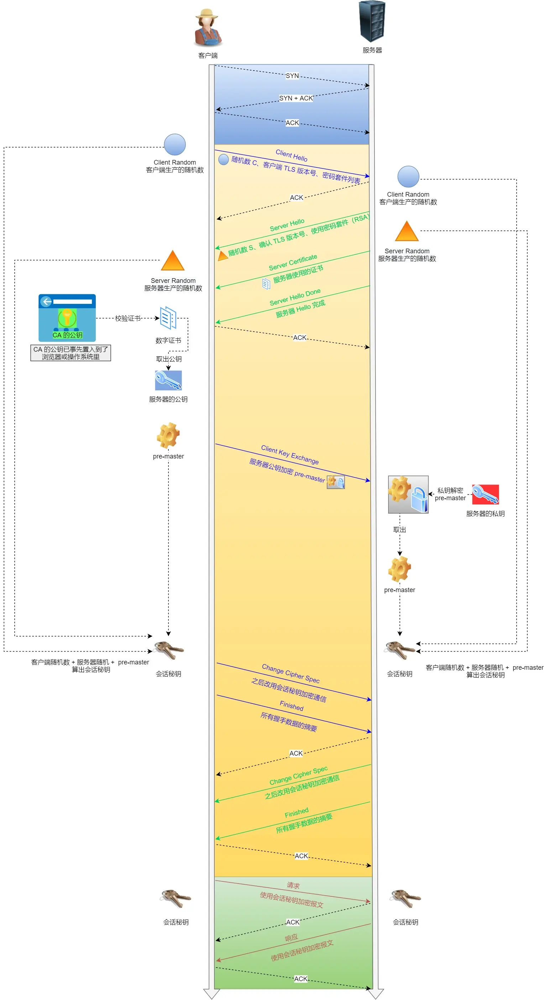

SSL ：安全套接层（Secure Sockets Layer）

TLS：传输层安全（Transport Layer Security）

SSL 1.0版本 -> SSL 2.0版本 -> SSL 3.0版本 -> TLS 1.0版本 -> TLS 1.1版本 -> TLS 1.2版本 -> TLS 1.3版本

- SSL 和 TLS 是同一东西不同时期的不同说法
- 很多浏览器目前已经完全不支持 SSL

OpenSSL，它是一个著名的开源密码学程序库和工具包，几乎支持所有公开的加密算法和协议，已经成为了事实上的标准，许多应用软件都会使用它作为底层库来实现 TLS 功能，包括常用的 Web 服务器 Apache、Nginx 等。

## 如何确保安全？

- 机密性（信息混合加密）
- 完整性（信息不可被篡改，哈希算法唯一值）
- 身份认证（防止冒充身份，证明你是你本人，数字证书）

## 如何实现机密性（加密）？

#### 对称加密

- AES，ChaCha20 等
- 加密解密同一个密钥

**优点：**

1. 加密算法运算速度快

**缺点：**

1. 无法解决交换密钥时密钥会泄露的安全问题

#### 非对称加密

- DH、RSA 等
- 公钥（公开）秘钥（保密）
- 公钥加密后只能用私钥解密，私钥加密后也只能用公钥解密

**优点：**

1. 解决了对称加密交换密钥会泄露的安全问题

**缺点：**

1. 加密算法运算速度慢

```
公钥和私钥加密的区别以及应用场景：

区别：

- （公钥加密，私钥解密）数据加密保证了数据接受方的数据安全性。
- （私钥加密，公钥解密）数据签名保证了数据发送方的数据安全性。

应用：

**情景一：加密**

既然是加密，只有我才能解密，**所以可得出公钥负责加密，私钥负责解密。**用于向公钥所有者发布信息，这个信息可能被他人篡改，但是无法被他人获得。

**情景二：签名**

既然是签名，只有我才能发布这个签名，**所以可得出私钥负责签名，公钥负责验证。**用于所有公钥所有者验证私钥所有者的身份并且用来防止私钥所有者发布的内容被篡改，但是不用来保证内容不被他人获得。

**情景三：双向认证** 什么wireguard

如果甲想给乙发一个安全的保密的数据，那么应该甲乙各自有一个公私钥，甲先用乙的公钥加密这段数据，再用自己的私钥加密这段加密后的数据，最后再发给乙，这样确保了内容即不会被读取，也不会被篡改。
```

#### 混合加密

结合两个加密方式的优缺点，兼顾安全与性能，首次握手通信时候使用非对称加密，后面的通信使用对称加密


## 如何实现完整性？

手段：**摘要算法**（哈希 ，散列函数）

理解成特殊的“单向”加密算法，加密后的数据无法解密，不能从摘要逆推出原文


哈希算法
- MD5，SHA-1，SHA-2（ SHA224、SHA256、SHA384 一系列算法的统称）
- **完整性是建立在机密性的前提下**（否则明文黑客可以把摘要也修改了）

## 如何实现身份认证和不可否认

### 数字签名

**数字签名主要用来验证数据完整性和认证数据来源**


- 私钥加密，公钥能解密就说明一定是发送者（认证数据来源，发送者不可否认）
- 数字签名=（先）摘要算法+（后）私钥加密
- 因为私钥保密，故黑客不能伪造签名

### 如何解决公钥信任问题？

因为公钥也可能是黑客给你发的

#### 数字证书和 CA（Certificate Authority，证书认证机构）

可以理解为警察局（CA）颁发身份证（数字证书）

数字证书：

- 公钥、序列号、用途、颁发者、有效时间等打包成签名
- 浏览器操作系统内置了 CA 的公钥


##### CA 如何证明自己？

- 证书链，低级信任高级直到根证书
- 操作系统和浏览器都内置了各大 CA 的根证书（顺着证书链层层验证找到根证书）

## TLS1.2 连接过程

### RSA 握手过程

1. 客户端发送随机数、版本号、密码套件等
2. 服务器确认，并也返回一个随机数，确认版本号和加密套件，以及返回证书确保公钥的真实性
3. 客户端验证证书通过后用服务器公钥加密发送一个随机数
4. 双方都用三次随机数生成对称会话密钥
5. 各自发送握手数据摘要确保之前握手信息没有被修改
6. 握手完成，之后用会话密钥对称加密通信

引入随机数是为了使每次连接的对称密钥都不同，虽然随机数1和随机数2是明文传输，但随机数3是加密传输，也就能够保证攻击者很难破解到密钥。



> 在握手阶段的最后，通信双方都通过 Hash 算法（比如 SHA256）对自己收到的和发送的所有握手消息计算出数字摘要，然后使用前面协商好的对称密钥对该数字摘要进行加密，发送给对方。
> 当收到对方发过来的数字摘要密文后，先用对称密钥对其进行解密，如果解密成功，**说明密钥生成没问题**；接着对比双方的数字摘要是否一致，如果一致，**说明握手阶段的消息没有被篡改过**，也即可以建立起正确的连接了。


### 双向认证

上面的是“**单向认证**”握手过程

- 只认证了**服务器**的身份，而没有认证**客户端**的身份。这是因为通常单向认证通过后已经建立了安全通信，用账号、密码等简单的手段就能够确认用户的真实身份。
- 但为了防止账号、密码被盗，有的时候（比如网上银行）还会使用 U 盾给用户颁发客户端证书，实现“**双向认证**”，这样会更加安全。

双向认证的流程在“**Server Hello Done**”之后，“**Client Key Exchange**”之前，客户端要发送“**Client Certificate**”消息，服务器收到后也把证书链走一遍，验证客户端的身份。

## 服务器名称指示 SNI

在该协议下，在[握手](https://zh.wikipedia.org/wiki/%E6%8F%A1%E6%89%8B_(%E6%8A%80%E6%9C%AF) "握手 (技术)")过程开始时[客户端](https://zh.wikipedia.org/wiki/%E5%AE%A2%E6%88%B7%E7%AB%AF "客户端")告诉它正在连接的[服务器](https://zh.wikipedia.org/wiki/%E6%9C%8D%E5%8A%A1%E5%99%A8 "服务器")要连接的[主机名称](https://zh.wikipedia.org/wiki/%E4%B8%BB%E6%A9%9F%E5%90%8D%E7%A8%B1 "主机名称")。这允许服务器在相同的[IP地址](https://zh.wikipedia.org/wiki/IP%E5%9C%B0%E5%9D%80 "IP地址")和[TCP端口号](https://zh.wikipedia.org/wiki/%E9%80%9A%E8%A8%8A%E5%9F%A0 "端口")上呈现多个[证书](https://zh.wikipedia.org/wiki/%E9%9B%BB%E5%AD%90%E6%86%91%E8%AD%89 "电子证书")，并且因此允许在相同的IP地址上提供多个安全（[HTTPS](https://zh.wikipedia.org/wiki/%E8%B6%85%E6%96%87%E6%9C%AC%E4%BC%A0%E8%BE%93%E5%AE%89%E5%85%A8%E5%8D%8F%E8%AE%AE "超文本传输安全协议")）网站（或其他任何基于TLS的[服务](https://zh.wikipedia.org/wiki/%E6%9C%8D%E5%8A%A1%E5%99%A8 "服务器")），而不需要所有这些站点使用相同的证书。